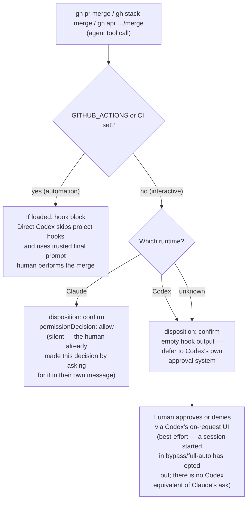

# Decision flow

[Back to Merge Authority](merge-authority.md#decision-flow)

The three merge shapes (`gh pr merge ...`, `gh stack merge ...`, and the `gh api` merge branch, including the GraphQL
`enablePullRequestAutoMerge`/`mergePullRequest` mutations) run through the same
`automationContext`/`runtime` decision — an interactive human can merge or arm auto-merge via
those paths, and an unchanged automation hook blocks all three. Every other hook policy (force-push,
`--amend`, dev-server launches, hook-bypass flags, PR draft-first, closing-ref validation) is
unrelated to merge authority and keeps blocking unconditionally in every context.

**Confirm strength differs by runtime.** Claude's `permissionDecision: "allow"` proceeds silently no
matter what auto-mode is active — there is no forced prompt to inherit. Codex's confirm relies on
`approval_policy = "on-request"` in `.codex/config.toml` — a Codex session explicitly started in a
bypass/full-auto mode has opted out of that, and the hook has no Codex-side equivalent to force a
prompt either way. Interactive Codex merge may still surface a confirmation, but that confirmation
is inherited from session config, not guaranteed by the hook.

Implementation: `dev/codex-hooks/pre-tool-use.mts` reads a `runtime` arg (`claude` or `codex`, set
by `.claude/settings.json` and `.codex/config.toml` respectively) and computes
`automationContext` once, threading both through `preToolUseOutput()`. The merge branches live in
`dev/codex-hooks/policy/github-workflow.mts` (`gh pr merge` and `gh stack merge`) and
`dev/codex-hooks/policy/github-api-merge-options.mts` (`gh api` / `gh api graphql` merge
mutations); reason text for both is in `dev/codex-hooks/policy/github-api-merge-reasons.mts`. The
disposition itself is rendered by `dev/codex-hooks/policy/pre-tool-use-confirm-output.mts`'s
`renderConfirmDisposition`, which returns a silent `permissionDecision: "allow"` for every
interactive Claude confirm and a hard `block` if `automationContext` were ever somehow true on that
path (defensive; unreachable, since the merge branches already return `block` directly under
automation). Tests: `dev/codex-hooks-tests/__tests__/codex-hook-gh-pr-merge-policy.test.mts` and
`…gh-api-merge-policy.test.mts` assert `automationContext:true` blocks on both runtimes and both
merge shapes, `runtime:'claude'` interactive allows silently, and `runtime:'codex'`/unknown
interactive emits empty output.

**Scope note:** this hook governs merges issued as **agent tool calls**. It does not touch
workflow-initiated merges. The shared action called by `dependabot-pr-automerge.yml` uses the
job-scoped `github.token` only for metadata and PR reads; its eligible `enablePullRequestAutoMerge` mutation uses the separate
`DEPENDABOT_AUTOMERGE_TOKEN` so the eventual merge emits normal `main` `push` workflows.
This is intentional, narrowly scoped automation, not an agent deciding to merge. The Dependabot workflow never synthesizes a
review or approval. See the [canonical Dependabot auto-merge policy](reference-dependency-updates-dependabot-automerge.md).

**What stays unconditional:** automation (`GITHUB_ACTIONS`/`CI` set) hard-blocks every merge shape
regardless of runtime, with no path back to `allow` — the merge branches return `disposition:
'block'` directly, and `renderConfirmDisposition`/`cursorBeforeShellOutput` keep a defensive
`automationContext` check on the confirm path that should never be reachable. What changed is the
interactive side: the human decision that authorizes a merge is the human asking for it in their own
message, not a second tool-level popup, so an interactive confirm renders as an immediate, silent
`allow` instead of a forced prompt.
