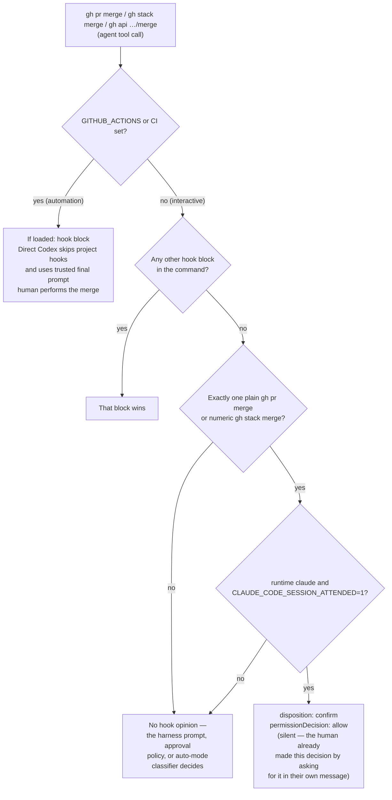

# Decision flow

[Back to Merge Authority](merge-authority.md#decision-flow)

Automation blocks all three merge shapes (`gh pr merge ...`, `gh stack merge ...`, and the `gh api`
merge branch, including the GraphQL `enablePullRequestAutoMerge`/`mergePullRequest` mutations).
Interactively, only a lone `gh pr merge` or numeric `gh stack merge` in an attended Claude session
gets the silent allow. Every other interactive merge gets no hook opinion, and the Cursor adapter
answers `permission: ask`. Every other hook policy (force-push, `--amend`, dev-server launches,
hook-bypass flags, PR draft-first, closing-ref validation) is unrelated to merge authority and
blocks the same way in automation and interactive sessions, and those blocks win over the merge
allow. The PR and issue content rules (draft-first, closing-ref validation, `--base`, raw `Plan:`
issues) are also scoped to the session checkout's home GitHub owners: they skip a `gh` command that
provably targets another owner's repository, while the merge shapes stay global. See the
[Codex hook policy](../../.agents/skills/agent-workflow/git-and-prs.md) and #434.

**Confirm strength differs by runtime.** Claude's `permissionDecision: "allow"` proceeds silently no
matter what auto-mode is active, so the hook emits it only for an attended session. An unattended
Claude session (`claude -p`) gets empty output, and its permission mode decides. Codex's confirm
relies on `approval_policy = "on-request"` in `.codex/config.toml`. A Codex session explicitly
started in a bypass/full-auto mode has opted out of that, and the hook has no Codex-side
equivalent to force a prompt either way. Interactive Codex merge may still surface a confirmation,
but that confirmation is inherited from session config, not guaranteed by the hook.

Implementation:

- `dev/codex-hooks/pre-tool-use.mts` reads a `runtime` arg (`claude` or `codex`, set by
  `.claude/settings.json` and `.codex/config.toml` respectively). It computes `automationContext`
  (`isAutomationContext`) and `attended` (`isAttendedClaudeSession`) once and threads them through
  `preToolUseOutput()`.
- The automation merge blocks live in `dev/codex-hooks/policy/github-workflow.mts` (`gh pr merge`),
  `github-stack-workflow.mts` (`gh stack merge`), and `github-api-merge-options.mts` (`gh api` /
  `gh api graphql` merge mutations, with reason text in `github-api-merge-reasons.mts`). Each
  returns null interactively.
- `findPreToolUseBlock` in `dev/codex-hooks/policy.mts` runs every block first. Its final return is
  `findInteractiveMergeConfirm` from `dev/codex-hooks/policy/github-merge-authority.mts`, the only
  source of `disposition: 'confirm'`. That uses `isLoneMergeCommand`, which rejects any shell
  metacharacter before tokenizing.
- `renderConfirmDisposition` in `dev/codex-hooks/policy/pre-tool-use-confirm-output.mts` returns
  the silent `permissionDecision: "allow"` only for `runtime: 'claude'` with `attended: true`, and
  empty output otherwise.
- Tests: `dev/codex-hooks-tests/codex-hook-merge-authority-output.test.mts` covers the precedence,
  lone-merge, and attended rows end to end through the wired entry script.
  `dev/codex-hooks-tests/__tests__/codex-hook-gh-pr-merge-policy.test.mts` and
  `…gh-api-merge-policy.test.mts` assert that `automationContext:true` blocks every merge shape.

**Scope note:** this hook governs merges issued as **agent tool calls**. It does not touch
workflow-initiated merges. Dependency-bot auto-merge is disabled in this repository; see the
[dependency update merge policy](dependency-updates.md#review-and-merge).

**What stays unconditional:** automation (`GITHUB_ACTIONS`/`CI` set) hard-blocks every merge shape
regardless of runtime, with no path back to `allow`. The merge branches return `disposition:
'block'` directly, and `findInteractiveMergeConfirm` never returns a confirm under automation. What
changed is the interactive side: the human decision that authorizes a merge is the human asking for
it in their own message, not a second tool-level popup. So a lone merge in an attended Claude
session renders as an immediate, silent `allow` instead of a forced prompt.
