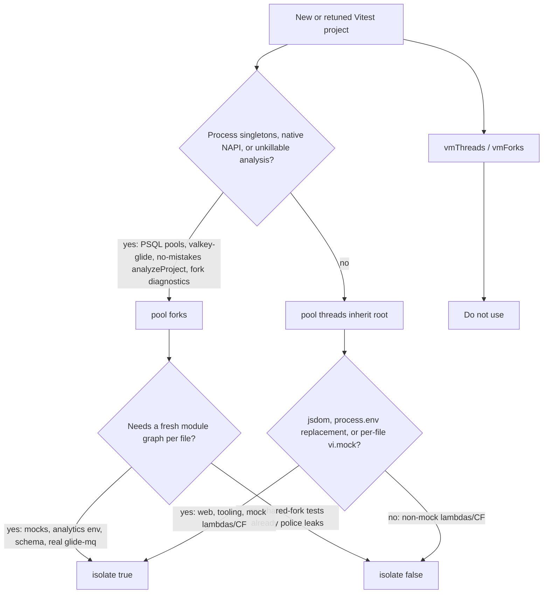

# Vitest Projects

[Back to Tests and Checks](tests.md#vitest-projects)

Never set `fileParallelism: false` or a literal `maxWorkers` in a Vitest config. Both are enforced
by `dev/vitest-config.test.mts`, and the root config explicitly keeps file parallelism on. Neither
knob actually works per-project: vitest reads the `VITEST_MAX_WORKERS` repo variable _after_ merging
project config and unconditionally overwrites both `fileParallelism: false` (which is itself
implemented internally as `maxWorkers = 1`) and any explicit `maxWorkers`. Concurrency is bounded
only by `VITEST_MAX_WORKERS` — set it via `parseVitestMaxWorkers()` /
`parseStorybookBrowserMaxWorkers()` (`test-helpers/vitest-config/environment.mts`), never a literal.
A test that cannot run in parallel with the rest of its suite needs to be fixed, not quarantined
behind a worker pin: assert properties scoped to the rows the test owns (randomized IDs, prefix
matching) instead of a global snapshot of shared state. A `sequence.groupOrder` sequential barrier
remains available for the rare case that genuinely cannot be made parallel-safe.

Every project must declare an explicit `testTimeout` and `hookTimeout`, enforced by
`dev/vitest-config.test.mts`. Without an explicit value, a project silently falls back to Vitest's
built-in `5000`/`10000` ms defaults — invisible at the project's definition site, and how
`ts-shared` broke `main` twice (#10762). The root config sets a `15_000`/`30_000` backstop, but that
is only a safety net for a project added between edits; it does not exempt any project from
declaring its own values. Start a new project at `15_000`/`30_000` and raise it only with a
demonstrated failure, documented with a one-line comment (see `toolingTestBudget` in
`test-helpers/vitest-config/tooling-projects.mts`) — never above the ceilings of `60_000` ms
(`testTimeout`) / `90_000` ms (`hookTimeout`) that the same guard file enforces. A single genuinely
slower test takes a per-test `{ timeout: ... }` override instead of raising its whole project's
budget, so one slow test doesn't mask a regression in every other test in that project.

Run any single project directly: `pnpm exec vitest run --project <name>`.

Reusable root scripts call [`ci/run-vitest-project-group.mts`](../../ci/run-vitest-project-group.mts), whose typed catalog is also used by local coverage. The runner starts one Vitest process for the selected projects and removes exactly one leading separator inserted by `pnpm run`, so both `pnpm run test:backend:default -- <files>` and forwarded Vitest flags work. Keep durable scripts project-based; filename lists are appropriate only for one-off local commands.

`pnpm run test:backend:modules` runs the Docker-free backend group: local analytics, modules,
`backend-no-data-mocks`, test helpers, and email templates. `pnpm run test:backend:docker` runs the
PostgreSQL/Valkey-backed analytics integration, data-store, and remaining mock projects. The
aggregate backend groups compose both sets.

Do not force a reporter for local Vitest runs; Vitest's default reporter behavior automatically uses `minimal` when it detects an AI coding agent. CI reporter wiring lives in `vitest.config.mts` and is activated by workflow env vars.

Backend Vitest projects alias `glide-mq` to an inline test shim. The shim drain waits for flushed
jobs to reach a terminal state with a bounded wall-clock timeout. Nested `Queue.add` calls from
inside a shim Worker processor enqueue and kick the child queue without waiting, matching
production. The shim still does not honor delay, deduplication, or ordering semantics, so tests
must assert production queue options directly and use integration tests for processor and
data-flow behavior.

`backend-real-glide-mq` is the narrow exception for a transport contract that cannot be established
with the shim. It runs only `backend/**/*.real-glide.mock.test.mts` against the worktree Valkey with the
actual `glide-mq` package. Its setup uses GlideMQ's isolated `voucha_qdb_15` key prefix plus a
random queue-name suffix, so it cannot consume or obliterate
jobs from the worktree worker fleet or a concurrent invocation. Run it explicitly with
`pnpm exec vitest run --project backend-real-glide-mq`; do not remove the shim from the normal
backend projects.

### Contents

- [Pools, Isolation, and Vitest 5](#pools-isolation-and-vitest-5)
- [Vitest 5 Pool and Isolate Matrix](reference-tests-vitest-5-pool-matrix.md)
- [Explain Test Selection and Vitest Ownership](reference-explain-test-selection-and-vitest-ownership.md)
- [DynamicConfig Cleanup](reference-dynamicconfig-cleanup.md)
- [Project Name Reference](reference-project-name-reference.md)
- [Vitest Worker-Exit Diagnostics](reference-vitest-worker-exit-diagnostics.md)

## Pools, Isolation, and Vitest 5

The repo already depends on the root `vitest` pin in [`package.json`](../../package.json). Vitest 5
applies these with no extra flags: inline projects that do not change Vite config share one Vite
server (`sharedViteServer` defaults on), warm modules are served to workers in one round trip,
isolated forks and `v8` coverage merge are faster, and the reporter `Duration` line breaks the run
into `environment` / `import` / `transform` / `setup` / `worker` / `tests` percentages.
[`experimental.diagnostics`](https://vitest.dev/config/experimental#experimental-diagnostics) may
hint after a run, but hints never suggest changing an option that is already set explicitly — keep
per-project `pool` and `isolate` explicit.

Do not follow the [Vitest 5 blog](https://vitest.dev/blog/vitest-5.html) pool tables as a migration
guide. Those headline cells are **vm pools**, **Browser Mode**, and **large isolated suites**. This
repo already took the isolation win (`isolate: false`) on the expensive backend/data/`web-api`
suites, and `web-storybook-browser` already runs Browser Mode with `isolate: false`. Owners of the
per-project values:

- Root inheritance default (`pool: 'threads'`): [`vitest.config.mts`](../../vitest.config.mts)
- Backend forks: [`test-helpers/vitest-config/backend-core-projects.mts`](../../test-helpers/vitest-config/backend-core-projects.mts), [`test-helpers/vitest-config/backend-data-projects.mts`](../../test-helpers/vitest-config/backend-data-projects.mts)
- Web / lambdas / Cloudflare: [`test-helpers/vitest-config/web-projects.mts`](../../test-helpers/vitest-config/web-projects.mts)
- Tooling: [`test-helpers/vitest-config/tooling-projects.mts`](../../test-helpers/vitest-config/tooling-projects.mts)
- Storybook browser: [`test-helpers/vitest-config/storybook-browser-project.mts`](../../test-helpers/vitest-config/storybook-browser-project.mts)

The per-configuration matrix lives in
[Vitest 5 Pool and Isolate Matrix](reference-tests-vitest-5-pool-matrix.md).

Shared-fork leak rules for `isolate: false` backend files live in
[Parallel-Safety and Test-Root Hygiene](reference-tests-parallel-safety-and-test-root-hygiene.md#live-glidemq-workers-must-not-leak-across-isolatefalse-files).
`pool: 'threads'` remains not a drop-in for those backend projects; the worker-exit stopping
condition still forbids a seventh instrumentation pass as a substitute for a scoped threads
proposal.

`fsModuleCache` is on at the root. Leave the remaining Vitest 5 knobs off until a **specific
project** `Duration` line shows the matching phase dominating. Do not enable them because a blog
cell or `vitest doctor` recommendation is faster on a clean machine.

| Knob                     | Status                                                                                                           | Gate if someone wants it later                                                                                                                                                                                                                                                                                                                                                                             |
| ------------------------ | ---------------------------------------------------------------------------------------------------------------- | ---------------------------------------------------------------------------------------------------------------------------------------------------------------------------------------------------------------------------------------------------------------------------------------------------------------------------------------------------------------------------------------------------------- |
| `sharedViteServer`       | already on (default). Projects that set Vite `plugins` / `resolve.alias` / `root` correctly get their own server | Do not set `sharedViteServer: false`                                                                                                                                                                                                                                                                                                                                                                       |
| `fsModuleCache`          | on, path `vitestFsModuleCachePath` (`.cache/vite/fs-module`)                                                     | Root `test.fsModuleCache` in [`vitest.config.mts`](../../vitest.config.mts). Workspace `.cache/vite/` only — never the default `node_modules/.vitest-cache`, never `actions/cache`. Does not apply to Browser Mode. `./dev/reset` still deletes `.cache`. If transforms go stale after a plugin-option change, run `vitest --clearCache` and file a cache-key generator rather than restoring GitHub cache |
| `NODE_COMPILE_CACHE`     | off                                                                                                              | Vitest disables it in workers when the `v8` coverage provider is on; CI Vitest jobs collect v8 coverage, so worker-side CI benefit is ~zero. Optional local no-coverage experiment under `.cache/` only, never `$HOME` on persistent runners                                                                                                                                                               |
| `vitest doctor`          | local measurement tool                                                                                           | Not a CI job and not a green light. It checks whether tests pass under `isolate: false` with shuffled file order; it does not prove parallel-safe dirty-DB shards or jsdom mock isolation. Do not run it against `backend-data-stores` as a reason to drop forks                                                                                                                                           |
| `vi.when`                | unused                                                                                                           | Argument-matched spy sugar, not faster tests. Fine in a **new** test that would otherwise grow an argument-switch `mockImplementation`. No sweep of existing mocks                                                                                                                                                                                                                                         |
| Dropping `extends: true` | keep the explicit flag                                                                                           | Default in Vitest 5, so deleting it is cosmetic. Comments and `ci/vitest-backend-config.test.mts` encode the additive `setupFiles` merge                                                                                                                                                                                                                                                                   |

Do not set `fileParallelism: false` or a literal `maxWorkers` to chase speed; that ban is at the
top of this page.
