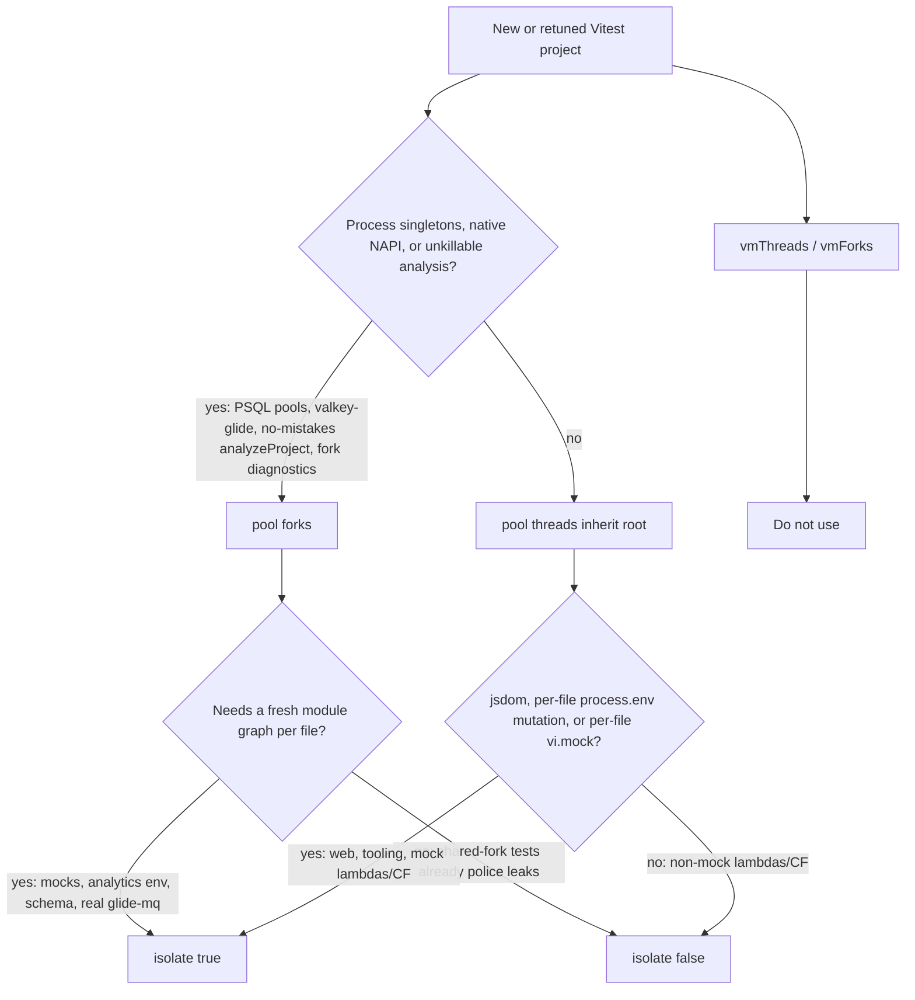

# Vitest Projects

[Back to Tests and Checks](tests.md#vitest-projects)

Never set `fileParallelism: false` or a literal `maxWorkers` in a Vitest config. Both are enforced
by `dev/vitest-config.test.mts`, and the root config explicitly keeps file parallelism on. Neither
knob actually works per-project: Vitest reads the repository-owned `VITEST_MAX_WORKERS` environment
policy _after_ merging
project config and unconditionally overwrites both `fileParallelism: false` (which is itself
implemented internally as `maxWorkers = 1`) and any explicit `maxWorkers`. Concurrency is bounded
only by `VITEST_MAX_WORKERS` — set it via `parseVitestMaxWorkers()` /
`parseStorybookBrowserMaxWorkers()` (`test-helpers/vitest-config/environment.mts`), never a literal.
A test that cannot run in parallel with the rest of its suite needs to be fixed, not quarantined
behind a worker pin: assert properties scoped to the rows the test owns (randomized IDs, prefix
matching) instead of a global snapshot of shared state. Measure a singleton ledger delta on the
connection that locks that ledger row and performs the owned write. A `sequence.groupOrder` sequential barrier
remains available for the rare case that genuinely cannot be made parallel-safe.

Every project must declare an explicit `testTimeout` and `hookTimeout`, enforced by
`dev/vitest-config.test.mts`. Follow the [suite rules](tests.md#test-suite-rules) when choosing
budgets for a new project or a per-test override. Existing project budgets are being reduced in
[#2149](https://github.com/vouchington/vouchington/issues/2149); their transitional values are not
the policy for new projects. An override belongs on the measured slow case and stays within the
suite's cap, rather than raising the budget for every test in its project.

The same headroom rule applies one layer down: a test that spawns a child process with its own
timeout must keep that timeout strictly below its project's `testTimeout`, and must report the
child's signal/timeout state on the result instead of coercing a kill into a generic failure code —
use `runProcess`/`RunProcessResult` from
[`dev/test-helpers/run-process.mts`](../../dev/test-helpers/run-process.mts), which has no default
timeout of its own (callers opt in via `timeoutMs`). The helper delegates its deadline to
an abort signal and waits for command completion. That deadline also bounds pipe capture after
the child exits; a successful TERM trap still reports `timedOut`, while an output-buffer error
remains a separate failure. See `RUN_TMUX_TIMEOUT_MS` in
[`dev/test-helpers/run-tmux.mts`](../../dev/test-helpers/run-tmux.mts) for an example caller.

A first exec of a freshly written executable file is expensive on macOS — roughly 200ms idle, over
1s under full-suite load — while re-execing an already-run file costs single-digit milliseconds. A
harness that writes a fresh set of fake executables per test can burn through a child process's
timeout budget under load. Build and warm one set of fakes per test file in `beforeAll`, then hand
each test a symlink to the warmed files instead of writing new ones, and symlink any pass-through
tool straight to its real system binary rather than copying it. See
[`dev/test-helpers/tmux-fake-bin.mts`](../../dev/test-helpers/tmux-fake-bin.mts) for the pattern.

Run any single project directly: `pnpm exec vitest run --project <name>`.

Reusable root scripts call [`ci/run-vitest-project-group.mts`](../../ci/run-vitest-project-group.mts), whose typed catalog is also used by local coverage. The runner starts one Vitest process for the selected projects and removes exactly one leading separator inserted by `pnpm run`, so both `pnpm run test:backend:default -- <files>` and forwarded Vitest flags work. Keep durable scripts project-based; filename lists are appropriate only for one-off local commands.

`pnpm run test:backend:modules` runs the Docker-free backend group: local analytics, modules,
`backend-no-data-mocks`, test helpers, and email templates. `pnpm run test:backend:docker` runs the
PostgreSQL/Valkey-backed analytics integration, data-store, and remaining mock projects. The
aggregate backend groups compose both sets.

`backend-no-data-mocks` also owns explicitly listed unit tests whose server, request, timer, and
shutdown dependencies are injected. They keep ordinary `.test.mts` filenames when they do not
mock modules; these files are excluded from the database-backed project.

Pure test-helper validation belongs to `backend-test-helpers` and must not initialize PostgreSQL
merely by importing a helper. A helper test that intentionally inspects the live PostgreSQL pools,
such as `bluesky-link-authorizations.test.mts`, belongs to `backend-data-stores` instead.

Do not force a reporter for local Vitest runs; Vitest's default reporter behavior automatically uses `minimal` when it detects an AI coding agent. CI reporter wiring lives in `vitest.config.mts` and is activated by workflow env vars.

Backend Vitest projects alias `glide-mq` to an inline test shim. The shim drain waits for flushed
owned jobs to complete, fail, or park using real queue transitions and the actual retry-promotion
and dead-letter admission promises. Inspections coalesce notifications and re-read state after
promotion, so transient retry parking cannot finish a drain. A four-second `AbortSignal` watchdog
bounds hangs below the intended five-second test budget; its expiration reports diagnostics and
never polls job state. Each drain removes its waiter and abort listener on settlement.
Nested `Queue.add` calls from
inside a shim Worker processor enqueue and kick the child queue without waiting, matching
production. Its in-memory state and deduplication checks do not establish production transport
ordering or retry-backoff timing. Assert production queue options directly and use integration
tests for transport and data-flow behavior.

`backend-real-glide-mq` is the narrow exception for a transport contract that cannot be established
with the shim. It runs only `backend/**/*.real-glide.mock.test.mts` against the worktree Valkey with the
actual `glide-mq` package. Its setup uses GlideMQ's isolated `voucha_qdb_15` key prefix plus a
random queue-name suffix, so it cannot consume or obliterate
jobs from the worktree worker fleet or a concurrent invocation. Run it explicitly with
`pnpm exec vitest run --project backend-real-glide-mq`; do not remove the shim from the normal
backend projects.

### Contents

- [Pools, Isolation, and Vitest 5](#pools-isolation-and-vitest-5)
- [Vitest 5 Pool and Isolate Matrix](reference-tests-vitest-5-pool-matrix.md)
- [Explain Test Selection and Vitest Ownership](reference-explain-test-selection-and-vitest-ownership.md)
- [DynamicConfig Cleanup](reference-dynamicconfig-cleanup.md)
- [Project Name Reference](reference-project-name-reference.md)

## Pools, Isolation, and Vitest 5

The repo already depends on the root `vitest` pin in [`package.json`](../../package.json). Vitest 5
applies these with no extra flags: inline projects that do not change Vite config share one Vite
server (`sharedViteServer` defaults on), warm modules are served to workers in one round trip,
isolated forks and `v8` coverage merge are faster, and the reporter `Duration` line breaks the run
into `environment` / `import` / `transform` / `setup` / `worker` / `tests` percentages.
[`experimental.diagnostics`](https://vitest.dev/config/experimental#experimental-diagnostics) may
hint after a run, but hints never suggest changing an option that is already set explicitly — keep
per-project `pool` and `isolate` explicit.

Do not follow the [Vitest 5 blog](https://vitest.dev/blog/vitest-5.html) pool tables as a migration
guide. Those headline cells are **vm pools**, **Browser Mode**, and **large isolated suites**. This
repo already took the isolation win (`isolate: false`) on the expensive backend/data/`web-api`
suites, and `web-storybook-browser` already runs Browser Mode with `isolate: false`. Owners of the
per-project values:

- Root inheritance default (`pool: 'threads'`): [`vitest.config.mts`](../../vitest.config.mts)
- Backend forks: [`test-helpers/vitest-config/backend-core-projects.mts`](../../test-helpers/vitest-config/backend-core-projects.mts), [`test-helpers/vitest-config/backend-data-projects.mts`](../../test-helpers/vitest-config/backend-data-projects.mts)
- Backend credentialed provider probes (also the source of the `backend` and per-provider `backend-<provider>` groups in `ci/run-vitest-project-group.mts` and of the transient-retry classifier's credentialed boundary): [`test-helpers/vitest-config/backend-credentialed-projects.mts`](../../test-helpers/vitest-config/backend-credentialed-projects.mts)
- Web / lambdas / Cloudflare: [`test-helpers/vitest-config/web-projects.mts`](../../test-helpers/vitest-config/web-projects.mts)
- Tooling: [`test-helpers/vitest-config/tooling-projects.mts`](../../test-helpers/vitest-config/tooling-projects.mts)
- Storybook browser: [`test-helpers/vitest-config/storybook-browser-project.mts`](../../test-helpers/vitest-config/storybook-browser-project.mts)

```mermaid
flowchart TD
  start[New or retuned Vitest project]
  start --> native{Process singletons, native NAPI, or unkillable analysis?}
  native -->|yes: PSQL pools, valkey-glide, no-mistakes analyzeProject, fork diagnostics| forks[pool forks]
  native -->|no| threads[pool threads inherit root]
  forks --> freshFork{Needs a fresh module graph per file?}
  freshFork -->|yes: mocks, analytics env, schema, real glide-mq| isoOn[isolate true]
  freshFork -->|no: shared-fork tests already police leaks| isoOff[isolate false]
  threads --> jsdom{jsdom, per-file process.env mutation, or per-file vi.mock?}
  jsdom -->|yes: web, tooling, mock lambdas/CF| isoOn
  jsdom -->|no: non-mock lambdas/CF| isoOff
  start --> vm[vmThreads / vmForks]
  vm --> unused[Do not use]
```

The per-configuration matrix lives in
[Vitest 5 Pool and Isolate Matrix](reference-tests-vitest-5-pool-matrix.md).

Tooling setup files apply their environment to `process.env` in place with `replaceEnvInPlace`
([`ci/tooling-test-env.mts`](../../ci/tooling-test-env.mts)). Never reassign `process.env` in a
setup file: `vi.stubEnv` and `vi.unstubAllEnvs` unset variables with `delete` on the original
object, so a replacement object silently leaks stubbed variables between tests.

Shared-fork leak rules for `isolate: false` backend files live in
[Parallel-Safety and Test-Root Hygiene](reference-tests-parallel-safety-and-test-root-hygiene.md#live-glidemq-workers-must-not-leak-across-isolatefalse-files).
`pool: 'threads'` remains not a drop-in for those backend projects; see
[Vitest workflow reference](ci/workflows/reference-vitest.md) for the worker-exit restore rule and
when a scoped threads proposal is warranted.

`fsModuleCache` is on at the root. Leave the remaining Vitest 5 knobs off until a **specific
project** `Duration` line shows the matching phase dominating. Do not enable them because a blog
cell or `vitest doctor` recommendation is faster on a clean machine.

| Knob                     | Status                                                                                                           | Gate if someone wants it later                                                                                                                                                                                                                                                                                                                                                                             |
| ------------------------ | ---------------------------------------------------------------------------------------------------------------- | ---------------------------------------------------------------------------------------------------------------------------------------------------------------------------------------------------------------------------------------------------------------------------------------------------------------------------------------------------------------------------------------------------------- |
| `sharedViteServer`       | already on (default). Projects that set Vite `plugins` / `resolve.alias` / `root` correctly get their own server | Do not set `sharedViteServer: false`                                                                                                                                                                                                                                                                                                                                                                       |
| `fsModuleCache`          | on, path `vitestFsModuleCachePath` (`.cache/vite/fs-module`)                                                     | Root `test.fsModuleCache` in [`vitest.config.mts`](../../vitest.config.mts). Workspace `.cache/vite/` only — never the default `node_modules/.vitest-cache`, never `actions/cache`. Does not apply to Browser Mode. `./dev/reset` still deletes `.cache`. If transforms go stale after a plugin-option change, run `vitest --clearCache` and file a cache-key generator rather than restoring GitHub cache |
| `NODE_COMPILE_CACHE`     | off                                                                                                              | Vitest disables it in workers when the `v8` coverage provider is on; CI Vitest jobs collect v8 coverage, so worker-side CI benefit is ~zero. Optional local no-coverage experiment under `.cache/` only, never `$HOME` on persistent runners                                                                                                                                                               |
| `vitest doctor`          | local measurement tool                                                                                           | Not a CI job and not a green light. It checks whether tests pass under `isolate: false` with shuffled file order; it does not prove parallel-safe dirty-DB shards or jsdom mock isolation. Do not run it against `backend-data-stores` as a reason to drop forks                                                                                                                                           |
| `vi.when`                | unused                                                                                                           | Argument-matched spy sugar, not faster tests. Fine in a **new** test that would otherwise grow an argument-switch `mockImplementation`. No sweep of existing mocks                                                                                                                                                                                                                                         |
| Dropping `extends: true` | keep the explicit flag                                                                                           | Default in Vitest 5, so deleting it is cosmetic. Comments and `ci/vitest-backend-config.test.mts` encode the additive `setupFiles` merge                                                                                                                                                                                                                                                                   |

Do not set `fileParallelism: false` or a literal `maxWorkers` to chase speed; that ban is at the
top of this page.
