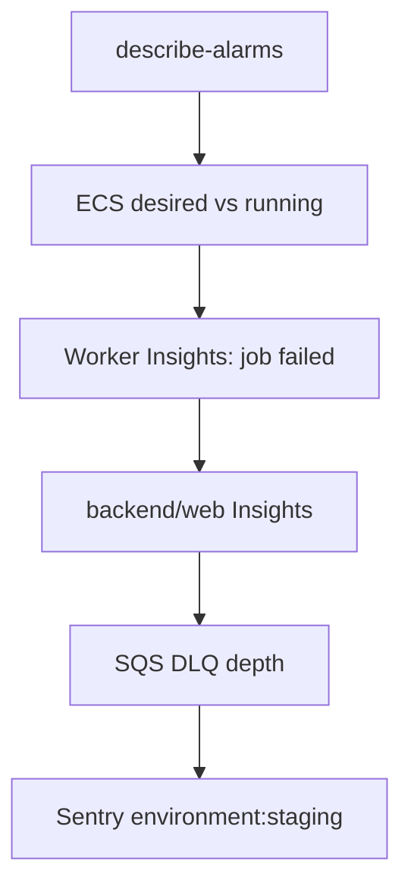

# Deployed Error Investigation - Runbook

How agents and operators find staging errors: CloudWatch alarms, Logs Insights,
SQS dead-letter queues, and Sentry. Production diagnostics require separate explicit authorization;
this runbook does not imply it. Use this before QA and after any unexpected 5xx.

## Staging post-deployment audit

Use the `voucha-dev` profile only. While staging uses the temporary standalone-account bridge, first
run `aws sts get-caller-identity --profile voucha-dev` and require an
`assumed-role/voucha-developer-staging/...` ARN in the staging account. The source profile may be
used only to obtain that short-lived role session, never to run diagnostics directly. After the
organization Identity Center migration, run `aws sso login --profile voucha-dev` before the identity
check. Stop on denial or a wrong account. Do not fall back to an unbounded or administrator profile.
Record a separate version and completion timestamp for the Cloudflare Worker, each Lambda, and every
ECS service (task definition/image digest). A failed, cancelled, or skipped component is
**undeployed**; record it and use the last confirmed anchor. Compare `[T-15m,T)` with `[T,T+15m)` for
each newly deployed component. Empty post-deployment bins are **inconclusive**, not healthy.

Capture anchors with bounded metadata commands, retaining only version, timestamp, digest, and
redacted request IDs. Set `WORKER_IO_ENABLED=true` for this shell only when private infrastructure's
`workerIoEnabled` flag is true:

```sh
pnpm --dir cloudflare-worker exec wrangler versions list \
  --name voucha-cloudflare-worker-staging --json
for FUNCTION in voucha-image-resize-staging voucha-ecs-db-rotation-redeploy-staging; do
  aws lambda get-function --profile voucha-dev --region us-west-2 --function-name "$FUNCTION" \
    --query 'Configuration.{version:Version,lastModified:LastModified,codeSha256:CodeSha256,revision:RevisionId,gitCommit:Environment.Variables.GIT_COMMIT}' \
    --output json
done
WORKER_SERVICES=(voucha-worker-cpu-default-staging)
if [ "${WORKER_IO_ENABLED:-false}" = true ]; then
  WORKER_SERVICES+=(voucha-worker-io-default-staging)
fi
aws ecs describe-services --profile voucha-dev --region us-west-2 --cluster voucha-staging-cluster \
  --services voucha-backend-staging voucha-web-staging \
    "${WORKER_SERVICES[@]}" \
  --query 'services[].{deployments:deployments,events:events[0:10],taskDefinition:taskDefinition}' \
  --output json
```

Audit all `voucha-staging-*` alarms; ECS desired/running/pending counts, deployment events,
revisions, and images; and worker `job failed:` signatures. Query the six primary groups:

```text
/voucha/staging/backend
/voucha/staging/web
/voucha/staging/worker/cpu-default
/voucha/staging/worker/io-default
/aws/lambda/voucha-image-resize-staging
/aws/lambda/voucha-ecs-db-rotation-redeploy-staging
```

Query `/aws/kinesisfirehose/voucha-analytics-staging` and
`/aws/rds/cluster/voucha-staging-aurora/postgresql` only for an alarm or correlated symptom. Run a
passive ten-minute Cloudflare tail limited to `error` and `canceled`; generate no browser traffic.
Sentry is optional when existing authentication works.

Inspect Bedrock batch, SES bounce, Stripe events, and SES inbound DLQs. For each queue record
visible/in-flight counts. If nonempty, receive at most ten with visibility timeout zero, classify in
memory, and output only queue, count, and redacted event class. Never print or persist bodies,
receipt handles, or payload fields. Sampling does not acknowledge messages but increments receive
count. Never delete, redrive, or purge. `voucha-dev` grants `StartQuery` only for the eight groups
above and receive-only access only to these four DLQs; it excludes source queues, DeleteMessage, and
PurgeQueue.

Follow the existing [CI transient retry policy](../development/ci.md#classifying-transient-infrastructure-failures)
for a classified ECR transport failure; do not alter application or retry policy from one timeout.

For each component use two bounded Insights windows, substituting that component's deployment epoch
for `T` and each permitted log group for `LOG_GROUP`. A zero-result post window is inconclusive:

```sh
T=<deployment-epoch-seconds>
for WINDOW in "$((T - 900)):$T" "$T:$((T + 900))"; do
  START=${WINDOW%%:*}; END=${WINDOW##*:}
  aws logs start-query --profile voucha-dev --region us-west-2 \
    --log-group-names "$LOG_GROUP" --start-time "$START" --end-time "$END" \
    --query-string 'fields @timestamp, @message | filter @message like /(?i)(error|exception|fatal|job failed:)/ | sort @timestamp desc | limit 30'
done
```

Passively tail the deployed Worker for exactly ten minutes; the command produces no requests:

```sh
python3 -c '
import collections, json, os, signal, subprocess, threading
command = ["pnpm", "--dir", "cloudflare-worker", "exec", "wrangler", "tail", "voucha-cloudflare-worker-staging", "--format", "json", "--status", "error", "--status", "canceled"]
counts = collections.Counter()
process = subprocess.Popen(command, start_new_session=True, stdout=subprocess.PIPE, stderr=subprocess.PIPE, text=True, bufsize=1)
def consume(stream, is_event_stream):
    for line in stream:
        if not is_event_stream:
            counts["diagnostic-line"] += 1
            continue
        try:
            event = json.loads(line)
        except json.JSONDecodeError:
            counts["unparsed-event"] += 1
            continue
        outcome = event.get("outcome") or event.get("event", {}).get("outcome")
        counts[outcome if outcome in {"canceled", "error", "exception", "exceededCpu"} else "filtered-event"] += 1
threads = [
    threading.Thread(target=consume, args=(process.stdout, True)),
    threading.Thread(target=consume, args=(process.stderr, False)),
]
for thread in threads:
    thread.start()
def stop_process_group():
    if process.poll() is not None:
        return
    try:
        os.killpg(process.pid, signal.SIGTERM)
    except ProcessLookupError:
        return
    try:
        process.wait(timeout=5)
    except subprocess.TimeoutExpired:
        try:
            os.killpg(process.pid, signal.SIGKILL)
        except ProcessLookupError:
            return
        process.wait()
early_status = None
interrupted = False
try:
    return_code = process.wait(timeout=600)
    early_status = return_code
except subprocess.TimeoutExpired:
    pass
except KeyboardInterrupt:
    interrupted = True
finally:
    stop_process_group()
    for thread in threads:
        thread.join()
    print(json.dumps({"tail_seconds": 600, "event_classes": dict(sorted(counts.items()))}))
if interrupted:
    raise SystemExit("Worker tail interrupted before ten minutes")
if early_status is not None:
    raise SystemExit(f"Worker tail exited before ten minutes with status {early_status}")
'
```

Probe the `voucha-dev` grants with one bounded query, then safely inspect all four DLQs. The receive
JSON is piped directly to the in-memory classifier; it prints no body, receipt handle, or payload:

```sh
aws logs start-query --profile voucha-dev --region us-west-2 \
  --log-group-names /voucha/staging/backend --start-time "$T" --end-time "$((T + 60))" \
  --query-string 'fields @timestamp | limit 1'

for QUEUE in bedrock-batch ses-bounce stripe-events ses-inbound; do
  URL="https://sqs.us-west-2.amazonaws.com/<staging-account-id>/voucha-staging-${QUEUE}-dlq"
  ATTRIBUTES=$(aws sqs get-queue-attributes --profile voucha-dev --region us-west-2 --queue-url "$URL" \
    --attribute-names ApproximateNumberOfMessages ApproximateNumberOfMessagesNotVisible \
    --query 'Attributes' --output json)
  VISIBLE=$(ATTRIBUTES="$ATTRIBUTES" python3 -c 'import json, os; print(json.loads(os.environ["ATTRIBUTES"]).get("ApproximateNumberOfMessages", "0"))')
  if [ "$VISIBLE" = 0 ]; then
    QUEUE="$QUEUE" ATTRIBUTES="$ATTRIBUTES" python3 -c '
import json, os
attributes = json.loads(os.environ["ATTRIBUTES"])
in_flight = int(attributes.get("ApproximateNumberOfMessagesNotVisible", "0"))
print(json.dumps({"queue": os.environ["QUEUE"], "visible_count": "0", "in_flight_count": str(in_flight), "event_classes": ["in-flight" if in_flight else "empty"]}))
'
    continue
  fi
  aws sqs receive-message --profile voucha-dev --region us-west-2 --queue-url "$URL" \
    --max-number-of-messages 10 --visibility-timeout 0 --output json | QUEUE="$QUEUE" ATTRIBUTES="$ATTRIBUTES" python3 -c '
import json, os, sys
messages = json.load(sys.stdin).get("Messages", [])
attributes = json.loads(os.environ["ATTRIBUTES"])
classes = set()
for message in messages:
    body = message.get("Body", "")
    queue = os.environ["QUEUE"]
    historical_region = queue == "bedrock-batch" and "Could not validate ListBucket" in body
    classes.add("bedrock-historical-region" if historical_region else {"bedrock-batch": "bedrock-state-change", "ses-bounce": "ses-bounce", "stripe-events": "stripe-event", "ses-inbound": "ses-inbound"}[queue])
if not messages:
    classes.add("no-visible-sample")
print(json.dumps({"queue": os.environ["QUEUE"], "visible_count": attributes.get("ApproximateNumberOfMessages", "0"), "in_flight_count": attributes.get("ApproximateNumberOfMessagesNotVisible", "0"), "sample_count": len(messages), "event_classes": sorted(classes)}))
'
done
```

## Scope

- Affected service or feature: ECS backend, web, and worker logs; CloudWatch alarms in
  `vouchington-infra/opentofu/monitoring.tf`; SQS event-ingress DLQs; Sentry for deployed `ENVIRONMENT=staging|production`.
- Environments: staging. Production diagnostics require separate explicit authorization and are not
  covered by the `voucha-dev` profile or this procedure.
- Operator role or permission needed: the staging-only `voucha-dev` profile documented in
  [`vouchington-infra` developer-access guide](https://github.com/vouchington/vouchington-infra/blob/main/opentofu/DEVELOPER_ACCESS.md). It grants only the bounded
  CloudWatch, Logs, ECS, Lambda, and four-DLQ reads used below; DLQ deletion and purge remain
  excluded.
- Out of scope: GitHub Actions CI logs (`review-ci-logs` skill), local Jaeger, CI-main OTel S3 dumps,
  CSAM or product-safety incidents (`docs/runbooks/`), Valkey flush recovery
  ([valkey-memory-recovery.md](valkey-memory-recovery.md)), ADOT/X-Ray (not deployed).

## Source Of Truth

- Implementation: `backend/modules/on-error/`, `backend/worker-runtime/observability.mts`,
  `backend/modules/scheduled-job-manifest/runtime.mts`
- Infrastructure/config: `vouchington-infra/opentofu/monitoring.tf`, `vouchington-infra/opentofu/ecs-backend.tf`, `vouchington-infra/opentofu/ecs-web.tf`,
  `vouchington-infra/opentofu/ecs-worker.tf`, `vouchington-infra/opentofu/sqs-event-ingress.tf`
- CI or deploy workflow: ECS image deploy; alarm provisioning lives in
  `vouchington-infra/opentofu/monitoring.tf`
- Related docs: [error-handling.md](../overview/architecture/error-handling.md),
  [staging-qa skill](../../.agents/skills/staging-qa/SKILL.md),
  [bedrock-batch-dlq-purge.md](bedrock-batch-dlq-purge.md)

## Prerequisites

- Required local tools: AWS CLI v2, Python 3 for timestamps, in-memory classification, and bounded
  process control, plus pnpm and Wrangler for the Cloudflare tail.
- Required cloud access: region `us-west-2` unless the operator config says otherwise. Cluster
  `voucha-<env>-cluster`.
- Required secrets or environment variables: `CLOUDFLARE_API_TOKEN` with read/tail access to the
  staging Worker for non-interactive Wrangler commands. Sentry MCP uses the stored org token; if
  MCP returns Authorization Expired, use the Sentry UI or re-authorize.
- Preflight checks: `source ~/voucha.env`,
  `aws sts get-caller-identity --profile voucha-dev`, and
  `test -n "${CLOUDFLARE_API_TOKEN:+configured}"`. Treat any failure as a blocked audit; do not
  switch to broader credentials. Do not dump unbounded log pages into the session.

## Procedure

### Execute

1. **Alarms first.** Staging currently has no SNS subscriber (see #9690), so `describe-alarms` is
   the paging substitute.

   ```bash
   aws cloudwatch describe-alarms --profile voucha-dev \
     --alarm-name-prefix "voucha-staging-" \
     --region us-west-2 \
     --query '{metric_alarms:MetricAlarms[].{name:AlarmName,state:StateValue,reason:StateReason},composite_alarms:CompositeAlarms[].{name:AlarmName,state:StateValue,reason:StateReason}}' \
     --output json
   ```

   Treat `ALARM` as a defect until proven otherwise. `OK` with "no datapoints ... NonBreaching" means
   no recent samples (common for ALB 5xx when there is no traffic).

2. **ECS service counts.**

   ```bash
   aws ecs describe-services --profile voucha-dev \
     --cluster voucha-staging-cluster \
     --services voucha-backend-staging voucha-web-staging \
       voucha-worker-cpu-default-staging \
     --region us-west-2 \
     --query 'services[].{name:serviceName,desired:desiredCount,running:runningCount,pending:pendingCount,taskDefinition:taskDefinition,deployments:deployments,events:events[0:10]}' \
     --output json
   ```

   The private `vouchington-infra` repository owns the expected desired counts and queue placement.
   Compare the returned services with its current staging configuration, and query the worker-cpu
   log group below. Add the worker-io service and log group only when private infrastructure's
   `workerIoEnabled` flag is true.

   For each returned task definition, inspect the image/revision explicitly:

   ```bash
   aws ecs describe-task-definition --profile voucha-dev --region us-west-2 \
     --task-definition "<task-definition-arn>" \
     --query 'taskDefinition.{revision:revision,arn:taskDefinitionArn,images:containerDefinitions[].image}' \
     --output json

   TASK_ARNS=$(aws ecs list-tasks --profile voucha-dev --region us-west-2 \
     --cluster voucha-staging-cluster --service-name "<service-name>" \
     --query 'taskArns' --output text)
   if [ -n "$TASK_ARNS" ] && [ "$TASK_ARNS" != "None" ]; then
     aws ecs describe-tasks --profile voucha-dev --region us-west-2 \
       --cluster voucha-staging-cluster --tasks $TASK_ARNS \
       --query 'tasks[].containers[].{name:name,image:image,imageDigest:imageDigest}' --output json
   else
     echo '{"status":"inactive-or-undeployed"}'
   fi
   ```

3. **Worker job failures.** Retention is 7 days on staging (`log_retention_days`). Use the anchored
   comparison-window command above, not a six-hour aggregate. Query cpu-default and io-default
   together; the UnknownJob alarm already sums both groups. Deployed `job failed: <name>` lines keep
   that prefix for the parse below, then log `{ queue, job_id, job_data }` and duration; `job_data`
   is scrubbed (`backend/worker-runtime/scrub-job-data.mts`) — PII/secret-shaped fields and other
   free-text values read `[Filtered]`, while ids, enums, booleans, and numbers survive. Correlate
   with Sentry tags `queue`, `job_name`, and `job_id`; extra includes the same scrubbed `job_data`.

   ```bash
   START=$((T - 900))
   END=$T
   aws logs start-query --profile voucha-dev \
     --region us-west-2 \
     --log-group-names \
       /voucha/staging/worker/cpu-default \
       /voucha/staging/worker/io-default \
     --start-time "$START" --end-time "$END" \
     --query-string 'fields @message
   | filter @message like /job failed:/
   | parse @message /job failed: (?<job>\S+)/
   | stats count() as n by job
   | sort n desc
   | limit 30'
   ```

   Then `aws logs get-query-results --profile voucha-dev --region us-west-2 --query-id <id>`. `Unknown job: <name>` is not automatically a
   leftover scheduler. Worker dispatch fallthroughs emit the same phrase when a queued job has no
   processor (`backend/workers/psql/processors.mts`, `backend/workers/vote-integrity/workers.mts`,
   and siblings). Classify by searching `backend/queues/**` and `backend/workers/**` for `<name>`:

   - Leftover scheduler: `<name>` matches a former scheduled-job template or scheduler id that is no
     longer in that queue's current `schedules.mts` manifest. `upsertScheduledJobManifest()` deletes
     extras after a successful upsert. If the last scheduled job for a queue is removed, keep an
     empty `jobs` array and keep the `SCHEDULE_DEFINITIONS` entry so upsert still runs.
   - Missing processor: `<name>` is still enqueued from a live path (`enqueues.mts`, a flow, or
     another worker) but has no processor. Do not purge Valkey schedulers.
   - `processPurgeCacheTag` + `Cache purge HTTP 502`: classify from the captured response; do not
     infer a rate-limit cause from an old limiter description. True RPC failures remain 502 and retry.
   - `crawl_url` + `URL not found`: leftover GlideMQ job after a staging DB reset. The processor
     completes `null` when the URL (or hostname) row is gone after a replica miss confirmed on the
     primary; it does not retry a true leftover, and it does not drop a newly inserted URL or
     hostname hidden only by replication lag.

4. **Backend and web errors.**

   ```bash
   aws logs start-query --profile voucha-dev \
     --region us-west-2 \
     --log-group-names /voucha/staging/backend \
     --start-time "$START" --end-time "$END" \
     --query-string 'fields @timestamp, @message
   | filter @message like /(?i)(error|exception|fatal)/
   | filter @message not like /RAISE EXCEPTION/
   | sort @timestamp desc
   | limit 30'
   ```

   Web group `/voucha/staging/web` often contains only Next.js Ready banners. Missing web lines with
   a user-visible 5xx is a logging gap, not proof the origin is healthy. Correlate `request_id`
   ([Admin Debugging with request_id](../overview/architecture/reference-error-handling-client-side-onerror-web-lib-on-error.md#admin-debugging-with-request_id)):

   ```bash
   REQUEST_ID='<request_id>'
   QUERY_ID=$(aws logs start-query --profile voucha-dev --region us-west-2 \
     --log-group-names /voucha/staging/backend \
     --start-time "$((T - 900))" --end-time "$((T + 900))" \
     --query-string "filter @message like /$REQUEST_ID/ | stats count(*) as matches, min(@timestamp) as first_seen, max(@timestamp) as last_seen" \
     --query queryId --output text)
   aws logs get-query-results --profile voucha-dev --region us-west-2 \
     --query-id "$QUERY_ID" --output json
   ```

5. **SQS DLQs.** Inspect all four staging DLQs (Bedrock batch, SES bounce, Stripe events, and SES
   inbound). Alarm `voucha-staging-bedrock-batch-dlq-messages` in `ALARM` means at least one
   visible message. Sample before purge. A Completed Bedrock event whose `jobArn` is missing from
   staging Postgres is expected after a staging DB reset or a local-dev job on the same account
   EventBridge bus. Purge through [bedrock-batch-dlq-purge.md](bedrock-batch-dlq-purge.md) (elevated
   IAM). Do not ack every unknown `jobArn` in the consumer: that throw is the EventBridge-beats-DB
   race guard.

   ```bash
   aws sqs get-queue-attributes --profile voucha-dev \
     --region us-west-2 \
     --queue-url "https://sqs.us-west-2.amazonaws.com/<account-id>/voucha-staging-bedrock-batch-dlq" \
     --attribute-names ApproximateNumberOfMessages ApproximateNumberOfMessagesNotVisible
   ```

6. **Sentry.** Query `environment:staging AND is:unresolved`. Search the same `request_id` tag.
   If Sentry MCP returns Authorization Expired, re-authorize or use the UI. Expected 4xx and
   `suppressLogging` never appear.

7. **Other log groups** when the symptom matches: `/aws/lambda/voucha-image-resize-staging`,
   `/aws/lambda/voucha-ecs-db-rotation-redeploy-staging`,
   `/aws/kinesisfirehose/voucha-analytics-staging`,
   `/aws/rds/cluster/voucha-staging-aurora/postgresql`. WAF logs exist only when `enable_waf` is
   true (off on staging).



## Verify

After a reproduced runtime fix, deploy it, record its new component anchor, and repeat its own
before/after comparison. Empty post-deploy bins remain inconclusive. After a leftover-scheduler fix,
the unknown-job Insights query over both worker log groups for one
hour returns 0, and `voucha-staging-worker-unknown-job` is `OK` or missing-as-not-breaching. After a
DLQ purge, visible messages are 0 and `voucha-staging-bedrock-batch-dlq-messages` is `OK`.

Expected result:

- A short verdict: alarm name, log group, representative message, whether it is leftover-scheduler,
  missing-processor, DLQ-foreign-job, or an application 5xx with `request_id`.

## Stale-Doc Sync Notes

- Log group names in `vouchington-infra/opentofu/ecs-backend.tf`, `ecs-web.tf`, `ecs-worker.tf`,
  `lambda-image-resize.tf`, `ecs-db-rotation-redeploy.tf`, `analytics-firehose.tf`.
  Worker groups are `/voucha/<env>/worker/cpu-default` and `/voucha/<env>/worker/io-default`.
- Alarm names and the `UnknownJob` metric in `vouchington-infra/opentofu/monitoring.tf`.
- `upsertScheduledJobManifest()` leftover deletion and empty-manifest tombstone in
  `backend/modules/scheduled-job-manifest/runtime.mts`.
- Staging `log_retention_days = 7` in `vouchington-infra/opentofu/staging.tfvars`.
- No automated guard for this procedure. Re-run the Insights queries in this runbook when those
  sources change.

## See Also

- [Operations index](README.md)
- [staging-qa skill](../../.agents/skills/staging-qa/SKILL.md) (mid-QA `request_id` correlation)
- [error-handling.md](../overview/architecture/error-handling.md)
- [bedrock-batch-dlq-purge.md](bedrock-batch-dlq-purge.md)
- [valkey-memory-recovery.md](valkey-memory-recovery.md)
- [`vouchington-infra` OpenTofu troubleshooting](https://github.com/vouchington/vouchington-infra/blob/main/opentofu/reference-readme-troubleshooting.md)
- [Harness Engineering](../development/harness-engineering.md)
- [OpenTelemetry](../development/opentelemetry.md) (local Jaeger; AWS ADOT is future)
