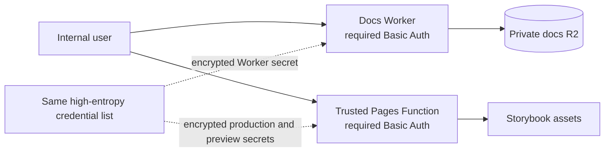

# Security boundaries

[Back to Private Internal Reference Sites](private-docs-site.md#security-boundaries)

- The credential exists only in encrypted Cloudflare bindings. Never put it in OpenTofu, GitHub
  Actions, SSM, an artifact, a command argument, a committed dotenv file, or browser code.
- `docs.voucha.ai` contains only the landing page, OpenAPI, MCP, and PostgreSQL documentation.
- Storybook stays on `pages.dev`; its public-suffix boundary isolates it from Voucha parent-domain
  cookies.
- Hosted PR previews are disabled. PR-controlled JavaScript could imitate a credential prompt and
  capture the shared password even though browser Basic Auth keeps the `Authorization` header
  origin-scoped. PRs retain read-only Storybook build and browser CI without a Pages artifact.
- The production publisher consumes only the current successful main build, rejects Pages control
  files from the artifact, then injects the repository-owned `_worker.js`. The Function removes
  `Authorization` before asset lookup.
- Missing or malformed server configuration returns `503`. Missing or incorrect request
  credentials return a browser Basic Auth challenge. Neither path reads R2 or Pages assets.
- Pages production and the disposable trusted preview canary use `fail_open=false`, so Function
  quota exhaustion cannot expose static assets. Never deploy PR artifacts to the preview environment.
- Basic Auth does not provide MFA, identity-provider audit logs, centralized logout, or individual
  policy revocation. Prefer one high-entropy pair per person in the shared list.
- Saved `vouchington-infra/opentofu/global` plans use enforced PBKDF2-derived AES-GCM encryption. State encryption is
  unchanged. Plan summaries and JSON are temporary runner files and are never artifacts.
