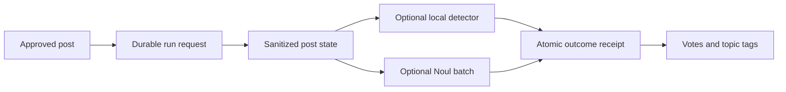

# Post classifier

`@agents/post-classifier` classifies already approved posts and applies automatic topic votes and
tags. It does not decide safety, spam, clearance, review, or publication.

`buildPostClassifierInput` sanitizes and wraps the post state, verifies the exact enabled topic
catalog, and produces one bounded remote Noul request. Local-only configurations make no provider
request. Missing, partial, malformed, duplicate, or catalog-drifted results fail closed.

`executePostClassifierRun` is C5's thin binding onto the shared
[classifier run executor](../classifier-runs/README.md): it supplies the input builder, the local
AI-generated detector and the fixed OpenRouter/Jev client factory, and the executor does the rest.
The client performs shared spend admission before the durable attempt reservation and records a
billed response before decoding. Approval writes a durable classifier-run request; the
`classifier-run-dispatcher` reserves one run before enqueue, the `classifier-run` job revalidates
the approved revision and configuration fingerprint on primary storage, and `completeClassifierRun`
then applies durable votes and tags. A changed revision or configuration supersedes its obsolete run
and reserves the current fingerprint; completed-run replays never make another provider request.

The provider client is built inside the recorded failure path. A missing `OPENROUTER_API_KEY` or
any other construction failure ends the run's remote half as terminal `client-unavailable`,
persists the local detector outcome in the same write, and raises one `classifier_run_alarm` Sentry
message instead of throwing into the queue retry loop; the recovery sweep then leaves the run
alone. Remote-side alarms and run-health alarms are owned going forward by C12 (#225).

