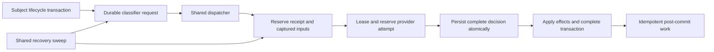

# AI platform

Voucha's fixed classifiers share one durable execution lifecycle. They separate the content being
classified from the candidates being judged, record decisions before applying effects, and reuse
the same receipt when unchanged work is delivered again. Focused recommendation and summary agents
remain separate from this classifier lifecycle.

## Decisions and subjects

[Structured decisions](structured-decisions.md) owns Jev's Noul, Choice and Score primitives and
the explicit TypeSafe or OpenRouter transport selection. The transport makes one attempt and never
switches providers. Noul answers independent questions; Choice assigns probabilities to criteria
in one question; Score returns a native scalar decision. The
[classifier call layer](ai-agents/classifiers/README.md) binds Noul questions or Choice criteria to
concrete candidates. It rejects Score because classifier persistence has no defined scalar
projection for it.

The **subject** is a post or RSS feed item. A **candidate** is a topic, community rule, story or
neighbor considered for that subject; it never replaces the subject in receipt identity. External
content is sanitized and wrapped before entering a prompt. Candidate bindings are explicit, and
every expected candidate must have exactly one valid answer.

| Classifier              | Scope and subject               | Outcome owner                                                                                                                     |
| ----------------------- | ------------------------------- | --------------------------------------------------------------------------------------------------------------------------------- |
| C5 post classifier      | Global, approved post           | [Topic votes and detected labels](ai-agents/post-classifier/README.md); no clearance, review or publication changes               |
| C6 autotagger           | Global, post or RSS feed item   | [Topic relations](ai-agents/autotagger/README.md), without publication changes                                                    |
| C7 `autotagger-agent`   | Global, post or RSS feed item   | [Bounded, add-only reasoning pass](ai-agents/autotagger/README.md#c7-scoped-reasoning-autotagger) over topics paying users follow |
| C8 community moderation | Per community publication, post | [Community rule flags](ai-agents/community-moderation/README.md) and the community's completion-time action                       |
| C9 story clustering     | Global, RSS feed item           | [Story membership](ai-agents/story-clustering/README.md), separate from summary generation                                        |

C6's completion transaction writes C7's durable request. C7 runs on the same shared lifecycle,
adds only topics C6 did not apply, and never overrides existing relations or changes publication.
It is a Jev classifier, not a direct OpenAI reasoning path or an LLM tool loop.

## Receipt, dispatch and recovery

[Classifier runs](services/classifier-runs/README.md) owns one receipt identity:
`(classifier, subject, content hash, configuration hash)`, with community scope included where
applicable. Candidate sets are captured once at reservation and are not part of identity. New
search results cannot mint a second receipt for unchanged content and configuration.

Lifecycle producers record requests in their own transaction and enqueue after commit. The
dispatcher checks readiness and reserves the run; a pending embedding leaves its request pending.
The shared sweep recovers both a lost request enqueue and an unfinished run. All classifiers use
the same lease, reclaim, bounded attempt reservation and terminal-failure machinery; adapters supply
input construction and outcome application rather than another queue or receipt table.

The [executor](ai-agents/classifier-runs/README.md) checks persisted outcomes before input building
or spend admission. Durable outcomes replay without another provider call. It revalidates current
content and configuration before spending; superseded work cannot apply stale effects. Completion
owns transactional effects, while idempotent post-commit hooks recover follow-on dispatches.

The generic call layer can persist several ordered context-window shards under one batch. Current
fixed-classifier execution uses the single-call preparation path: every captured binding is sent in
one request, and an oversized request fails instead of splitting into additional billed calls.
The [persistence contract](structured-decisions.md#classifier-persistence) owns complete candidate
coverage, batch replay, immutable threshold revisions and atomic call/result writes.

## Thresholds and failure behavior

Each decision retains its prompt version, threshold revision and effective lower/upper bounds.
Later configuration edits cannot reinterpret historical results. Topic application maps values
strictly outside those bounds to downvotes or upvotes; the inclusive interval is neutral. Story
membership and community flags have their own outcome rules, described in their owning pages.

Malformed, partial, duplicate or mismatched results fail closed. Provider failures do not invent
votes, labels, joins or moderation actions. Missing credentials, permanent rejection, spend-cap
parking and transient retry use the shared executor's explicit failure paths and attempt cap.

Community moderation alone reads `communities.automod_action` when a run completes: `record_only`
is the default, with `review_queue` and `unpublish` available. Changing this setting never triggers
classification again. Global C5, C6 and C7 remain record-only for publication: they never clear,
review or unpublish content. The [community moderation service](services/community-agent-prompts/README.md)
owns completion-time permissions and effects.

## Provider and removal boundaries

Fixed classifiers use Jev through the structured-decision boundary; the local C5 detector performs
no provider call. The retained focused OpenRouter agents are
[appeal resolution](ai-agents/appeal-resolution/README.md),
[dispute resolution](ai-agents/dispute-resolution/README.md),
[report judgement](ai-agents/report-judgement/README.md) and
[story-post summarization](ai-agents/story-post/README.md). Their terminal provider metadata settles
usage directly, outside the direct OpenAI background-response reconciler.

Copyright email intake, form screening and appeal recommendation are separate agents owned by the
DMCA work; they are not classifiers or part of Epic C. See the
[agent package inventory](ai-agents/README.md) and
[queue processor inventory](queues/ai-agents/README.md) for current exported entrypoints and jobs.
Hosted agent chat, customer support, CRM outreach and Wikipedia recommendation are removed runtime
surfaces. No classifier depends on those surfaces or retains a hosted fallback. Native conversation
transcripts follow their own [storage contract](conversations.md).

## Evidence and measurement

D3's KPI is at most one billed model call per classifier scope, subject content version and
configuration, per community where applicable. Persisted decisions make retry and replay free of
another call. This is a receipt-level target, not a claim about queue job counts or exactly-once
remote billing: a crash after billing and before persistence can consume another capped attempt.

The [call-efficiency report](services/classifier-runs/README.md#call-efficiency-d3-kpi), implemented by
[`classifier-call-efficiency.mts`](../../../backend/scripts/classifier-call-efficiency.mts), reads
durable requests, runs, attempts, decisions and the AI usage ledger for a bounded reservation
window. It reports calls, retries, content/configuration changes, cost and latency; unfinished work
makes an otherwise unbreached window inconclusive, and unpriced calls make cost a floor. Deployed
figures are tracked in [#1804](https://github.com/vouchington/vouchington/issues/1804); this overview
publishes no figures.

Measurement limits remain explicit:

- Replays have no durable counter, so replay frequency cannot be inferred from job counts.
- Crash-after-billing retries can exceed one call per receipt within the attempt cap.
- Community dry runs bill as `community-moderation-dry-run`, outside the per-receipt report.
- Subject foreign keys use `ON DELETE CASCADE`; deleting a subject removes its runs from later
  receipt reports even though usage remains in the ledger without that receipt attribution.

C12's [receipt-health instrumentation](services/classifier-runs/README.md#receipt-health) monitors
old pending requests, unfinished runs, unrequested eligible subjects and terminal failures. Alarm
payloads contain only bounded identifiers and diagnostic counts, never prompt or content text.

The [credentialed golden regression set](ai-agents/classifiers/README.md#credentialed-golden-regression-set)
checks fixed synthetic inputs through production prompts, bindings and threshold snapshots. It
asserts complete candidate coverage and expected decision bands with reviewed tolerance, and
records provider call count and elapsed time. It is neither calibration nor a quality evaluation.

## Schema and client handoff

The [generated schema snapshot](../../development/postgresql/schema-snapshot/README.md) records the
current receipt, batch, candidate and result relations. Shared API contracts are generated into
[`api-fixtures/v1`](../../development/testing/backend/api-fixtures.md). The
[client parity matrix](../../requirements/CLIENT-PARITY-MATRIX.md) owns producer-first staging and
linked Swift/.NET consumption, including community automod actions and classifier threshold
management. These changes use one current prelaunch contract; no historical reader or hosted-agent
compatibility path is retained. This documentation change alters no API or client contract.
