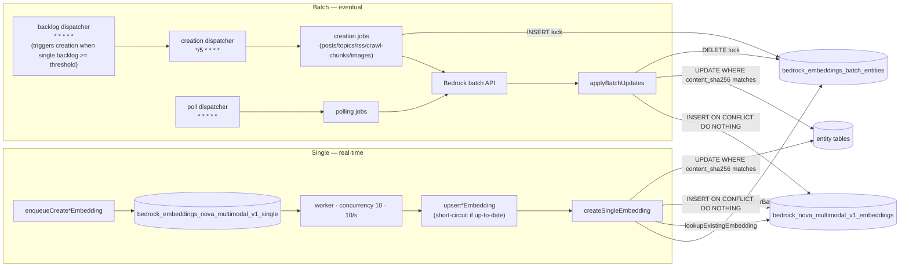
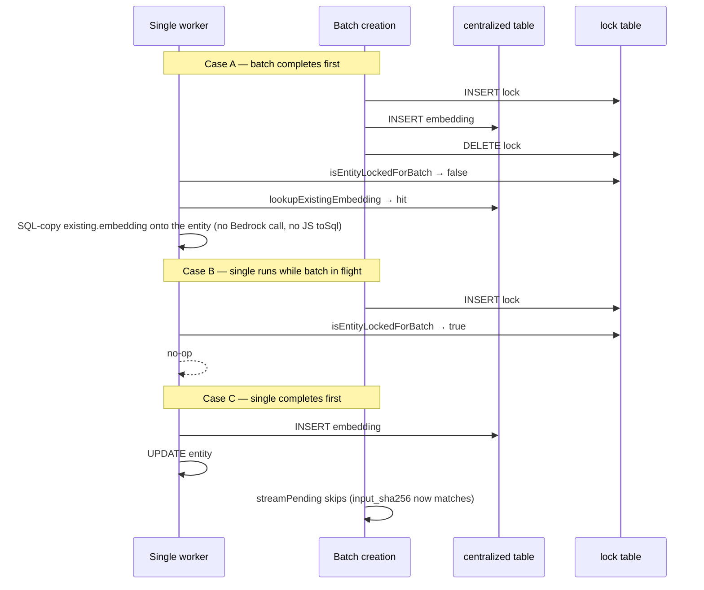

# Bedrock Embeddings Pipeline

`Amazon Nova 2 Multimodal Embeddings V1` embeddings are generated through two complementary pipelines. The **single pipeline** handles real-time text requests so that posts, topics, and RSS feed items have embeddings available immediately after creation. The **batch pipeline** uses the Bedrock batch API for eventual consistency and covers all entity types, including crawl chunks and moderated images. Text embeddings share a centralized deduplication table keyed on `content_sha256`, write with `INSERT ... ON CONFLICT DO NOTHING`, and guard entity-row updates with a `content_sha256` check so stale writes silently no-op. A Valkey Bloom filter gates negative text lookups against the centralized table for efficiency. Cache-hit reuse SQL-copies `existing.embedding`. The Bedrock miss path accepts only a 1,024-element array of finite numbers (`requireDenseEmbedding`) and throws `UnrecoverableError` otherwise so malformed provider JSON does not become retryable COPY or `pgvector.toSql` work.

## Dual Pipeline Architecture

## Race Outcomes

## Entity Types and Pipelines

| Entity Type     | Single Pipeline | Batch Pipeline | Latency Expectation                  |
| --------------- | --------------- | -------------- | ------------------------------------ |
| `post`          | Yes             | Yes (updates)  | Real-time on creation; batch on edit |
| `topic`         | Yes             | Yes (updates)  | Real-time on creation; batch on edit |
| `rss_feed_item` | Yes             | Yes (updates)  | Real-time on creation; batch on edit |
| `crawl_chunk`   | No              | Yes            | Minutes to hours                     |
| `image`         | No              | Yes            | Minutes to hours                     |

## Batch Minimum Size

AWS Bedrock batches require at least `min_records_per_job` records per job (default 100, configurable in the `bedrock-embeddings-batch-config` Dynamic Config namespace). When a creation cycle streams fewer than the minimum, the batch **defers** — nothing is submitted, and the next `creation_dispatcher` cycle (every 5 minutes) re-streams pending entities until the minimum is met. The batch pipeline is only used for entity updates (and as the sole path for `crawl_chunk` / `image`), so waiting is correct: real-time creation flows already cover the user-visible path through the single pipeline.

## Depth-Driven Creation Trigger

The `backlog_dispatcher` runs every minute and reads the single-queue depth (`waiting + active`) via `getQueueStats`. When depth meets or exceeds `backlog_threshold` (default 1000, configurable in the `bedrock-embeddings-batch-config` Dynamic Config namespace), it enqueues an extra `creation_dispatcher` so a fresh batch is built well before the next 5-minute tick. This shortens the worst-case time-to-first-batch when a bulk import dumps a large pile of single-embedding jobs.

## Downstream Consumers

- **Story clustering** — both pipelines fan out `enqueueStoryClustering` after writing an `rss_feed_item` embedding. See [docs/requirements/content/stories.md](../../requirements/content/stories.md) for the clustering algorithm and trigger sources.

## Infrastructure

Bedrock access is role-based in ECS. `vouchington-infra` OpenTofu creates the backend and worker Bedrock invoke permissions, the worker batch-job permissions, and the dedicated `bedrock_batch` role that Amazon Bedrock assumes for S3 input/output. The batch role reads and writes a dedicated `voucha-bedrock-batch-{env}` bucket, region-pinned to `var.bedrock_region` (us-east-1) so the batch job and its S3 I/O bucket satisfy Bedrock's same-region requirement — see the infrastructure sources (the private `vouchington-infra` repository). Operators still need to enable `Amazon Nova 2 Multimodal Embeddings V1` model access in the Bedrock console for `us-east-1`.

## Related

- [backend/services/bedrock-embeddings/README.md](../../../backend/services/bedrock-embeddings/README.md) — Dedup contract, centralized table, bloom filter, testing
- [backend/queues/bedrock-embeddings/README.md](../../../backend/queues/bedrock-embeddings/README.md) — Real-time single pipeline queue config and processors
- [backend/queues/bedrock-embeddings-batch/README.md](../../../backend/queues/bedrock-embeddings-batch/README.md) — Batch pipeline schedulers, ordering lanes, and processors
- [Backend rules](../../../backend/CLAUDE.md) — workspace service and data conventions
- [AI Agents rules](../../../backend/agents/CLAUDE.md) — agent patterns and tool loop design
- [Backend services rules](../../../backend/services/CLAUDE.md) — mocking policy for external API calls
