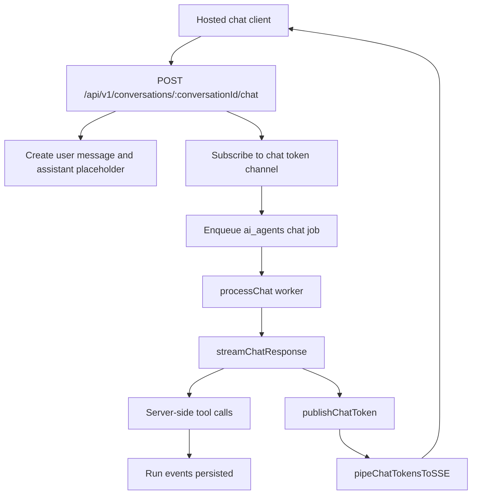
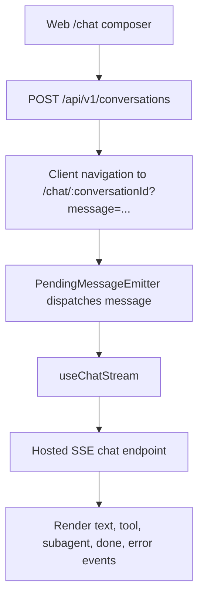
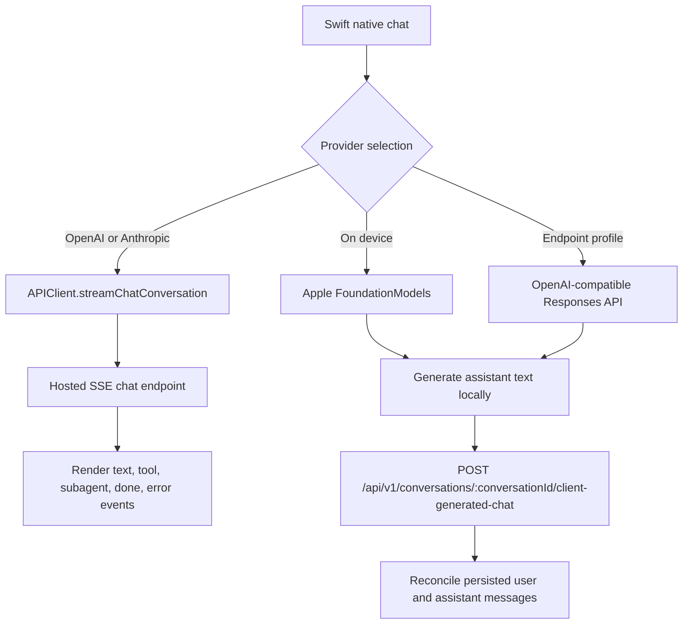
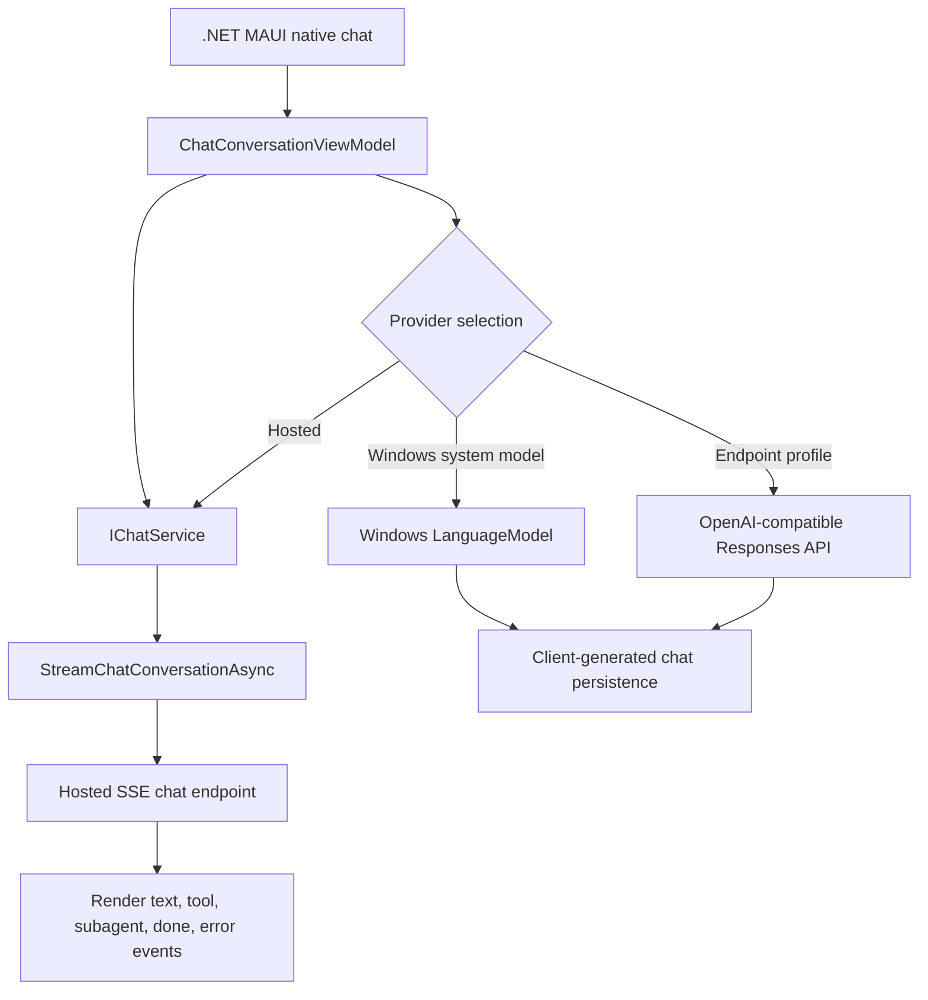

# Conversations

LLM agentic chat sessions where users interact with AI agents. Each conversation contains messages (user and assistant) and tracks agentic runs that execute tool calls.

## Data Model

| Table                                      | Partitioning                                                            | Description                                                       |
| ------------------------------------------ | ----------------------------------------------------------------------- | ----------------------------------------------------------------- |
| `conversations`                            | Not partitioned                                                         | Chat sessions with title, creator, optional post/RSS item context |
| `conversation_messages`                    | RANGE by UUIDv7 `conversation_id`                                       | User and assistant messages with JSON content                     |
| `conversation_message_agentic_runs`        | RANGE by `id` (monthly partition drop)                                  | LLM execution runs tracking model, lifecycle timestamps, I/O      |
| `conversation_message_agentic_runs_events` | RANGE by `conversation_message_agentic_run_id` (monthly partition drop) | Individual tool calls and model responses within a run            |

### Retention

Agentic runs and their events use monthly RANGE partitions. `cleanupPartitions` drops whole expired
partitions rather than row-deleting them, avoiding write amplification. The configured 30-day
retention therefore yields an approximate 30–61-day effective window rather than an exact per-row
cutoff; see the canonical [PostgreSQL Partitioning Strategy](partitioning-strategy.md). Conversations
and messages are retained indefinitely.

## Hosted Message Flow

1. User sends a message, creating a `conversation_message` with `{ role: 'user', content: string }`
2. An assistant message placeholder is created with `{ role: 'assistant', content: null }`
3. The API route subscribes to the assistant message's Valkey token channel, then enqueues a `chat` job
4. The worker creates a `conversation_message_agentic_run`, calls the hosted model, executes server-side tools, and publishes stream chunks
5. The API route pipes Valkey token chunks to the client as SSE events
6. Each tool call and model response within the run is recorded as a `conversation_message_agentic_runs_event`
7. The run completes with a termination reason: `no_tool_calls`, `max_topics`, `max_iterations`, `stalled`, or `error`; display status is derived from `completed_at`/`failed_at`

## Client Flows

## SSE Streaming

Hosted chat responses are streamed as Server-Sent Events through `pipeChatTokensToSSE` after the
worker publishes token chunks with `publishChatToken`:

- `event: metadata` -- conversation and message IDs
- `event: text` -- incremental text content
- `event: tool_call` -- agent invoking a tool
- `event: tool_result` -- tool execution result
- `event: subagent_step` -- a subagent tool step
- `event: subagent_text` -- child stream text emitted by a subagent
- `event: done` -- stream complete
- `event: error` -- error occurred

## Tool Calls By Client

| Client path   | Transport                                | Where tools run            | Notes                                                                                                                         |
| ------------- | ---------------------------------------- | -------------------------- | ----------------------------------------------------------------------------------------------------------------------------- |
| Web hosted    | `/chat` SSE API                          | Backend hosted chat worker | Web renders streamed `tool_call`, `tool_result`, and subagent events.                                                         |
| Swift hosted  | `/chat` SSE API                          | Backend hosted chat worker | Same hosted backend path as web; Swift renders streamed events.                                                               |
| Swift local   | `/client-generated-chat` persistence API | Not run today              | Foundation Models or an endpoint profile generates text, then the client persists the completed turn.                         |
| .NET hosted   | `/chat` SSE API                          | Backend hosted chat worker | Same hosted backend path as web; .NET renders streamed events.                                                                |
| .NET local    | `/client-generated-chat` persistence API | Not run today              | Windows LanguageModel or an endpoint profile generates text, then the client persists the completed turn.                     |
| Android local | `/client-generated-chat` persistence API | Not run today              | ML Kit Prompt API generates text on device; the signed-in persistence integration remains part of the Android client rollout. |
| MCP clients   | `/api/v1/mcp` Streamable HTTP JSON-RPC   | MCP tools service          | Available for external MCP clients with `mcp` API keys; native chat does not use MCP.                                         |

First-party native local agents should use REST/API calls derived from `backend/tools/manifest.json`
for client-surface tools rather than runtime MCP. See [Agent Tools](agent-tools/README.md).

## Context Links

Conversations can be linked to entities for contextual lookup:

- `post_id` -- conversation about a specific post
- `rss_feed_id` + `rss_feed_item_guid` -- conversation about an RSS feed item

## Related Services

- [Backend rules](../../../backend/CLAUDE.md) — service and data conventions
- [Web rules](../../../web/CLAUDE.md) — UI and routing conventions

- [backend/services/conversations-messages/README.md](../../../backend/services/conversations-messages/README.md) -- CRUD, streaming, agentic run queries
- [backend/agents/chat/README.md](../../../backend/agents/chat/README.md) -- chat agent that processes messages and executes tool calls
- [backend/api/v1/conversations/README.md](../../../backend/api/v1/conversations/README.md) -- API endpoints
- [backend/queues/psql/README.md](../../../backend/queues/psql/README.md) -- partition cleanup jobs
