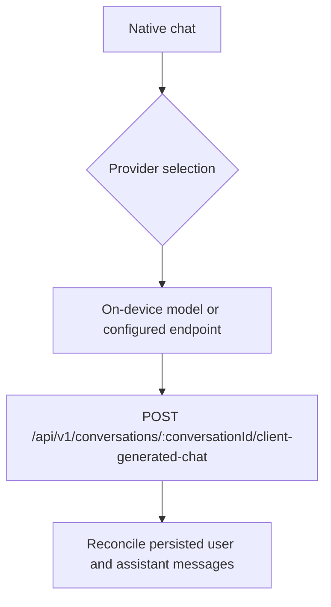

# Conversations

Conversations are durable transcript records shared between a member's native devices. The hosted
web chat interface has been removed. Native clients generate assistant responses locally or through
their configured endpoint, then persist completed turns through the transcript API.

## Data Model

| Table                                      | Partitioning                                                            | Description                                                       |
| ------------------------------------------ | ----------------------------------------------------------------------- | ----------------------------------------------------------------- |
| `conversations`                            | Not partitioned                                                         | Chat sessions with title, creator, optional post/RSS item context |
| `conversation_messages`                    | RANGE by UUIDv7 `conversation_id`                                       | User and assistant messages with JSON content                     |
| `conversation_message_agentic_runs`        | RANGE by `id` (monthly partition drop)                                  | LLM execution runs tracking model, lifecycle timestamps, I/O      |
| `conversation_message_agentic_runs_events` | RANGE by `conversation_message_agentic_run_id` (monthly partition drop) | Individual tool calls and model responses within a run            |

### Retention

Agentic runs and their events use monthly RANGE partitions. `cleanupPartitions` drops whole expired
partitions rather than row-deleting them, avoiding write amplification. The configured 30-day
retention therefore yields an approximate 30–61-day effective window rather than an exact per-row
cutoff; see the canonical [PostgreSQL Partitioning Strategy](partitioning-strategy.md). Conversations
and messages are retained indefinitely.

## Native Client Flow

The transitional hosted streaming route and agentic-run records remain only until native client
migrations complete. They are not a web product surface and must not gain new web consumers.

Native clients use REST/API calls derived from `backend/tools/manifest.json` for client-surface
tools rather than runtime MCP. See [Agent Tools](agent-tools/README.md).

## Context Links

Conversations can be linked to entities for contextual lookup:

- `post_id` -- conversation about a specific post
- `rss_feed_id` + `rss_feed_item_guid` -- conversation about an RSS feed item

## Related Services

- [Backend rules](../../../backend/CLAUDE.md) — service and data conventions
- [Web rules](../../../web/CLAUDE.md) — UI and routing conventions

- [backend/services/conversations-messages/README.md](../../../backend/services/conversations-messages/README.md) -- CRUD, streaming, agentic run queries
- [backend/agents/chat/README.md](../../../backend/agents/chat/README.md) -- chat agent that processes messages and executes tool calls
- [backend/api/v1/conversations/README.md](../../../backend/api/v1/conversations/README.md) -- API endpoints
- [backend/queues/psql/README.md](../../../backend/queues/psql/README.md) -- partition cleanup jobs
