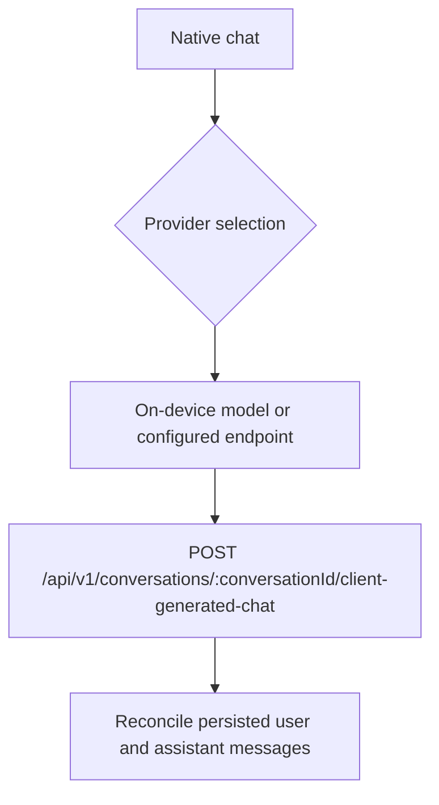

# Conversations

Conversations are durable transcript records shared between a member's native devices. The hosted
web chat interface has been removed. Native clients generate assistant responses locally or through
their configured endpoint, then persist completed turns through the transcript API.

## Data Model

| Table                   | Partitioning                      | Description                                                       |
| ----------------------- | --------------------------------- | ----------------------------------------------------------------- |
| `conversations`         | Not partitioned                   | Chat sessions with title, creator, optional post/RSS item context |
| `conversation_messages` | RANGE by UUIDv7 `conversation_id` | User and assistant messages with JSON content                     |

### Retention

Conversations and messages are retained indefinitely and have no monthly retention partitions; see
the canonical [PostgreSQL Partitioning Strategy](partitioning-strategy.md). There is no separate
execution-run storage: a persisted assistant message carries its completion model as JSON
(`model_provider`, `model_name`) beside the opaque turn fingerprint.

## Native Client Flow

```mermaid
flowchart TD
  input[Native chat] --> selection{Provider selection}
  selection --> local[On-device model or configured endpoint]
  local --> persist[POST /api/v1/conversations/:conversationId/client-generated-chat]
  persist --> reconcile[Reconcile persisted user and assistant messages]
```

The public transcript DTOs expose conversation identity, title and timestamps, and message identity,
content, timestamps and completion (`completed`, `incomplete`, or `failed`). They omit execution
identities and stored error diagnostics. A submitted turn uses the client's ordered UUIDv7
`user_message_id` and `assistant_message_id`, scoped to its conversation, as its identity. Clients persist both IDs before sending
and reuse them with identical text on retries. The existing message primary key and a conversation
row lock make duplicate submissions return the original pair atomically; changed content or partial
identity reuse returns 409, as does a retry that names a different `model_provider` or
`model_name`. Both stored message JSON values carry an opaque SHA-256 fingerprint of the ordered ID
pair, so recombining messages from separate turns also conflicts. The stored assistant JSON also
records the completion `model_provider` and `model_name`. The fingerprint and model metadata are
omitted from public DTOs. A turn is never rejected because the conversation holds an incomplete
assistant placeholder; incomplete placeholders remain readable in history.

The shared decode examples are generated under `api-fixtures/v1/responses/native.chat.*.json` for
Swift, Android, .NET and web; clients adopt them through clients#149 and clients#150 independently.

The hosted streaming route, its `chat` and `reconcile-chat-runtime-generations` queue jobs, the
Valkey token channel, and the stale-run reconciler are removed
([A6a, #1542](https://github.com/vouchington/vouchington/issues/1542)), so
`POST /api/v1/conversations/:conversationId/chat` returns 404. The agentic-run tables and their
services are removed ([A6, #185](https://github.com/vouchington/vouchington/issues/185)).
The chat orchestrator, its research, discovery and profile subagents, and the streaming tool loop are
removed ([A4b, #183](https://github.com/vouchington/vouchington/issues/183)). Under decision D1,
server removal proceeds without waiting on native client migrations; clients adopt independently.
These retained paths are not a web product surface and must not gain new web consumers.

Native clients use REST/API calls derived from `backend/tools/manifest.json` for client-surface
tools rather than runtime MCP. See [Agent Tools](agent-tools/README.md).

## Context Links

Conversations can be linked to entities for contextual lookup:

- `post_id` -- conversation about a specific post
- `rss_feed_id` + `rss_feed_item_guid` -- conversation about an RSS feed item

## Related Services

- [Backend rules](../../../backend/AGENTS.md) — service and data conventions
- [Web rules](../../../web/AGENTS.md) — UI and routing conventions

- [docs/overview/architecture/services/conversations-messages/README.md](services/conversations-messages/README.md) -- conversation and message CRUD, client-generated turns
- [docs/requirements/api/v1/conversations/README.md](../../requirements/api/v1/conversations/README.md) -- API endpoints
- [docs/overview/architecture/queues/psql/README.md](queues/psql/README.md) -- partition cleanup jobs
