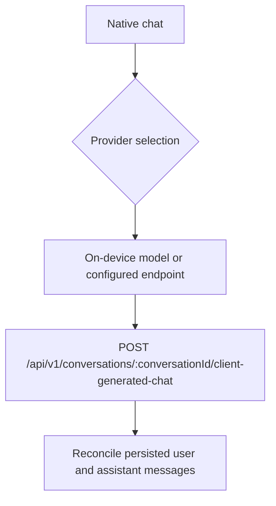

# Conversations

Conversations are durable transcript records shared between a member's native devices. The hosted
web chat interface has been removed. Native clients generate assistant responses locally or through
their configured endpoint, then persist completed turns through the transcript API.

## Data Model

| Table                                      | Partitioning                                                            | Description                                                       |
| ------------------------------------------ | ----------------------------------------------------------------------- | ----------------------------------------------------------------- |
| `conversations`                            | Not partitioned                                                         | Chat sessions with title, creator, optional post/RSS item context |
| `conversation_messages`                    | RANGE by UUIDv7 `conversation_id`                                       | User and assistant messages with JSON content                     |
| `conversation_message_agentic_runs`        | RANGE by `id` (monthly partition drop)                                  | LLM execution runs tracking model, lifecycle timestamps, I/O      |
| `conversation_message_agentic_runs_events` | RANGE by `conversation_message_agentic_run_id` (monthly partition drop) | Individual tool calls and model responses within a run            |

### Retention

Agentic runs and their events use monthly RANGE partitions. `cleanupPartitions` drops whole expired
partitions rather than row-deleting them, avoiding write amplification. The configured 30-day
retention therefore yields an approximate 30–61-day effective window rather than an exact per-row
cutoff; see the canonical [PostgreSQL Partitioning Strategy](partitioning-strategy.md). Conversations
and messages are retained indefinitely.

## Native Client Flow

```mermaid
flowchart TD
  input[Native chat] --> selection{Provider selection}
  selection --> local[On-device model or configured endpoint]
  local --> persist[POST /api/v1/conversations/:conversationId/client-generated-chat]
  persist --> reconcile[Reconcile persisted user and assistant messages]
```

The public transcript DTOs expose conversation identity, title and timestamps, and message identity,
content, timestamps and completion (`completed`, `incomplete`, or `failed`). They omit provider
response chaining, execution identities and stored error diagnostics. A submitted turn uses the client's ordered UUIDv7
`user_message_id` and `assistant_message_id`, scoped to its conversation, as its identity. Clients persist both IDs before sending
and reuse them with identical text on retries. The existing message primary key and a conversation
row lock make duplicate submissions return the original pair atomically; changed content or partial
identity reuse returns 409. Generation provider details remain internal run metadata and do not
appear in transcript responses. Incomplete stored assistant placeholders remain readable in history.

The shared decode examples are generated under `api-fixtures/v1/responses/native.chat.*.json` for
Swift, Android, .NET and web; clients adopt them through clients#149 and clients#150 independently.

The transitional hosted streaming route and agentic-run records remain only until native client
migrations complete. They are not a web product surface and must not gain new web consumers.

Native clients use REST/API calls derived from `backend/tools/manifest.json` for client-surface
tools rather than runtime MCP. See [Agent Tools](agent-tools/README.md).

## Context Links

Conversations can be linked to entities for contextual lookup:

- `post_id` -- conversation about a specific post
- `rss_feed_id` + `rss_feed_item_guid` -- conversation about an RSS feed item

## Related Services

- [Backend rules](../../../backend/AGENTS.md) — service and data conventions
- [Web rules](../../../web/AGENTS.md) — UI and routing conventions

- [docs/overview/architecture/services/conversations-messages/README.md](services/conversations-messages/README.md) -- CRUD, streaming, agentic run queries
- [docs/overview/architecture/ai-agents/chat/README.md](ai-agents/chat/README.md) -- chat agent that processes messages and executes tool calls
- [docs/requirements/api/v1/conversations/README.md](../../requirements/api/v1/conversations/README.md) -- API endpoints
- [docs/overview/architecture/queues/psql/README.md](queues/psql/README.md) -- partition cleanup jobs
