# Feeds

Personalized post and RSS feed item feeds for logged-in users. Feeds are filtered by the user's follow graph, mute/block lists, and vote scores. Posts support both chronological (`sort=new`) and trending (`sort=hot`) ordering.

## Query Pipeline

Both `getPostFeedIds` and `getRssFeedItemFeedIds` build one large CTE chain in the same shape — relation CTEs, then an eligible-entity CTE, then delivery CTEs unioning direct-follow and shared deliveries. The RSS item pipeline mirrors the post pipeline but has no hot-sort branch; it is always ordered chronologically.

```mermaid
flowchart TD
    subgraph Posts["Post feed - getPostFeedIds (sort=new default, or hot)"]
        PR["Relation CTEs: followed_users/topics, excluded_users/topics, hidden_posts, excluded_hostname_ids"] --> PE
        PE["eligible_posts CTE: visibility, mute/block, hostname block, post_type, search filters"] --> PDirect
        PE --> PShared
        PDirect["direct_candidate_posts -> direct_posts (follow-match via followed_users/topics)"] --> PCombined
        PShared["shared_posts (post_feed_shares JOIN eligible_posts)"] --> PCombined
        PCombined["combined_posts = direct_posts UNION ALL shared_posts"] --> PSort
        PSort{"sort=hot or sort=new?"}
        PSort -- hot --> PHot["ORDER BY hot_score DESC (3-day half-life)"]
        PSort -- new --> PNew["ORDER BY sort_at DESC"]
        PHot --> PCursor
        PNew --> PCursor
        PCursor["LIMIT+1 -> page_info (opaque cursor: score|timestamp + id)"]
    end

    subgraph RSS["RSS item feed - getRssFeedItemFeedIds (mirrors post pipeline)"]
        RR["Relation CTEs: followed_rss_feeds/topics, excluded_*, hidden_items, excluded_hostname_ids"] --> RE
        RE["eligible_rss_feed_items CTE: source-enabled, mute/block, hostname block, search filters"] --> RDirect
        RE --> RShared
        RDirect["direct_candidate_rss_feed_items -> direct_rss_feed_items"] --> RCombined
        RShared["shared_rss_feed_items (rss_feed_item_feed_shares JOIN eligible items)"] --> RCombined
        RCombined["combined_rss_feed_items = UNION ALL"] --> RFinal
        RFinal["eligible direct-story winner plus independent shares -> cursor/order -> LIMIT+1"]
    end
```



## Feed Types

| Entity Type    | Feed Type          | Description                                                                                                                                                      |
| -------------- | ------------------ | ---------------------------------------------------------------------------------------------------------------------------------------------------------------- |
| Posts          | `follow_users`     | Posts by users the current user follows                                                                                                                          |
| Posts          | `follow_topics`    | Posts with a related topic the current user follows (`votes_score_net > 0` on the category relation; vote-stats recompute is async after `upsertEntityRelation`) |
| Posts          | `any`              | Union of the above (default)                                                                                                                                     |
| Posts          | `all`              | Intersection: must match both follow_users and follow_topics                                                                                                     |
| RSS Feed Items | `follow_rss_feeds` | Items from RSS feeds the current user follows                                                                                                                    |
| RSS Feed Items | `follow_topics`    | Items with a category/related topic the current user follows                                                                                                     |
| RSS Feed Items | `any`              | Union of the above (default)                                                                                                                                     |
| RSS Feed Items | `all`              | Intersection of the above                                                                                                                                        |

## Filtering

- **Post types**: Filter by discussion, review, article, etc. The default feed excludes `article`, `comment`, and `topic_recommendation` post types. Articles are staff-created content and do not appear in user feeds by default — they are browsable at `/articles`. Comments only show from followed users.
- **Minimum vote score**: Separate thresholds per source (e.g. `min_score_follow_users` defaults to -5, `min_score_follow_topics` defaults to 0).
- **Time range**: `1d`, `1w` (default), `1m`, `1y`, `all`.
- **Privacy**: `buildViewerPostDiscoveryEligibilityFilter` applies canonical candidate/root eligibility plus discovery-only archived-content and suspended-author exclusions.
- **Hidden content**: Posts/items related to muted or blocked topics, users, or RSS feeds are excluded.
- **RSS-specific**: `appendRssFeedItemEligibilityFilters` owns the shared item predicate for direct and shared delivery paths: nondeleted item, at least one active/nondeleted source that is not muted or publisher-topic-excluded, hidden/topic/hostname exclusions, related-post, media, text, source-topic, and hashtag filters. A `topic_ids` source match itself must be active and nondeleted, so an item with an unrelated active source cannot pass through a disabled or deleted matching source. This intentionally does not require global discoverability: users can still receive items from feeds they follow when those feeds are hidden from public discovery. `has_related_posts` shows only items with/without linked discussion posts.
- **Community scope**: Authenticated News Feed and Posts Feed pages accept a `community` query
  parameter. For Posts Feed, the community's active topic list replaces the viewer's followed topic
  scope. For News Feed, the community's active RSS feed and topic lists replace the viewer's followed
  source/topic scope. The dropdown is populated from communities the viewer is an active member of
  or proxy-follows and only includes communities that can source the selected feed.
- **RSS suppression (global feed only)**: Items whose every source feed is globally suppressed — either by admin flag or because the owning topic's `votes_score_net` is below the global threshold — are hidden from the global feed. Personal feeds are **not** filtered this way: users who follow a suppressed feed still see items in their personal feed. See [Admin Suppression](../../../backend/services/rss-feeds/README.md) for threshold configuration.

## Share Actions

Users can share posts or RSS feed items with their followers. Share requests persist a bounded follower-distribution intent and workers fan it out in chunks to `post_feed_shares` and `rss_feed_item_feed_shares`. Only public, broadly-visible posts can be shared, users cannot share their own posts, and shared post deliveries still respect the post's current broadcast audience if the creator later tightens visibility.

## Post Feed Sort Options

- `sort=new` (default) — chronological descending. Cursor encodes `{ timestamp: number, id: string }`.
- `sort=hot` — exponential time-decay ranking with a 3-day half-life. Higher-scored recent posts rank above older high-score posts. Cursor encodes `{ score: number, id: string }`. Search, feeds, and trending posts share the canonical [hot-score builder](../../../backend/modules/feed-query-builders/README.md#hot-score), including its future-timestamp handling.

## Pagination

Cursor-based pagination with opaque base64-encoded cursors (industry standard: GraphQL Relay, GitHub API, Stripe).

- Cursor structure varies by sort: `{ timestamp: number, id: string }` for `sort=new`, `{ score: number, id: string }` for `sort=hot`
- Use `after` parameter with `page_info.end_cursor` to get the next page
- Check `page_info.has_next_page` before fetching
- Limit: 1-100 (default 25)

## API Endpoints

```
GET /api/v1/feeds/posts/:feed_type?sort=new&limit=25&after=<cursor>
GET /api/v1/feeds/posts/:feed_type?sort=hot&limit=25&after=<cursor>
GET /api/v1/feeds/rss_feed_items/:feed_type?limit=25&after=<cursor>
GET /api/v1/communities/:idOrSlug/news?limit=25&after=<cursor>
```

## Performance Notes

- Feed queries generate 600+ plan nodes due to CTE chains, broadcast/privacy subqueries, and partition scans.
- PostgreSQL JIT compilation can dominate execution time at these plan sizes (JIT is disabled during profiling).
- `relation__user__*` tables use plain B-tree indexes, so privacy filter lookups hit a single index scan. They were previously hash-partitioned (HASH partitioning is now forbidden repo-wide) and de-partitioned after this caused broadcast checks to fan out across all 8 partitions — see [entity-relations.md](entity-relations.md#table-structure), [partitioning-strategy.md](partitioning-strategy.md), and the measured incident in [feeds/README.md#performance](../../../backend/services/feeds/README.md#performance).
- The post feed composes viewer-aware publication eligibility once per candidate and resolved root.
- Feed services share common eligibility CTEs across direct and shared deliveries to avoid repeating the same mute/block/visibility anti-joins.
- RSS feed pagination uses the `LIMIT + 1` pattern instead of a full-window row count so `has_next_page` does not require counting the full candidate set.

## Story Clustering

RSS feed items are grouped into stories — first-class entities representing a single news event covered by multiple outlets. The `@story-teller` agent decides whether to cluster using heuristics (e.g., rumors ≠ announcements). Eligibility filters run before selecting one direct representative: official first, then highest vote score, then ID. Share deliveries remain independent events. The resulting canonical rows are cursor-filtered and paginated, so a story cannot recur on a later page. See [stories.md](../../requirements/content/stories.md) for full details.

## Related Services

- [backend/services/feeds/README.md](../../../backend/services/feeds/README.md) -- feed query logic and share actions
- [backend/modules/feed-query-builders/README.md](../../../backend/modules/feed-query-builders/README.md) -- shared visibility, filtering, and hot-score SQL fragments
- `backend/services/posts/privacy-filter.mts` -- generic `buildPrivacyFilter` SQL builder
- [backend/services/entity-relations/README.md](../../../backend/services/entity-relations/README.md) -- follow/mute/block relationships that drive feed filtering
- [backend/api/v1/feeds/README.md](../../../backend/api/v1/feeds/README.md) -- API route handlers
- [docs/requirements/community/community-lists.md](../../requirements/community/community-lists.md) -- community list feed scopes
- [Backend rules](../../../backend/CLAUDE.md) -- pagination, transaction, and service conventions
- [Web rules](../../../web/CLAUDE.md) -- feed list components and infinite-scroll patterns
