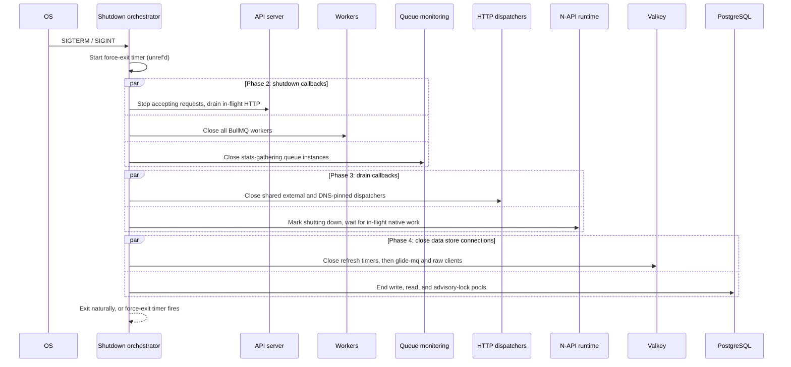

# Graceful Shutdown

Backend processes shut down in a strict sequence when they receive `SIGTERM` or `SIGINT`. The orchestrator lives in `backend/data-stores/graceful-shutdown/index.mts`.

## Shutdown Sequence

The orchestrator drives each phase in order, running every callback within a phase in parallel:

PostgreSQL closes all three lazily populated pools. Their combined maxima describe a worst-case
per-process connection budget, not connections reserved at process start.

## Registration APIs

| Function                               | Purpose                                                                      |
| -------------------------------------- | ---------------------------------------------------------------------------- |
| `addGracefulShutdownCallback(fn)`      | Phase 2 — stop accepting work and finish in-flight requests                  |
| `addGracefulShutdownDrainCallback(fn)` | Phase 3 — close/drain subsystems that must wait for in-flight work to finish |

Entry points register their shutdown logic at startup:

- **Server** (`backend/entrypoints/api/serve.mts`): registers HTTP terminator callback + N-API drain
- **Worker** (`backend/entrypoints/worker/serve.mts`): registers worker close callback + N-API drain
- **Dev** (`backend/dev.mts`): registers HTTP terminator callback; imports worker/serve.mts for worker + N-API drain

Valkey concern packages self-register with `@data-stores/graceful-shutdown` on import, so loading
`@data-stores/valkey-pubsub`, `@data-stores/valkey-rate-limiter`, or
`@data-stores/valkey-glide-mq` is enough to wire their shutdown cleanup without importing the
`@data-stores/valkey` barrel.

## One-Off Commands

One-off entrypoints that must make successful cleanup part of their result contract use
`shutdownDataStoresForOneOffCommand()`. Unlike signal shutdown's best-effort reporting, this path
is quiet and rejects with every Valkey/PostgreSQL close failure after attempting both stores. Its
force-exit timer stays referenced while cleanup is pending, so an unresolved close is bounded; it
becomes unref'd after cleanup settles and fires only when a residual native handle prevents natural
termination. Any force-exit is nonzero: even after cleanup succeeds, a residual handle is not a
clean one-off termination. The Valkey admin command emits completed operation evidence before
starting strict shutdown, so a cleanup failure cannot hide a destructive operation and invite an
unsafe retry.

## N-API Runtime Drain

The Rust N-API packages (`@jongleberry/vurst-markdown`, `@jongleberry/vurst-html`, and `@jongleberry/vurst-ai`) wrap all native function calls in a shared TypeScript runtime that tracks in-flight promises. During shutdown:

1. `beginNativeAddonShutdown()` — marks the runtime as shutting down; new native calls throw immediately
2. `waitForNativeAddonWorkToDrain()` — resolves once all in-flight native promises settle

This prevents V8/N-API teardown crashes where native completion callbacks fire after Node.js has started destroying the JS environment.

## Rules

- **Never call `process.exit()` or `process.kill()` in runtime code.** Use `addGracefulShutdownCallback` or call `onGracefulShutdown` directly for fatal errors.
- **The force-exit timer is the only place `process.exit()` is allowed.** It handles NAPI handles (e.g. `@glidemq/speedkey` threadsafe functions) that keep the event loop alive after all JS connections close.
- **Do not use `process.emit('SIGTERM')`** — banned by Oxlint's restricted process lifecycle rules.

## Test Teardown

In Vitest, `vitest.setup.data-stores.mts` runs a simplified teardown: drain N-API work, then close data store connections via `gracefulShutdown()`. No signal handlers or callbacks are involved. This close is also the only socket-leak tripwire for tests — `setup()` opens Valkey/PSQL/glide-mq in the main process, so a leaked handle blocks a clean exit.

The forks-pool `teardownTimeout` (`vitest.config.mts`, root/global-only) bounds this close plus pool/worker shutdown. Under self-hosted-runner CPU contention the close occasionally missed the previous 5s budget and was force-killed mid-teardown, which the forks pool then misreported as a worker crash (#8259) — see [CI Reference § Classifying Transient Infrastructure Failures](../../development/ci.md#classifying-transient-infrastructure-failures). `teardownTimeout` is now `20_000` for contention headroom; a genuine hang still force-kills at that ceiling. Each phase (`queues`, `native-drain`, `data-stores`) emits `[vitest-teardown] phase=… start/done ms=…` timing, and a real trip additionally emits a `[vitest-teardown-overrun]` process/handle snapshot from `onProcessTimeout()` (`test-helpers/vitest-teardown-overrun-diagnostics.mts`) — both CI-gated and both using vocabulary the transient-retry classifier never reads as a failure.

## Fork-Side Leak Detection

The tripwire above only covers `globalSetup`'s `teardown()` in the main process — it says nothing about a handle a **test** leaks inside a forks-pool fork (`pool: 'forks'`, `isolate: false`). Each fork runs many test files sequentially in one OS process, then is force-killed at pool teardown with any leaked in-fork handle still open, silently masking the leak (#8278).

`test-helpers/vitest.setup.fork-leak-detection.mts` closes that gap with a per-fork, per-test `afterEach` growth-delta tripwire (logic in `test-helpers/vitest-fork-leak-detection.mts`): it baselines each persistent-handle type's (`TCPSocketWrap`, `PipeWrap`, `TLSWrap`, `UDPWrap`, …) live count during a warmup window, then records one above-threshold episode against that last confirmed baseline. Its primary signal counts new episode-wide high-water marks, retaining sparse growth and bounded dips without letting oscillation manufacture enough evidence. A separate rolling `SUSTAINED_CHECKPOINTS` sample window recovers continuous growth below a transient high, requiring distinct new highs among its positive deltas (including the transition into its first sample) and a current count above that first sample. Either qualifying signal becomes a pending candidate; only a later rise above that candidate's high-water mark, within the next sustained window, emits the failure. Expired evidence needs a strictly higher high-water before it can nominate another candidate. It rebases after `SUSTAINED_CHECKPOINTS` equal observations following arrival at a stable candidate plateau, or clears all evidence when the count returns to the original baseline band. This distinguishes a finite lazy PostgreSQL pool ramp during the test sequence from test-attributable continued growth without subtracting or normalizing any raw resource count. `process.getActiveResourcesInfo()` returns resource type names rather than instance identities, so a static allowlist-by-type cannot distinguish an expected socket from an extra one.

The detector instance must survive across every test **file** a fork runs, not just the tests within one file: Vitest re-evaluates a fork's `setupFiles` module scope on every file even though the fork's OS process (and everything on its `globalThis`) is reused across hundreds of files, so a module-scope `const detector = createForkLeakDetector()` would silently reset every file and never reach `WARMUP_CHECKPOINTS + SUSTAINED_CHECKPOINTS` — most real test files have far fewer tests than that. `getForkLeakDetector()` persists one instance per fork via `globalThis[Symbol.for('vitest-fork-leak-detector')]`, which survives the per-file module-cache reset because it lives on the process object, not the module registry.

Because the detector's state now spans a fork's entire file sequence, a type can legitimately step to a new elevated plateau partway through — e.g. a connection pool a later file is first to lazily open — without ever growing again after. It adopts that plateau only after a full stable window, preserving its original-baseline episode through short gaps so later sparse growth remains attributable. A confirmed leak throws in the hook and fails that test with a `[vitest-fork-leak]` block naming the type, episode baseline, current count, selected evidence span and growth-evidence count, file where the signal tripped, and file with the largest observed growth step. The span/count describe episode-wide new highs for the primary signal or rolling positive deltas for recovery. When PostgreSQL pools were already initialized, the block also reports their `total`, `idle`, derived non-idle-or-connecting, and `waiting` values as context only — those values never alter raw resource detection. See [PostgreSQL Data Store § Vitest Fork-Leak Context](../../../backend/data-stores/psql/README.md#vitest-fork-leak-context). Set `VITEST_FORK_LEAK_DETECTION=off` to disable it for a run where the heuristic misfires. Wired into `backend-data-stores`, `backend-aws`, and `backend-openai` — see [CI Reference § Classifying Transient Infrastructure Failures](../../development/ci.md#classifying-transient-infrastructure-failures) for how a trip reads next to the main-process tripwire.

## Related

- Process lifecycle rules: [../../../backend/CLAUDE.md](../../../backend/CLAUDE.md)
- Data stores: [../../../backend/data-stores/README.md](../../../backend/data-stores/README.md)
- N-API runtime package: `@jongleberry/vurst-runtime`
- [Runtime Timeouts](../../development/runtime-timeouts.md#principle-sse--long-lived-connection-duration-under-fargate-spot) — the Fargate Spot interruption-notice window that SSE/long-lived connections must degrade within; distinct from this doc's own `GRACEFUL_SHUTDOWN_PERIOD_SECONDS` force-exit timer above — don't conflate the two
