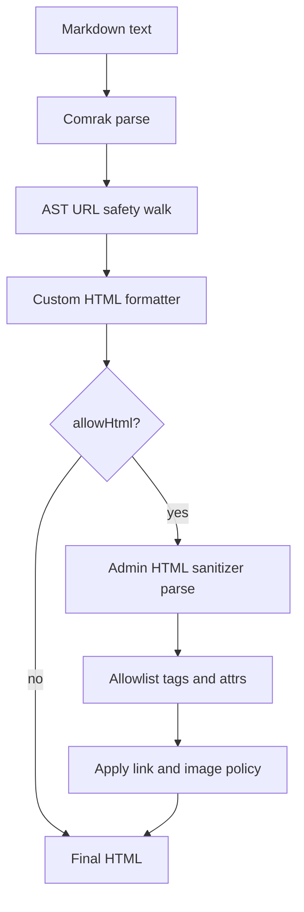
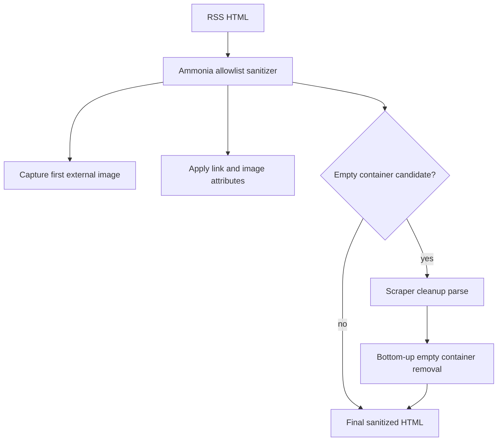

# HTML And Markdown Rendering Passes

This document records the pass budget for RSS HTML sanitization and Rust-backed
markdown rendering. The goal is to keep parsing work proportional to the
security or transformation boundary that requires a DOM/AST.

## Markdown Rendering

Markdown input is parsed once by Comrak. URL safety is handled on the Comrak AST
before rendering. Generated markdown links and images are emitted by the custom
formatter with their final render-time attributes:

- external links receive `rel` and `target`
- unsafe link/image URLs are omitted
- external images are optionally rewritten to an absolute `IMAGE_ORIGIN/sideload/` URL

Non-admin markdown does not reparse the emitted HTML. Admin markdown still needs
one HTML parse because raw admin HTML must be allowlist-sanitized. That sanitizer
also applies link and image render policy during the same traversal, so admin
rendering does not need a second post-processing parse.

## RSS HTML Sanitization

RSS input is untrusted HTML, so Ammonia remains the first pass and owns the
allowlist policy. The Ammonia attribute filter also captures the first external
image URL and optionally rewrites image sources to an absolute `IMAGE_ORIGIN/sideload/` URL.

Empty layout containers are a cleanup concern, not a security boundary. The
Scraper cleanup pass now runs only when the sanitized HTML contains an empty
container pattern that could be removed. Most fragments return directly after
Ammonia.

## Options Considered

The selected implementation keeps Ammonia for RSS security and Comrak for
markdown parsing, then removes or gates redundant downstream parsing.

Other options were not selected:

- Replacing Ammonia with a custom Scraper sanitizer would make RSS a single DOM
  parse, but it would reimplement a security-sensitive allowlist.
- Adding a streaming HTML rewriter after Ammonia would avoid a full DOM for some
  cleanup, but nested empty-container removal still needs subtree state and
  would add another HTML processing dependency.

## Related

- [Content Rendering Rules](content-rendering.md)
- [Rust Workspace](https://github.com/jonathanong/vurst)
