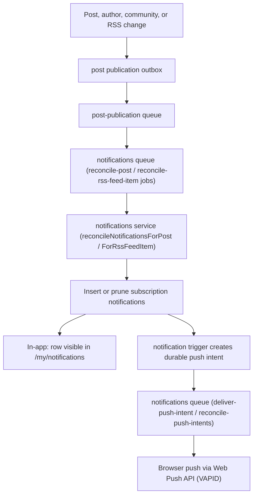

# Notifications

Cross-service notification system: subscription-based delivery, manual sends, and browser push.

## Architecture

The fan-out pipeline flows from durable publication reconciliation to per-channel delivery:

## Subscription Rules

| Subscription                       | Notifies on                            |
| ---------------------------------- | -------------------------------------- |
| `subscribe → post`                 | New direct child comments/posts        |
| `subscribe → rss_feed`             | New RSS feed items from that feed      |
| `subscribe → user`                 | New top-level posts by that user       |
| `subscribe_posts → topic`          | Posts tagged with that topic           |
| `subscribe_rss_feed_items → topic` | RSS items categorized under that topic |

Notifications apply to entities created while the subscription was active. A delayed reconcile can
still create or keep a notification for an entity created before unsubscribe, but unsubscribing
stops notifications for later entities.

## Manual Sends

- `send to followers` persists a follower-distribution intent; workers create `delivery_type='manual_send'` rows for the sender's followers in bounded chunks
- Snapshot at send time — followers added later do not receive the notification
- Manual-send rows are not reconciled or pruned like subscription rows

## Reconciliation

- Flagged or deleted posts and deleted RSS feed items do not notify
- Reconcile jobs run multiple times as topic/tag classification completes asynchronously
- Same entity appears at most once per subscription delivery, while each manual-send event may
  coexist with subscription-driven notifications for the same entity
- Read notifications are preserved even if the entity later stops qualifying
- Unsubscribing does not prune or suppress notifications for entities created while subscribed
- Only `delivery_type='subscription'` rows participate in reconciliation
- Large recipient audiences are reconciled in bounded service batches; each notification write creates
  a durable push intent, and intent jobs are enqueued per created-notification batch

## Moderation Reports

- Resolving a pending report creates one generic `moderation_report` notification for the reporter
- Report review notifications persist `target_intent: notifications_inbox` (not a content
  `target_path`) so in-app, native, and browser-push clients route to `/my/notifications`
- Notification copy does not expose the reported target, reporter note, moderator identity, or an appeal CTA

## Community Lifecycle and Digest

Community application decisions, role changes, and ownership transfers are persisted atomically with their state transitions and use structured community targets. The weekly Monday dispatcher creates one combined inbox notification per eligible owner/moderator for the previous closed UTC week. Stable event keys make retries safe even after dismissal. See the [notification anatomy](../../requirements/anatomy/notification.md).

## Browser Push

Web Push (VAPID) delivery uses durable `deliver-push-intent` jobs. The notification trigger records an
intent in the same transaction as every notification write; the five-minute
`reconcile-push-intents` schedule re-enqueues pending and expired-lease work. Delivery soft-deletes
expired registrations, reads active `web_push_subscriptions` rows for the user, records endpoint
receipts, and sends payloads with `web-push`. Successful sends and terminal provider outcomes create
receipts, preventing a retry from resending that notification to the same endpoint. Only 404/410
responses invalidate and soft-delete a registration. Other integer 300–499 responses terminalize
that notification while preserving the registration; 408, 429, 500–599, malformed statuses, and
transport failures remain retryable. Every failure updates the subscription failure timestamp.

Each active delivery claim is renewed on the database clock while endpoints are in flight. Results
are persisted one endpoint at a time under the exact token, so a completed endpoint remains durable
while a peer is slow. If renewal or persistence loses ownership, the worker destroys its private
provider agent, awaits active work, and leaves final state to recovery; recovery skips durable
endpoint receipts and sends only pending endpoints.

Each enable creates a new subscription generation. A global, unpartitioned endpoint-owner registry
maps the exact HTTPS endpoint digest to one active `(user_id, subscription_id)` generation; deferred
constraints make both sides of that mapping mandatory. Delivery payloads and receipts carry that
generation, so a late provider result cannot alter a replacement owner. The service worker persists
the same binding before it displays a push notification. Payloads without the exact endpoint and
subscription generation are rejected, including before the binding is initialized. A permanent
disabled tombstone records an explicit clear, while a separate reconciliation barrier preserves the
known generation, rejects mismatches, and remains retryable after a transient
authentication-bootstrap failure. Ownership bootstrap reads use the primary database so a newly
created generation cannot be mistaken for a missing or stale owner during replica lag.

Post-publication owns subscription reconciliation and notification dispatch; the notifications queue
owns push delivery and recovery. Required env vars: `WEB_PUSH_PUBLIC_KEY`, `WEB_PUSH_PRIVATE_KEY`,
`WEB_PUSH_SUBJECT`.

## URL Redirect Safety

RSS item notifications store the external article URL in PostgreSQL, but push payloads and the web app expose only `/notification-redirect?notification_id=...`. The redirect resolves the destination server-side — the client never receives a raw external URL as a query parameter.

## Data Model

| Table                                            | Purpose                                                |
| ------------------------------------------------ | ------------------------------------------------------ |
| `notifications`                                  | Per-user notification rows (UUIDv7 RANGE by `user_id`) |
| `notification_push_intents`                      | Durable per-notification push-delivery state and lease |
| `notification_push_intent_subscription_receipts` | Per-generation delivery receipts                       |
| `web_push_subscriptions`                         | Browser push registrations (UUIDv7 RANGE by `user_id`) |
| `web_push_endpoint_owners`                       | Global exact endpoint-to-active-generation registry    |

## Planned Notification Types

The following notification concepts have underlying signals tracked in the database, but user-facing notifications for them are not yet implemented. See [Feedback Loops](../../strategy/feedback-loops.md) for context on why these matter for growth.

| Type                | Trigger                                  | Issue                      |
| ------------------- | ---------------------------------------- | -------------------------- |
| New follower        | User B follows user A                    | jonathanong/filaments#1421 |
| Referral signup     | New user signs up with `referrer_id` set | jonathanong/filaments#1422 |
| Contribution impact | Data point changes aggregate metric      | jonathanong/filaments#1423 |

## Related

- Service: [backend/services/notifications/README.md](../../../backend/services/notifications/README.md)
- System: [backend/queues/notifications/README.md](../../../backend/queues/notifications/README.md)
- Requirements: [../../requirements/navigation/NOTIFICATIONS.md](../../requirements/navigation/NOTIFICATIONS.md)
- [Web rules](../../../web/CLAUDE.md) -- notification list and push permission UI
- [Backend rules](../../../backend/CLAUDE.md) -- service conventions
