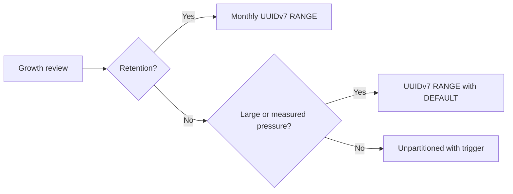

# PostgreSQL Partitioning Strategy

This is the canonical inventory and decision record for PostgreSQL table growth. The typed source
of truth is [`schema-growth-registry.mts`](../../../backend/data-stores/psql/schema-growth-registry.mts).
Catalog-backed tests require it to materialize one entry for every logical table while excluding
physical leaf partitions.

## Policy

- Internal row, entity, and event IDs are UUIDv7. Natural/provider keys and the six small static
  identity lookups are documented exceptions in the registry.
- Use `RANGE` on the UUIDv7 row or owning-parent key. HASH partitioning is forbidden.
- Tables without retention start with one `DEFAULT` child. Add explicit aligned ranges after about
  one million rows or measured planner/write pressure.
- Monthly children are reserved for partition-drop retention owned by `cleanupPartitions`.
- An unpartitioned table classified as unbounded must record both its rationale and the condition
  that would trigger reconsideration.

## Exact Partition Inventory

This block is rendered from the typed registry, and its normalized rows are checked exactly by
`repo-file-policy`.

<!-- schema-growth-registry:start -->

| Table                                                   | Strategy      | Key                                    | Children           | Retention owner   | Access class       |
| ------------------------------------------------------- | ------------- | -------------------------------------- | ------------------ | ----------------- | ------------------ |
| `agent_moderation_votes`                                | RANGE         | `agent_moderation_id`                  | default            | none              | target-scoped      |
| `agent_moderations`                                     | RANGE         | `post_id`                              | default            | none              | target-scoped      |
| `agent_responses`                                       | RANGE         | `id`                                   | monthly            | cleanupPartitions | retention-window   |
| `ai_usage_records`                                      | RANGE         | `id`                                   | default            | none              | target-scoped      |
| `classifier_decision_batch_candidates`                  | RANGE         | `batch_id`                             | default            | none              | target-scoped      |
| `community_post_review_changes`                         | RANGE         | `id`                                   | default            | none              | target-scoped      |
| `conversation_message_agentic_runs`                     | RANGE         | `id`                                   | monthly            | cleanupPartitions | retention-window   |
| `conversation_message_agentic_runs_events`              | RANGE         | `conversation_message_agentic_run_id`  | monthly            | cleanupPartitions | retention-window   |
| `conversation_messages`                                 | RANGE         | `conversation_id`                      | default            | none              | target-scoped      |
| `crawl_chunks`                                          | RANGE         | `crawl_id`                             | monthly            | cleanupPartitions | retention-window   |
| `crawls`                                                | RANGE         | `id`                                   | monthly            | cleanupPartitions | retention-window   |
| `entity_relation_votes`                                 | LIST -> RANGE | `relation_table -> entity_relation_id` | list-default-range | none              | intentional-fanout |
| `hostname_votes`                                        | RANGE         | `hostname_id`                          | default            | none              | target-scoped      |
| `notifications`                                         | RANGE         | `user_id`                              | default            | none              | target-scoped      |
| `post_autotagger_results`                               | RANGE         | `post_id`                              | default            | none              | target-scoped      |
| `post_clearance_changes`                                | RANGE         | `id`                                   | default            | none              | target-scoped      |
| `post_data_point_topics`                                | RANGE         | `post_id`                              | default            | none              | target-scoped      |
| `post_explicit_topic_categories`                        | RANGE         | `post_id`                              | default            | none              | target-scoped      |
| `post_feed_shares`                                      | RANGE         | `recipient_user_id`                    | default            | none              | target-scoped      |
| `post_publication_dirty_work_keys`                      | RANGE         | `dirty_work_id`                        | default            | none              | target-scoped      |
| `post_publication_projection_receipts`                  | RANGE         | `post_id`                              | default            | none              | target-scoped      |
| `post_read_states`                                      | RANGE         | `user_id`                              | default            | none              | target-scoped      |
| `post_review_topic_ratings`                             | RANGE         | `post_id`                              | default            | none              | target-scoped      |
| `post_revisions`                                        | RANGE         | `id`                                   | default            | none              | target-scoped      |
| `post_topic_recommendations`                            | RANGE         | `post_id`                              | default            | none              | target-scoped      |
| `post_votes`                                            | RANGE         | `post_id`                              | default            | none              | target-scoped      |
| `posts`                                                 | RANGE         | `id`                                   | default            | none              | target-scoped      |
| `relation__post__category__topic`                       | RANGE         | `subject_id`                           | default            | none              | target-scoped      |
| `relation__post__category__topic__votes`                | RANGE         | `entity_relation_id`                   | default            | none              | target-scoped      |
| `relation__post__category__topic_alias`                 | RANGE         | `subject_id`                           | default            | none              | target-scoped      |
| `relation__post__category__topic_alias__votes`          | RANGE         | `entity_relation_id`                   | default            | none              | target-scoped      |
| `relation__post__mentioned__post`                       | RANGE         | `subject_id`                           | default            | none              | target-scoped      |
| `relation__post__mentioned__topic`                      | RANGE         | `subject_id`                           | default            | none              | target-scoped      |
| `relation__post__mentioned__user`                       | RANGE         | `subject_id`                           | default            | none              | target-scoped      |
| `relation__post__related__post`                         | RANGE         | `subject_id`                           | default            | none              | target-scoped      |
| `relation__post__related__post__votes`                  | RANGE         | `entity_relation_id`                   | default            | none              | target-scoped      |
| `relation__post__related__url`                          | RANGE         | `subject_id`                           | default            | none              | target-scoped      |
| `relation__post__related__url__votes`                   | RANGE         | `entity_relation_id`                   | default            | none              | target-scoped      |
| `relation__rss_feed_item__category__topic__votes`       | RANGE         | `entity_relation_id`                   | default            | none              | target-scoped      |
| `relation__rss_feed_item__category__topic_alias__votes` | RANGE         | `entity_relation_id`                   | default            | none              | target-scoped      |
| `relation__topic__category__topic__votes`               | RANGE         | `entity_relation_id`                   | default            | none              | target-scoped      |
| `relation__topic__faq__post__votes`                     | RANGE         | `entity_relation_id`                   | default            | none              | target-scoped      |
| `relation__topic__faq__url__votes`                      | RANGE         | `entity_relation_id`                   | default            | none              | target-scoped      |
| `relation__topic__guide__url__votes`                    | RANGE         | `entity_relation_id`                   | default            | none              | target-scoped      |
| `relation__topic__landing_page__url__votes`             | RANGE         | `entity_relation_id`                   | default            | none              | target-scoped      |
| `relation__topic__publisher_type__topic__votes`         | RANGE         | `entity_relation_id`                   | default            | none              | target-scoped      |
| `relation__topic__related__post__votes`                 | RANGE         | `entity_relation_id`                   | default            | none              | target-scoped      |
| `relation__topic__related__topic__votes`                | RANGE         | `entity_relation_id`                   | default            | none              | target-scoped      |
| `relation__topic__related__url__votes`                  | RANGE         | `entity_relation_id`                   | default            | none              | target-scoped      |
| `relation__topic__terms_of_service__url__votes`         | RANGE         | `entity_relation_id`                   | default            | none              | target-scoped      |
| `relation__user__category__topic__votes`                | RANGE         | `entity_relation_id`                   | default            | none              | target-scoped      |
| `rss_feed_crawls`                                       | RANGE         | `id`                                   | monthly            | cleanupPartitions | retention-window   |
| `rss_feed_item_feed_shares`                             | RANGE         | `recipient_user_id`                    | default            | none              | target-scoped      |
| `rss_feed_item_read_states`                             | RANGE         | `user_id`                              | default            | none              | target-scoped      |
| `rss_feed_item_votes`                                   | RANGE         | `rss_feed_item_id`                     | default            | none              | target-scoped      |
| `rss_feed_items`                                        | RANGE         | `id`                                   | default            | none              | target-scoped      |
| `session_referral_attributions`                         | RANGE         | `id`                                   | default            | none              | target-scoped      |
| `story_classifier_results`                              | RANGE         | `story_id`                             | default            | none              | target-scoped      |
| `topic_classifier_results`                              | RANGE         | `topic_id`                             | default            | none              | target-scoped      |
| `topic_votes`                                           | RANGE         | `topic_id`                             | default            | none              | target-scoped      |
| `user_sessions`                                         | RANGE         | `id`                                   | default            | none              | target-scoped      |
| `user_vouch_votes`                                      | RANGE         | `target_user_id`                       | default            | none              | target-scoped      |
| `web_push_subscriptions`                                | RANGE         | `user_id`                              | default            | none              | target-scoped      |

<!-- schema-growth-registry:end -->

Ordinary vote parents are generated from `VOTE_SCHEMA_CONFIGS`. Relation tables and their vote
parents are generated from `entityRelationMetadatum`; do not duplicate either list in code.
`entity_relation_votes` retains LIST grouping so each concrete relation can enforce its FK, then
uses RANGE by relation ID. Both keys are required for full two-level pruning. Voter-only maintenance
and export intentionally fan out and rely on local `user_id` indexes.

`web_push_endpoint_owners` is intentionally unpartitioned: its SHA-256 endpoint key is the global
serialization and uniqueness point across the user-partitioned `web_push_subscriptions` table.
`notification_push_intent_subscription_receipts` retains delivery outcomes by exact subscription
generation, rather than an endpoint-only key.

## Unbounded Unpartitioned Inventory

These tables may grow for the lifetime of the product but remain unpartitioned while their indexed
access paths are selective. Reconsider each at roughly one million rows or when measured planner,
write, vacuum, or retention pressure warrants it, except where a dedicated trigger below preserves
a stronger invariant. The typed registry owns the rationale and trigger.

- Durable entities and content: `communities`, `conversations`, `images`, `lists`, `podcast_shows`,
  `remote_actors`, `rss_feeds`, `topics`, `url_hostnames`, `urls`, `users`.
- Audit and workflow history: `admin_import_batches`, `admin_import_rows`,
  `activitypub_distribution_checkpoints`, `ap_inbox_activities`,
  `community_activity_digest_dispatch_windows`, `community_agent_prompt_changes`,
  `crm_contact_lifecycle_changes`,
  `dynamic_config_change_logs`, `follower_distribution_deliveries`, `follower_distributions`,
  `identity_verification_attempts`, `membership_administrator_refund_operation_requests`,
  `membership_changes`, `membership_entitlement_effects`,
  `membership_ineligible_purchase_reversal_refund_observations`,
  `membership_ineligible_purchase_reversal_refund_scan_cycles`,
  `membership_ineligible_purchase_reversal_refund_scans`, `membership_purchase_intents`,
  `membership_refund_operation_attempt_metadata_scans`, `membership_refund_operation_attempts`,
  `membership_refunds`,
  `membership_verifications`, `moderation_appeal_lifecycle_changes`,
  `moderation_appeals`, `moderation_cases`, `moderation_report_judgements`, `moderation_reports`,
  `moderation_transparency_daily_rollups`, `moderation_transparency_released_daily_rollups`,
  `moderator_actions`, `oauth_authorization_server_events`, `report_integrity_flags`,
  `review_dispute_lifecycle_changes`, `review_successions`,
  `review_disputes`, `ses_bounce_events`, `stripe_events`, `support_agent_runs`,
  `support_message_lifecycle_changes`, `support_messages`, `support_thread_lifecycle_changes`,
  `user_data_request_attempts`, `user_data_requests`, `user_deletion_audit_logs`,
  `user_deletion_external_works`,
  `user_deletion_relation_impacts`, `user_deletion_requests`, `user_engagement_email_sends`,
  `user_import_requests`, `user_moderation_email_sends`, `user_rss_feed_import_batches`,
  `user_rss_feed_import_rows`, `vote_integrity_flags`.
- Provider delivery receipts: `support_inbound_email_receipts`. One durable receipt is retained for
  every inbound support email; provider and support-message indexes keep replay checks selective.
- Post moderation ledger: `post_moderation_attempts`, `post_moderation_dispositions`,
  `post_moderation_versions`, and `post_moderation_work_items`. Rows follow the retained post and
  remain selectively addressable through their version, source, attempt, and post indexes.
- Notification push effects: `notification_push_intents` and
  `notification_push_intent_subscription_receipts`.
  Pending intents remain durable recovery work. Delivered and suppressed intents are deleted after
  90 days in locked batches using their terminal timestamp, and generation receipts cascade with
  the parent intent; this bounds retained terminal delivery evidence without touching pending work.
- Global idempotency keys: `ai_usage_openai_response_keys`. Partitioning cannot preserve the
  response-ID primary key's global uniqueness; reconsider only if the replacement enforces that
  invariant across every ledger partition.
- Work queue (drains to empty): `ap_inbox_deliveries`. Rows are deleted on success and rejection.
  Unverified envelopes expire after one hour; operational failures expire seven days after their
  immutable first failure. A five-minute cleanup deletes at most 10,000 rows per run in locked
  batches, so table size remains bounded work rather than retained history.
- Singleton aggregate: `ap_inbox_delivery_storage_counters`. Its true-valued primary key permits
  exactly one row, which statement triggers maintain as the exact retained and unverified row/byte
  totals used for admission and monitoring.
- Ordinary relationship edges: `ap_post_likes`, `bluesky_follow_records`,
  `community_list_items__posts`,
  `community_list_items__rss_feeds`, `community_list_items__topics`,
  `community_list_items__url_hostnames`, `community_list_items__urls`, `community_members`,
  `community_pinned_posts`, `conversation_participants`, `facebook_friends`, `github_friends`,
  `household_members`, `linkedin_accounts`, `list_items__posts`, `list_items__rss_feed_items`,
  `post_images`, `post_slugs`, `post_topic_alias_sources`, `rss_feed_item_categories`, `rss_feed_item_ids`,
  `rss_feed_item_sources`,
  `topic_aliases`, `x_friends`.
- Config-generated relationship edges: `relation__rss_feed_item__category__topic_alias`.
- Lower-amplification entities and workflow rows: `agent_prompts`, `agents`,
  `agents__moderators`, `ap_actor_keys`, `ap_posts`, `api_keys`, `app_attestation_keys`,
  `apple_accounts`,
  `bedrock_embeddings_batch_entities`, `bedrock_embeddings_batches`,
  `bedrock_nova_multimodal_v1_embeddings`, `bedrock_nova_multimodal_v1_image_embeddings`,
  `bluesky_link_authorizations`, `bluesky_link_completions`, `bluesky_linked_accounts`,
  `boilerplate_removal_urls`, `boilerplate_removals`, `classifier_candidate_community_overrides`,
  `classifier_candidate_thresholds`, `classifier_candidates`, `classifier_decision_batches`, `classifier_decision_calls`,
  `classifier_prompt_versions`, `classifier_topic_vote_applications`, `classifiers`, `community_agent_prompts`,
  `community_application_questions`, `community_applications`, `community_auto_tagger_agents`,
  `community_bans`, `community_invites`, `community_member_vacations`,
  `community_post_reviews`, `community_restrictions`, `community_saved_replies`, `crawlers`,
  `crm_contact_social_accounts`, `crm_contacts`, `curated_aside_items`, `domain_blacklists`,
  `email_address_login_tokens`, `facebook_accounts`, `fediverse_instance_integration_changes`,
  `github_accounts`, `google_accounts`,
  `households`, `individual_cards`, `individual_financial_profiles`,
  `individual_rewards_program_point_valuations`, `individual_rewards_program_statuses`,
  `individuals`, `membership_administrator_refund_operation_requests`,
  `membership_automatic_refund_receipts`, `membership_changes`,
  `membership_grant_activation_periods`, `membership_grants`,
  `membership_google_play_acknowledgements`, `membership_google_play_purchase_tokens`,
  `membership_ineligible_purchase_reversal_case_operations`,
  `membership_ineligible_purchase_reversal_cases`, `membership_lineage_bindings`,
  `membership_microsoft_store_credentials`,
  `membership_operations`, `membership_products`, `membership_provider_evidence_records`,
  `membership_provider_lineages`, `membership_provider_observations`,
  `membership_provider_products`, `membership_refund_operation_attempts`,
  `membership_refund_operation_attempt_metadata_scans`, `membership_refunds`,
  `membership_source_states`, `membership_sources`, `memberships`, `microsoft_accounts`,
  `moderation_media_reveals`, `moderation_queue_claims`, `moderation_training_feedbacks`,
  `oauth_access_tokens`, `oauth_authorization_codes`, `oauth_authorization_requests`,
  `oauth_clients`, `oauth_grants`, `oauth_refresh_token_families`, `oauth_refresh_tokens`,
  `phone_number_login_tokens`, `podcast_playback_positions`, `post__stories`,
  `post_autotagger_result_topics`, `post_dispute_annotations`, `post_locks`,
  `post_topic_recommendations_hostnames`, `referral_program_link_validations`,
  `referral_program_link_validations_rules`, `report_abuse_penalties`, `retailer_countries`,
  `rss_feed_categories`, `rss_feed_discoverability_changes`, `rss_feed_enablement_changes`,
  `rss_feed_item_autotagger_result_topics`, `rss_feed_item_autotagger_results`,
  `rss_feed_item_category_rejections`, `rss_feed_item_unmapped_category_counts`,
  `sites`, `spending_entries`, `stories`, `support_contacts`,
  `support_inbound_email_message_ids`, `support_threads`, `topic_claims`, `topic_metrics`,
  `topic_revisions`, `topics__cards`, `topics__fediverse_instances`,
  `topics__referral_program_link_validations`,
  `topics__referral_programs`, `topics__retailers`, `topics__rewards_program_statuses`,
  `topics__rewards_programs`, `topics__spending_categories`, `url_hostname_blocks`,
  `user_aside_preferences`, `user_consents`, `user_email_addresses`,
  `user_landing_page_group_members`, `user_landing_page_items`, `user_landing_pages`,
  `user_metrics`, `user_mod_notes`, `user_passkeys`, `user_permissions`, `user_phone_numbers`,
  `user_profile_links`, `user_referral_program_links`, `user_role_permissions`, `user_roles`,
  `user_suspensions`, `user_totp_authenticators`, `user_warnings`, `verified_identities`,
  `vote_user_agents`, `vote_weight_penalties`, `web_user_agents`, `x_accounts`.
- Config-generated relationship edges: `relation__community__mute__topic`,
  `relation__community__mute__url_hostname`, `relation__remote_actor__follow__user`,
  `relation__rss_feed_item__category__topic`,
  `relation__topic__category__topic`, `relation__topic__faq__post`,
  `relation__topic__faq__url`, `relation__topic__guide__url`,
  `relation__topic__landing_page__url`, `relation__topic__mentioned__post`,
  `relation__topic__parent__topic`, `relation__topic__publisher_type__topic`,
  `relation__topic__related__post`, `relation__topic__related__topic`,
  `relation__topic__related__url`, `relation__topic__terms_of_service__url`,
  `relation__user__block__topic`, `relation__user__block__url_hostname`,
  `relation__user__block__user`, `relation__user__category__topic`,
  `relation__user__dismiss_recommendation__topic`,
  `relation__user__dismiss_recommendation__user`, `relation__user__follow__post`,
  `relation__user__follow__rss_feed`, `relation__user__follow__topic`,
  `relation__user__follow__user`, `relation__user__hide__post`,
  `relation__user__hide__rss_feed_item`, `relation__user__mentioned__post`,
  `relation__user__mute__rss_feed`, `relation__user__mute__topic`,
  `relation__user__mute__url_hostname`, `relation__user__mute__user`,
  `relation__user__proxy_follow__community`, `relation__user__proxy_mute__community`,
  `relation__user__save__community`, `relation__user__save__post`,
  `relation__user__save__rss_feed_item`, `relation__user__save__url`,
  `relation__user__subscribe__post`, `relation__user__subscribe__rss_feed`,
  `relation__user__subscribe__user`, `relation__user__subscribe_posts__topic`,
  `relation__user__subscribe_rss_feed_items__topic`.

`session_referral_attributions` is `RANGE (id)`-partitioned with a default partition only (see the
inventory above) — this was the structural half of a change formerly filed as
jonathanong/filaments#8750. The retention question is now
settled too: anonymous (`user_id IS NULL`) rows are deleted after 30 days by
`deleteOldReferralAttributionBatch()`, while user-linked rows are retained for the life of the
account — `deleteUser` nulls `user_id`, which drops the row into the same 30-day sweep. See the
[attribution service README](../../../backend/services/attribution/README.md#retention--dedup) for
the dedup/move-to-latest design that keeps the anonymous set bounded by traffic as well.

A monthly-partition, partition-drop retention model is permanently off the table for this table:
a `DROP` is unconditional and cannot honor the `user_id IS NULL` predicate, so it would delete
live users' attribution history along with the anonymous rows it's meant to age out. Row-based
batch deletion is the only retention mechanism this table will use.

## Operating Explicit Ranges

A populated default overlaps every prospective range. Create a standalone matching table, move the
range out of the default, validate range and default-exclusion `CHECK` constraints, then attach it.
Align bounds across tables joined by the same UUIDv7 parent key. Monitor defaults through the
partition-status API and `pg_total_relation_size()`.

## Related

- [Partition Pruning Hints](partition-pruning-hints.md)
- [Database Rules](../../../backend/data-stores/psql/CLAUDE.md)
- [PostgreSQL queue](../../../backend/queues/psql/README.md)
- [RSS feed crawling](../../requirements/content/RSS-FEED-CRAWLING.md)
- [PostgreSQL EXPLAIN ANALYZE prompt](../../prompts/scheduled/postgresql-explain-analyze.md) — recurring schema-growth classification audit against this policy.
