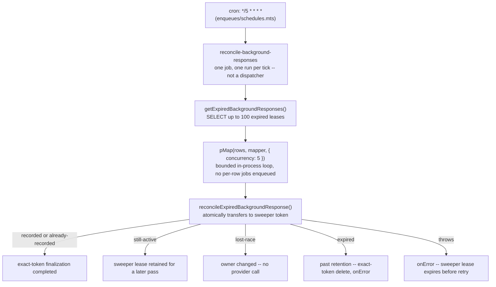

# AI Agents System

Source entrypoint: [backend/queues/ai-agents/README.md](../../../../../backend/queues/ai-agents/README.md)

Unified queue package for AI agent workloads. OpenAI-backed agent jobs run through `ai_agents`
with shared RPM and TPM limits. The limiter-independent `openai-spend-cap-rechecks` queue owns the
single coordinator that releases jobs when an operator relaxes the daily cap.

## Summary

| Processor                                  | Job Name                               | Description                                                                                                                                                    |
| ------------------------------------------ | -------------------------------------- | -------------------------------------------------------------------------------------------------------------------------------------------------------------- |
| `processAutotaggerRssFeedItem`             | `autotagger-rss-feed-item`             | Applies the no-LLM collaborative-follower topic pass to an RSS feed item; the classifier pass is a `classifier-run`                                            |
| `processClassifierRunDispatcher`           | `classifier-run-dispatcher`            | Reserves one run for an approved subject/content/configuration and awaits its `classifier-run` enqueue; a subject that is not ready leaves its request pending |
| `processClassifierRun`                     | `classifier-run`                       | Runs one reserved classifier run through the shared lifecycle after primary revalidation of the content and configuration fingerprints                         |
| `processReconcileClassifierRuns`           | `reconcile-classifier-runs`            | Two-phase sweep: re-enqueues incomplete runs up to ten counted times each, then dispatches pending requests that never got a run; stops on a spend-cap breach  |
| `processCommunityModerationDispatcher`     | `community-moderation-dispatcher`      | Dispatches community moderation prompt jobs; post-created recovery awaits queue delivery so failures retain the reconciliation checkpoint                      |
| `processCommunityModerationPrompt`         | `community-moderation-prompt`          | Runs a community moderation prompt on a post                                                                                                                   |
| `processCopyrightEmailIntake`              | `copyright-email-intake`               | Parses a preserved copyright-inbox email into an advisory structured recommendation; moderator approval remains mandatory                                      |
| `processCopyrightFormScreening`            | `copyright-form-screening`             | Screens a structured form only for obvious spam or invalidity; a clear signed-in result may provisionally restrict pending mandatory human review              |
| `processCopyrightAppealRecommendation`     | `copyright-appeal-recommendation`      | Persists advisory appeal analysis for a moderator; it never changes a restriction or restores material                                                         |
| `processStoryPost`                         | `story-post`                           | Generates or refreshes a story summary; entity recovery uses the awaited enqueue so queue failure retains the durable checkpoint for retry.                    |
| `processStoryClustering`                   | `story-clustering`                     | Clusters an RSS feed item into stories; re-enqueues with 5 s delay (up to 10 times) when embedding is not yet visible — mirrors the autotagger retry pattern   |
| `processReconcileBackgroundResponses`      | `reconcile-background-responses`       | Crash-recovery sweep of orphaned OpenAI `background: true` responses (cancel/retrieve/record); see [Background Response Sweeper](#background-response-sweeper) |
| `processReconcileCopyrightAgentDispatches` | `reconcile-copyright-agent-dispatches` | Re-enqueues advisory email, form-screening, and appeal gaps; applies saved clear form screens without another model run                                        |

## Architecture

- **Queue name**: `ai_agents`
- **Concurrency**: `getWorkerConcurrency('aiAgents', { baseline: 5 })` — `WORKER_CONCURRENCY_AI_AGENTS` env var overrides the baseline, clamped to `WORKER_CONCURRENCY_MAX` (default 25)
- **Rate limits**: `OPENAI_RPM` env var (default: 60 req/min), `OPENAI_TPM` env var (default: 500,000 tokens/min)
- **Spend cap**: `openai-spend-cap` `DynamicConfig` bounds the daily dollar total across all agents (default $10/day), independent of the rate limits above; see [Daily spend cap](../workers/ai-agents/README.md#daily-spend-cap)
- **Spend-cap coordinator**: `openai-spend-cap-rechecks`, concurrency 1, no OpenAI RPM/TPM limiter; it drains at most 100 registered `ai_agents` jobs per pass
- **Lock duration**: 300,000 ms (5 min); stalled interval: 30,000 ms (default)
- **Enqueue files**: `enqueues/*.mts` — one file per job category
- **Coordinator enqueue**: [`enqueues/spend-cap-recheck.mts`](../../../../../backend/queues/ai-agents/enqueues/spend-cap-recheck.mts) — one simple-deduplicated job per queried UTC day

Coordinator failures cannot lose agent work: every registered job is also delayed to its queried
UTC midnight and becomes eligible naturally at rollover. The coordinator retries once per minute
for the registry's full two-day retention window. Each release cycle has a generation-scoped
deduplication ID, so a registration accepted during the prior coordinator's final return creates a
new coordinator instead of deduplicating against the old active job. Coordinator enqueue is an
explicitly reported best-effort optimization: if the dedicated queue is unavailable after
registration, the source job still reaches its midnight delay fallback.

There is no hosted chat job: `chat` and `reconcile-chat-runtime-generations` were removed with the
hosted chat transport, and native chat persists through `client-generated-chat`. A `chat` or
`reconcile-chat-runtime-generations` job still queued at deploy follows the worker's unknown-job
path (`Unknown AI agent job: <name>`) and fails as an ordinary job failure without crashing the
worker; the scheduled reconciler's scheduler is pruned when the manifest is upserted. The
agentic-run storage is removed, so no run state remains that could block native chat.

## Enqueue Files

- [`enqueues/autotagger.mts`](../../../../../backend/queues/ai-agents/enqueues/autotagger.mts) — autotagger jobs
- [`enqueues/community-moderation.mts`](../../../../../backend/queues/ai-agents/enqueues/community-moderation.mts) — fire-and-forget community moderation jobs plus an awaited recovery variant
- [`enqueues/copyright-email-intake.mts`](../../../../../backend/queues/ai-agents/enqueues/copyright-email-intake.mts) — replay-safe copyright email extraction jobs
- [`enqueues/copyright-form-screening.mts`](../../../../../backend/queues/ai-agents/enqueues/copyright-form-screening.mts) — stable-ID structured form anti-spam jobs
- [`enqueues/copyright-appeal-recommendation.mts`](../../../../../backend/queues/ai-agents/enqueues/copyright-appeal-recommendation.mts) — stable-ID advisory appeal recommendation jobs
- [`enqueues/reconcile-copyright-agent-dispatches.mts`](../../../../../backend/queues/ai-agents/enqueues/reconcile-copyright-agent-dispatches.mts) - copyright agent delivery recovery job
- [`enqueues/classifier-run.mts`](../../../../../backend/queues/ai-agents/enqueues/classifier-run.mts) — durable classifier-run dispatch and stable-id run jobs; run jobs use the outage-sized `CLASSIFIER_RUN_ATTEMPTS` and `CLASSIFIER_RUN_BACKOFF` from `config.mts` (see [classifier-run backoff](../workers/ai-agents/README.md#classifier-run-backoff)) instead of `AI_AGENTS_DEFAULTS`
- [`enqueues/reconcile-classifier-runs.mts`](../../../../../backend/queues/ai-agents/enqueues/reconcile-classifier-runs.mts) — five-minute cursor-paginated run and request recovery
- [`enqueues/story-clustering.mts`](../../../../../backend/queues/ai-agents/enqueues/story-clustering.mts) — story clustering jobs
- [`enqueues/story-post.mts`](../../../../../backend/queues/ai-agents/enqueues/story-post.mts) — fire-and-forget creation enqueue plus an awaited recovery variant that propagates delivery failure
- [`enqueues/reconcile-background-responses.mts`](../../../../../backend/queues/ai-agents/enqueues/reconcile-background-responses.mts) — background-response sweeper job

## Copyright Agent Dispatch

Copyright forms, successfully parsed email intakes, and appeals are durable before queue delivery. The
five-minute `reconcile-copyright-agent-dispatches` job pages the whole pending backlog from
PostgreSQL by dispatched intake or submission ID and re-enqueues records still missing their agent
result with stable logical job IDs. A failed dispatch does not stop the rest of its page or later
pages; the job fails with every collected error after the walk, so a stuck low-ID record cannot
starve newer work. A saved latest clear signed-in form screen with no moderator
review instead invokes the durable form-effect service directly, which resumes its assessment and
unrestricted targets without calling a model. Reviewed forms and targets already lifted under an
automated assessment never re-enter automated enforcement. Failed MIME parses are preserved for
staff and are not sent to the extraction agent. Appeal recommendations are advisory evidence only;
no agent processor changes material availability or a restriction.

`COPYRIGHT_INTAKE_ENABLED` gates the dispatches that start work for new intake. While it is off, the
reconciler still walks every page but skips the `email` and `form-screening` dispatches, which stay
pending for the first pass after the switch is on. The email-intake and form-screening processors
check the switch too, so a job queued before it went off returns without a model call. An `appeal`
re-enqueue and a saved `form-effect` run in either state, since both belong to a case that is
already open and the form effect calls no model. Automated withholding has its own
`copyright.automaticProvisionalWithholding` switch.

## Background Response Sweeper

Every OpenAI call in this queue that goes through `createOpenAIResponse()`
(`@modules/openai-utils/create-response.mts`) — every job here — now runs with
`background: true` internally, so a response keeps generating and billing on OpenAI's side even if
the worker that started it crashes, OOM-kills, or is replaced mid-call by an ECS rolling deploy.
`reconcile-background-responses` is the crash-recovery reconciler for that class of orphan: it runs
every 5 minutes (`enqueues/schedules.mts`), pages durable registry rows whose PostgreSQL-clock
lease has expired, and atomically transfers each selected row to a two-minute sweeper lease before
calling OpenAI. The original owner renews its three-minute lease every 60 seconds, so a legitimate
long-running generation is not selected merely for being old. The worker then cancels/retrieves the
terminal response and finalizes only with its exact lease token. Bounded concurrency
(`RECONCILE_CONCURRENCY = 5`) prevents a large expired-lease backlog from fanning out into an
OpenAI rate-limit burst. It is declared in the queue's scheduled-job manifest
and projected into `SCHEDULED_JOBS_REGISTRY`
(`backend/api/v1/mq/scheduled-jobs-registry.mts`), so it is also admin-triggerable like every other
scheduled job.

Each cron tick runs exactly one job — it is a batch reconciler, not a dispatcher that enqueues a
sub-job per row. The bounded concurrency is an in-process loop inside that single job run:

The registry, lease/token fencing, response-ID idempotency guarantee, the sweeper's own recovery logic, and the
full failure-mode transition matrix live in
[`@services/openai-background-responses`](../../services/openai-background-responses/README.md) —
this queue package only owns the enqueue/schedule wiring
(`enqueues/reconcile-background-responses.mts`) and the thin processor
(`backend/workers/ai-agents/processors/process-reconcile-background-responses.mts`).

## Related

- Agents (business logic): [../../agents/README.md](../../../../../backend/agents/README.md)
- Systems overview: [../README.md](../README.md)
- Worker entry point: [../../entrypoints/worker-cpu/README.md](../../backend/entrypoints/worker-cpu/README.md)
