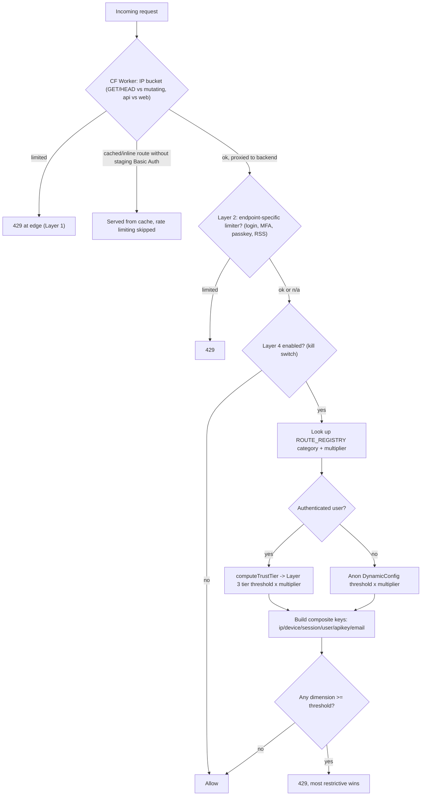

# Rate Limiting

Rate limiting operates at four layers, each protecting against different abuse patterns.

Contribution authoring has a separate action-policy registry. Its Safety/Pro/Plus/Free matrix is
pure configuration; the registry now resolves an internal global `authored_post` policy together
with a mapped type policy, while atomic dual-counter enforcement and public telemetry remain a
separate rollout.

The diagram below traces a single request through all four layers in order; Layer 4's threshold
lookup consumes Layer 3's trust-tier config directly (`getRateLimitThreshold`), so the two aren't
independent sequential gates so much as a config layer (3) feeding an enforcement layer (4).

## Contents

- [Layer 1: Cloudflare Worker (Edge)](reference-rate-limiting-layer-1-cloudflare-worker-edge.md)
- [Layer 2: Per-Endpoint (Backend)](reference-rate-limiting-layer-1-cloudflare-worker-edge.md#layer-2-per-endpoint-backend)
- [Layer 3: User-Aware Trust Tier (Backend)](reference-rate-limiting-layer-3-user-aware-trust-tier-backend.md)
- [Layer 4: Per-Route Rate Limiting (Backend)](reference-rate-limiting-layer-4-per-route-rate-limiting-backend.md)
- [Creation Gates](reference-rate-limiting-creation-gates.md)
- [Pagination Limits (Anti-Scraping)](reference-rate-limiting-creation-gates.md#pagination-limits-anti-scraping)
- [Related](reference-rate-limiting-creation-gates.md#related)
