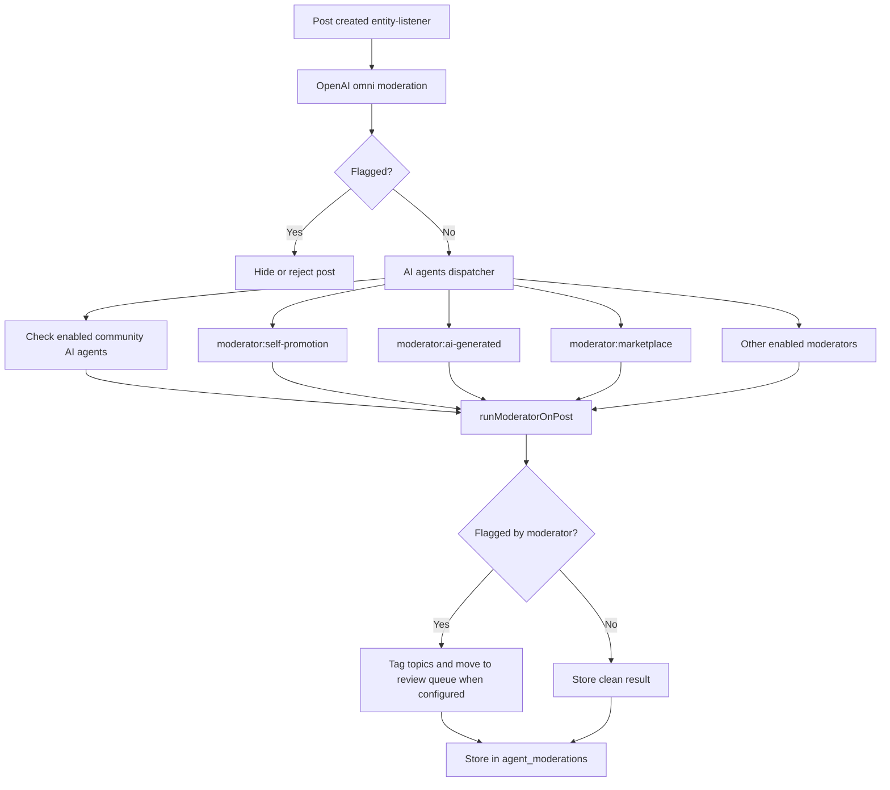

# AI Agents reference

[Back to AI Agents](ai-agents.md)

## Content Moderation Pipeline

Posts flow through two moderation layers after creation:



Admin-created posts are the exception: they publish immediately and skip the moderation branch on
create. The entity listener still runs embeddings and the autotagger, but it does not enqueue OpenAI
omni moderation, moderator-agent dispatch, community moderation prompts, or spam detection for that
initial create event.

### Deduplication

Moderation results are keyed by `(post_id, content_sha256, prompt_id)`. If post content hasn't changed, existing moderation results are reused — no OpenAI call made. Automated review-queue moves are attributed to the `automod` system user; per-moderator agent users remain the authors of agent-specific moderation/tagging results.

### Community AI Agent Toggles

Built-in post label agents are global agent definitions, but communities decide whether each one is
active for their own posts. The global prompt, system user, and label mapping are shared; only the
`community_id` × `agent_id` enablement row is community-specific.

Built-in community AI agents are disabled by default. Community owners and moderators can toggle
them on the moderation settings page or through the community API. If no built-in agents are enabled
for a community, the moderation dispatcher skips the post-specific label agent branch for posts in
that community.

The enablement response includes an `entitlement` object:

```json
{ "allowed": true, "reason": null }
```

Today, owner/moderator access is the entitlement. Future paid plans can add plan checks in the
entitlement service without changing the API response shape or toggle UI contract.

**Built-in community AI agents:**

| Slug              | Labels                                             | On flag      |
| ----------------- | -------------------------------------------------- | ------------ |
| `self-promotion`  | `self-promotion`                                   | Review queue |
| `marketplace`     | `buying`, `selling`, `trade`, `for-hire`, `hiring` | Review queue |
| `ai-generated`    | `ai-generated`                                     | Review queue |
| `politics-averse` | `political`                                        | Review queue |
| `click-bait`      | `click-bait`                                       | Tag only     |
| `vague-post`      | `vague-post`                                       | Tag only     |
| `shit-post`       | `shit-post`                                        | Tag only     |

### Custom Moderators

Moderators are config-driven (database records), not code-driven. New moderators can be added by seeding a new moderator config without code changes. Community toggles expose only the fixed-label built-in moderators above; custom community prompts use the separate community moderation prompt system.

**Current moderators:**

| Slug             | Detects                       | Actions                            |
| ---------------- | ----------------------------- | ---------------------------------- |
| `self-promotion` | Promoting own product/service | Tag `self-promotion`, review queue |
| `ai-generated`   | Likely AI-generated text      | Tag `ai-generated`, review queue   |
| `marketplace`    | Buying/selling/trade offers   | Tag category topics, review queue  |
| `click-bait`     | Intentionally misleading post | Tag `click-bait`                   |
| `vague-post`     | Too vague to be useful        | Tag `vague-post`                   |
| `shit-post`      | Low-effort noise              | Tag `shit-post`                    |

`ai-generated` currently uses the local Rust `is-it-slop` detector rather than an
OpenAI call. Its confidence score and threshold are stored in `agent_moderations.results`.

Full flow details: [backend/queues/ai-agents/README.md](../../../backend/queues/ai-agents/README.md)
