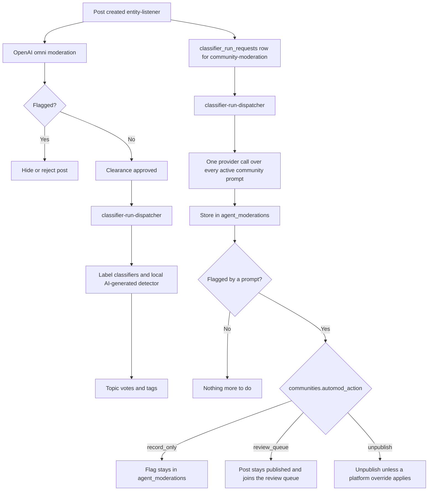

# AI Agents reference

[Back to AI Agents](ai-agents.md)

## Content Moderation Pipeline

Posts flow through two moderation layers after creation:


```mermaid
flowchart TD
  post[Post created entity-listener] --> omni[OpenAI omni moderation]
  omni --> flagged{Flagged?}
  flagged -- Yes --> hidden[Hide or reject post]
  flagged -- No --> approved[Clearance approved]
  approved --> classifier[classifier-run-dispatcher]
  classifier --> labels[Label classifiers and local AI-generated detector]
  labels --> effects[Topic votes and tags]
  post --> request[classifier_run_requests row for community-moderation]
  request --> community[classifier-run-dispatcher]
  community --> run[One provider call over every active community prompt]
  run --> stored[Store in agent_moderations]
  stored --> action{Flagged by a prompt?}
  action -- No --> clean[Nothing more to do]
  action -- Yes --> setting{communities.automod_action}
  setting -- record_only --> recorded[Flag stays in agent_moderations]
  setting -- review_queue --> review[Post stays published and joins the review queue]
  setting -- unpublish --> unpublish[Unpublish unless a platform override applies]
```

Admin-created posts are the exception: they publish immediately and skip the moderation branch on
create. The entity listener still runs embeddings and the autotagger, but it does not enqueue OpenAI
omni moderation, community moderation prompts, or spam detection for that
initial create event.

### Deduplication

Community prompt results are keyed by `(post_id, content_sha256, prompt_id)`. A community moderation
run is requested per post content digest and completes at most once, so a replay never repeats the
provider call or the community's chosen action. Automated review-queue moves and unpublishes are
attributed to the `automod` system user.

### Community AI Agent Toggles

Built-in post label agents are global agent definitions, but communities decide whether each one is
active for their own posts. The global system user and label mapping are shared; only the
`community_id` × `agent_id` enablement row is community-specific.

Built-in community AI agents are disabled by default. Community owners and moderators can toggle
them on the moderation settings page or through the community API. The post classifier reads these
rows when it builds a community's label configuration.

The enablement response includes an `entitlement` object:

```json
{ "allowed": true, "reason": null }
```

Today, owner/moderator access is the entitlement. Future paid plans can add plan checks in the
entitlement service without changing the API response shape or toggle UI contract.

**Built-in community AI agents:**

| Slug              | Labels                                             |
| ----------------- | -------------------------------------------------- |
| `self-promotion`  | `self-promotion`                                   |
| `marketplace`     | `buying`, `selling`, `trade`, `for-hire`, `hiring` |
| `ai-generated`    | `ai-generated`                                     |
| `politics-averse` | `political`                                        |
| `click-bait`      | `click-bait`                                       |
| `vague-post`      | `vague-post`                                       |
| `shit-post`       | `shit-post`                                        |

### Custom Moderators

Community toggles expose only the fixed-label built-in agents above. Custom community prompts use
the separate community moderation classifier (`community-moderation`) on the shared classifier-run
lifecycle: one provider call asks every active community prompt, and the community-level
`communities.automod_action` setting (`record_only`, `review_queue` or `unpublish`) decides what a
flag does. Moderators set it from the moderation settings page.

`ai-generated` uses the local Rust `is-it-slop` detector rather than an OpenAI call. Its confidence
score and threshold are stored in `agent_moderations.results`.

Full flow details: [docs/overview/architecture/queues/ai-agents/README.md](queues/ai-agents/README.md)
