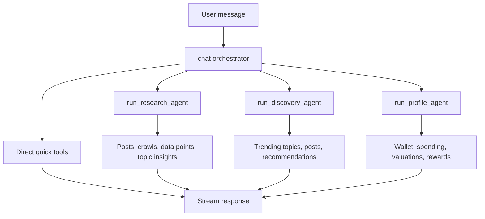
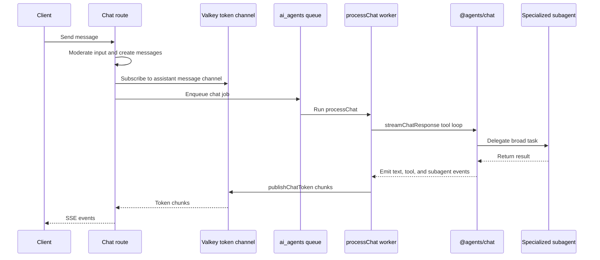

# AI Agents reference

[Back to AI Agents](ai-agents.md)

## LLM Agent Conversations

`@services/conversations-messages` provides an agentic chat system backed by hosted model workers for OpenAI and Anthropic streaming, and by client-generated run records for native local models. The hosted route subscribes to a Valkey token channel, enqueues a chat job, and pipes worker-published chunks back to the client as SSE. Each conversation tracks:

- `conversations` — top-level thread per user
- `messages` — individual turns (user + assistant)
- `agentic-runs` — tracks tool calls and agent state within a turn (parent/child for orchestrator + subagents)

The chat system uses an **orchestrator + subagent** architecture:

The orchestrator handles quick lookups directly (`get_my_profile`, `search_topics`) and delegates broad research, discovery, or profile mutations to specialized subagents.
Chat requests run prompt-injection and moderation checks both at the HTTP route and inside the
worker-side `streamChatResponse()` entry point. When a response chain is not yet available, chat
history is rebuilt as application-owned user/assistant messages with sanitized, wrapped content
boundaries. Each provider adapter maps that history to its native message array; it is never
flattened or serialized into prompt text. Stored messages are runtime-validated and malformed rows
fail before a provider call. Null assistant placeholders are omitted, and persisted history cannot
create system or developer messages because trusted OpenAI instructions and the Anthropic system
prompt remain separate provider parameters.

The first OpenAI request in a chain sends the full typed history without `previous_response_id`.
Continuations send only the current typed user message with the saved response ID. Anthropic always
receives the full typed history because OpenAI response IDs are not portable across providers.
If the bounded history begins with an assistant turn, the Anthropic boundary drops leading
assistant turns up to the first user message. It otherwise preserves message order, including
consecutive same-role turns supported by the Messages API.

OpenAI retains Responses API application state for 30 days by default, so a durable Voucha
conversation can outlive its saved continuation response. If OpenAI reports the exact structured
`previous_response_not_found` error for `previous_response_id` before any user-visible event,
`streamChatResponse()` conditionally clears the matching saved ID and retries once without it,
rebuilding the same sanitized, typed 20-message history used for a new chain. A concurrent newer ID,
an unrelated error, or any already-emitted text/tool/subagent event prevents recovery. This follows
OpenAI's documented recovery semantics while avoiding duplicate output or tool execution; see the
[conversation-state guide](https://developers.openai.com/api/docs/guides/conversation-state), the
[data-retention policy](https://developers.openai.com/api/docs/guides/your-data#default-usage-policies-by-endpoint),
and the [chat agent implementation guide](../../../backend/agents/chat/README.md#openai-continuation-recovery).

Native clients can default to local device models when supported. Those responses are generated on
device, then persisted through `POST /api/v1/conversations/:conversationId/client-generated-chat`
with `model_provider: apple_foundation` and `model_name: apple-foundation-system` on Apple
platforms. Windows sends `model_provider: windows_foundry` without a model name so each deployed API
version can select its canonical Windows identity during client-first rollout and backend rollback.
Hosted upgrades keep using the SSE `/chat` endpoint; OpenAI remains the default hosted provider,
and Anthropic streams through the server-side Messages API adapter.

### Subagent Pattern

All subagents are created via `createSubagentTool()` from `@agents/_shared`. The factory enforces:

- Child `conversation_message_agentic_runs` row with `parent_agentic_run_id` pointing to the orchestrator's run
- Progress events (`subagent_step`) emitted to the client as each subagent tool call executes
- `AbortSignal` propagation so client cancellations stop the inner `runToolLoop`
- Consistent error handling and lifecycle timestamp updates for derived run status

All tools with `run_*` schema names must use this factory. Automated replacement coverage for this
policy is tracked in the static-analysis migration milestone.
Subagent `task`, `query`, and `context` inputs are sanitized and wrapped before the inner model call.

`chat-stream.mts` streams responses back to clients using async generators. External API calls are isolated in dedicated functions marked with `/* no-mistakes: integration=<provider> */`.
