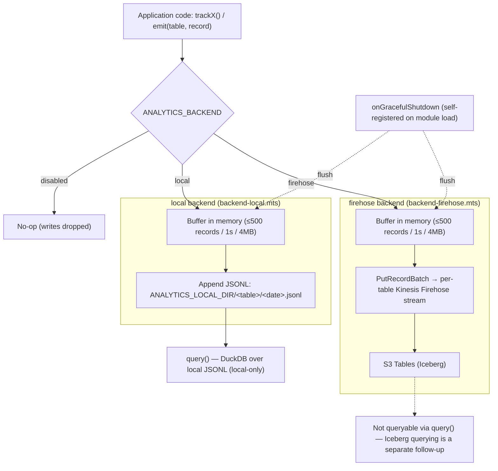

# Analytics Pipeline reference

[Back to Analytics Pipeline](analytics-pipeline.md)

## Code entry points

- Data store (emit/query/shutdown): [backend/data-stores/analytics/](../../../backend/data-stores/analytics/)
- Typed emit wrappers: [backend/services/analytics/](../../../backend/services/analytics/)
- Agent conventions: [backend/data-stores/analytics/CLAUDE.md](../../../backend/data-stores/analytics/CLAUDE.md), [backend/services/analytics/CLAUDE.md](../../../backend/services/analytics/CLAUDE.md)

## Backends

| `ANALYTICS_BACKEND`                  | Behaviour                                                                                                                         |
| ------------------------------------ | --------------------------------------------------------------------------------------------------------------------------------- |
| `disabled` (default in unit tests)   | All writes are no-ops.                                                                                                            |
| `local` (default in dev/integration) | Appends JSONL to `ANALYTICS_LOCAL_DIR` (default `./tmp/analytics`), partitioned `<table>/<YYYY-MM-DD>.jsonl`. Readable by DuckDB. |
| `firehose`                           | `PutRecordBatch` to per-table Kinesis Data Firehose stream → S3 Tables (Iceberg).                                                 |

## Pipeline Flow

`emit()` reads `ANALYTICS_BACKEND` at call time and forks to the selected backend. Both the local
and firehose backends buffer in-process and flush on a threshold, a 1s timer, or process shutdown.
Only the local backend's JSONL files are queryable — Firehose-backed data lands in S3 Tables
(Iceberg) but `query()` cannot read it.

