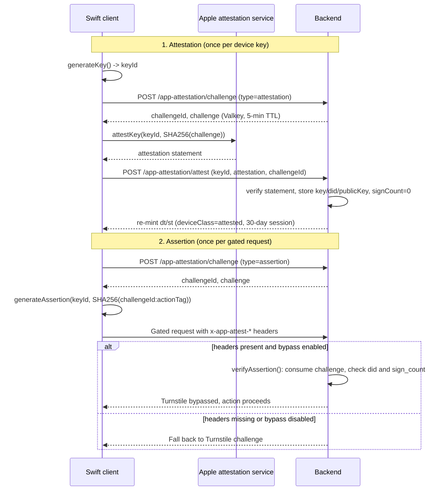

# App Attest reference

[Back to App Attest](app-attestation.md)

## Two Ceremonies

App Attest has two distinct steps, backed by `backend/services/app-attestation/`. The ceremony
between the Swift client, Apple's attestation service, and the backend — including the Turnstile
bypass decision on the gated request — flows as follows:



Note the attestation ceremony hashes the random `challenge` value; the assertion ceremony hashes
`"challengeId:actionTag"` instead, since only the assertion needs to be bound to a specific
gated action.

## Turnstile Bypass Decision Path

`verifyCaptchaOrAttestation()` (`backend/services/captcha/verify-or-attestation.mts`) is the single
entry point every gated route calls instead of `verifyCaptchaToken()` directly. It runs a strict
decision path:

1. **Header check** — all three of `x-app-attest-key-id`, `x-app-attest-assertion`, and
   `x-app-attest-challenge-id` must be present and non-empty. Any missing header falls back to
   the existing Turnstile flow.
2. **Config gate** — with all three headers present, both `isAppAttestationEnabled()` and
   `isAttestationRequiredForBypass()` must be `true` (`app-attestation-config` DynamicConfig
   namespace), or the request is rejected with `403 App Attest bypass is not enabled` — it does
   **not** fall back to Turnstile once headers are present.
3. **Verify** — `verifyAssertion()` consumes the Valkey challenge (keyed by the `challengeId`
   header), checks the stored key's `did` matches the caller's current `did` claim, and validates
   the assertion against the stored key's `sign_count`. A missing/expired challenge throws `400`;
   every other rejection (unknown key, `did` mismatch, disallowed development environment, invalid
   assertion) throws `403 ATTESTATION_REJECTED`, or `409 ATTESTATION_REJECTED` specifically for a
   `sign_count` regression — none of these fall back to Turnstile.
4. **Bind to action** — the payload verified is `` `${challengeId}:${actionTag}` ``, a plain
   UTF-8 string concatenation (not JSON). `node-app-attest` SHA-256-hashes this payload once
   internally, reconstructing the same `clientDataHash` the Swift client computed. `actionTag`
   does not provide replay protection by itself — the single-use challenge does that — it only
   prevents a captured assertion from being redirected to a _different_ gated endpoint than the
   one it was minted for.

Only the bypass decision is gated by config. `POST /api/v1/app-attestation/challenge` and
`POST /api/v1/app-attestation/attest` are always reachable (anonymous, rate-limited) regardless of
the `enabled`/`require_attestation_for_bypass` flags, since a device needs to attest before an
operator turns the bypass on, and a successful `/attest` call always grants the 30-day session
regardless of those flags.

The eight gated actions and their Swift-side `AppAttestActionTag` values are listed in
[captcha.md § Action × provider matrix](captcha.md#action--provider-matrix) and the
[captcha service README's protected-endpoints table](../../../backend/services/captcha/README.md#protected-endpoints) —
keep both in sync with
[`AppAttestActionTag.swift`](https://github.com/vouchington/vouchington-clients/tree/main/swift-clients/core/Sources/VouchaAuth).

## Per-Request Signing

Every request from a device with `dc: 'attested'` carries four extra headers that prove the request
was originated by the specific device that holds the App Attest private key — a stolen bearer `dt`
cookie alone cannot forge them:

| Header                   | Contents                                                                |
| ------------------------ | ----------------------------------------------------------------------- |
| `x-app-attest-key-id`    | Base64 key ID of the App Attest key pair                                |
| `x-app-attest-assertion` | CBOR-encoded App Attest assertion (ECDSA signature + authenticatorData) |
| `x-app-attest-timestamp` | Unix epoch seconds, base-10 string                                      |
| `x-app-attest-nonce`     | ≥128-bit random string (single-use)                                     |

The assertion signs a **canonical request string** (passed _unhashed_ as `payload` to `node-app-attest`,
which SHA-256s it once internally):

```
VOUCHA-REQSIG-v1\n{METHOD}\n{PATH}\n{sha256(rawBody)}\n{timestamp}\n{nonce}
```

- `{METHOD}` is uppercase (`GET`, `POST`, …).
- `{PATH}` is the pathname only — no query string.
- `{sha256(rawBody)}` is lowercase hex SHA-256 of the raw request body bytes; bodyless requests use
  `e3b0c44298fc1c149afbf4c8996fb92427ae41e4649b934ca495991b7852b855` (sha256 of empty string).

Replay defense uses three layers: (1) timestamp window ±300 s, (2) nonce recorded-on-first-use in
Valkey SET NX (600 s TTL — 2× the clock-skew window), (3) `did` binding (the stored key must
match the device's current `did`). Sign-count monotonicity is **disabled** in this path
(`signCountFloor: -1`) because concurrent in-flight requests arrive out of order; the sign count is
updated best-effort as a high-water mark for forensics only.

The signing mode is controlled by the `request_signing_mode` field in the `app-attestation-config`
DynamicConfig namespace:

- `off` — headers are accepted but never verified (default; ship dark).
- `observe` — headers are verified; failures are logged via `onError` but the request proceeds.
- `enforce` — failures are rejected with `403 ATTESTATION_REJECTED` or `403 ATTESTATION_SIGNATURE_REQUIRED`.

On the Swift side, `AppAttestRequestSigner` (VouchaAuth) implements the `RequestSigning` protocol
(VouchaAPI) and is injected into `APIClient`. It generates assertions directly via
`AppAttestProviding.generateAssertion` without a network round-trip. Callers with the existing
`x-app-attest-challenge-id` header (challenge-based gated routes) are skipped to avoid double-signing.

`verifyAttestedRequestSignature()` runs automatically in `requireAuth` / `requireAuthAndRateLimit` /
`getOptionalAuthAndRateLimit` (via `backend/api/response-helpers.mts`) — no call-site changes needed
for existing routes. The required-auth helpers start verification only after their 401/403 checks
pass, so requests already known to be unauthenticated or forbidden do not pay the verification cost.
This is response-code-preserving and follows the cheap-rejection ordering used for
[CAPTCHA verification](captcha.md#order-of-checks). `getOptionalAuthAndRateLimit` intentionally starts verification
concurrently with authentication because it has no authentication/authorization rejection to defer
past and always consumes a route-rate-limit bucket. In `enforce` mode, all three helpers still apply
the route rate limit before they return the original 403 from a signature rejection.
`verifyCaptchaOrAttestation()` skips its challenge-path branch when per-request signing already
verified the request (no double sign-count bump).

Source: `backend/services/app-attestation/{assertion-core,request-canonical,request-nonce,request-signature}.mts`,
`backend/api/context/request-verification.mts`,
[client `AppAttestRequestSigner`](https://github.com/vouchington/vouchington-clients/tree/main/swift-clients/core/Sources/VouchaAuth).
