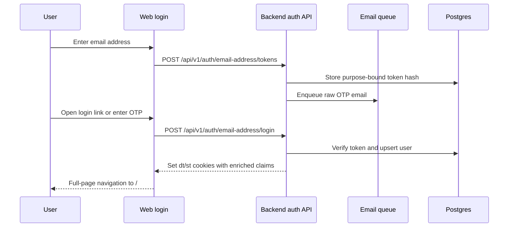

# Authentication Overview reference

[Back to Authentication Overview](auth-overview.md)

## Login Flows

### Auth Endpoint Change Checklist

When adding or changing an auth/session endpoint:

- Add the route to `backend/services/route-rate-limits/config.mts` unless the route is explicitly
  exempt. Most `/api/v1/auth/**` endpoints are `sensitive`; high-frequency session reads such as
  `GET /api/v1/auth/me` and `PATCH /api/v1/session` are `read`; logout stays exempt so users can
  always end a session.
- Use `requireAuth`, `getOptionalAuthAndRateLimit`, or `requireAuthAndRateLimit` for standard
  authenticated route preambles. If a route must call `ctx.applyRouteRateLimit()` directly, keep the
  `METHOD:/path` route ID string exact.
- Return generic failure messages for credential, OTP, OAuth, MFA, and passkey verification failures
  so the response does not reveal which identifier, credential, or factor was valid.
- Wrap verification-library calls at the service boundary and map expected failures to controlled
  4xx responses. Unexpected provider/library errors should be handled with `onError`/Sentry context,
  not leaked to clients.
- Add focused tests for route registry coverage, rate-limit category, generic error behavior, and
  verification-library failure handling.

Logout accepts an optional complete web-push binding (`web_push_endpoint` plus
`web_push_subscription_id`). Both values are required together; the endpoint is canonicalized as an
HTTPS URL. Before session revocation it deactivates only that exact current generation, making stale
or foreign browser state a no-op.

### Email OTP (production)

1. `POST /api/v1/auth/email-address/tokens` — generates an 8-character uppercase hex token, stores
   a purpose-bound HMAC-SHA256 hash in `email_address_login_tokens`, and enqueues an email to deliver the raw token.
   Expires in 15 minutes. Rate-limited per email, IP, device, and session. The email includes both a CTA button and the
   full `/login?emailAddress=...&otp=...` URL as fallback text.
   Keep the backend token length in sync with the web login UI: `LoginCodeStep` renders eight OTP
   slots, `LoginForm` trims deep-link OTP values to eight characters, and Playwright covers a real
   backend-generated token through the UI.
2. If the user opens that login link, `/login` pre-fills the email address and OTP, renders the
   verification-code step immediately, hides OAuth buttons unless the user presses Back, and
   auto-submits once.
3. User can also enter the token manually from the email.
4. `POST /api/v1/auth/email-address/login` — verifies the token, upserts the user, fetches
   enriched claims, creates new `dt`/`st` JWTs with `uid` and enrichment fields set, and sets
   the cookies. When an existing pair is present in the request body or cookies, the backend
   reuses that device/session chain. Verification attempts are also rate-limited.

### Verified email resolution

An OAuth account is valid even when its provider supplies no email address. Features that need a
verified address resolve one at send or action time in this order: the primary verified Voucha
address, other verified Voucha addresses, then verified provider addresses from Apple, Google,
LinkedIn, GitHub, Facebook, and Microsoft. X is excluded because its account data does not establish
a verified email address. Provider addresses remain provider-owned and are not copied into the
user's managed email-address list.

If no candidate exists, outbound user-targeted email jobs complete as a typed
`no_verified_email` skip instead of failing or reporting an operational error. Recurring schedulers
release their claim so a later run can try again after the user adds an address. One-time lifecycle
emails are not backfilled.

Actions that require a verified email return `EMAIL_VERIFICATION_REQUIRED`. Web, Swift, and .NET
open their native add-and-verify flow while preserving the user's draft or rolling back an
optimistic mutation. After verification they show `Email verified. Try your action again.` The
original action is never replayed automatically, so the user remains in control of a mutation that
may no longer be safe to repeat.

The user creation path is implemented in
[`backend/services/users/create.mts`](../../../backend/services/users/create.mts). Concurrent
email/phone signups recover from unique-constraint races by refetching the winning user through the
primary-read lookup path in
[`backend/services/users/get.mts`](../../../backend/services/users/get.mts). Backend workspace
conventions for this area live in [`backend/CLAUDE.md`](../../../backend/CLAUDE.md).

#### Disposable email blocking

Step 1 validates the email domain before issuing a token. Domains listed in the email blacklist
(synced from `unkn0w/disposable-email-domain-list` and `disposable-email-domains/disposable-email-domains`)
are rejected with HTTP 422 and the message:

> Please use a permanent email address. Disposable email providers are not supported.

The bloom filter accelerates this check — domains clearly absent from the blacklist skip the DB
query entirely. The filter is rebuilt weekly; domains added between rebuilds are caught on the
next rebuild cycle.

### Test user (dev/test only)

`POST /api/v1/auth/login` accepts `{ email: "tests@voucha.ai", login_token: "12345678" }` and sets cookies directly. Only works when `NODE_ENV` is `development` or `test`.

### OAuth Providers

| Provider  | SDK Type            | Env Var                           |
| --------- | ------------------- | --------------------------------- |
| Facebook  | JS SDK (`FB.login`) | `NEXT_PUBLIC_FACEBOOK_APP_ID`     |
| Apple     | Redirect            | `NEXT_PUBLIC_APPLE_CLIENT_ID`     |
| Google    | Redirect            | `NEXT_PUBLIC_GOOGLE_CLIENT_ID`    |
| X         | PKCE redirect       | `NEXT_PUBLIC_X_CLIENT_ID`         |
| LinkedIn  | PKCE redirect       | `NEXT_PUBLIC_LINKEDIN_CLIENT_ID`  |
| Microsoft | PKCE redirect       | `NEXT_PUBLIC_MICROSOFT_CLIENT_ID` |
| GitHub    | Redirect            | `NEXT_PUBLIC_GITHUB_CLIENT_ID`    |

All OAuth flows end with `POST /api/v1/auth/oauth/{provider}/continue`, which exchanges the
provider token/code for a user, stores any provider access/refresh tokens as authenticated
ciphertext, then sets `dt`/`st` cookies with enriched session claims.

Facebook, X, and GitHub also support the shared server-begun authorization broker. The provider and
client mode are enabled independently through the default-off `oauth-authorization-broker`
DynamicConfig. Clients discover those capabilities from `GET /api/v1/auth/oauth/providers`, begin
with `POST /api/v1/auth/oauth/{provider}/authorizations`, and finish with
`POST /api/v1/auth/oauth/authorizations/{flowId}/complete`.

The public callback stores the provider code as authenticated ciphertext before it awaits an
ID-only queue enqueue. Provider-account persistence and the `completion_ready` transition commit in
one fenced transaction. X exchange must start within ten seconds of callback persistence so its
documented 30-second code lifetime still has a bounded 15-second provider-call budget. Facebook
uses confidential server exchange without RFC 7636; X and GitHub use S256 PKCE. Web opens a blank
popup synchronously, then navigates it to the server-generated provider URL. The callback popup
relays only flow ID and terminal outcome to its exact-origin opener. Web completion accepts the
secret only from a path-scoped HttpOnly cookie whose expiry is capped by the durable authorization.
The callback page retries transient completion failures, delivers a parsed terminal result, and
waits for its exact-origin opener to confirm receipt. Only then does it explicitly acknowledge that
result through the same credential-bound route. Acknowledgement consumes the durable
completion-token hash and clears the cookie; a popup crash before receipt remains replayable, while
a lost acknowledgement after receipt does not withhold the delivered result and the remaining
credentials expire with the authorization.
Native completion requires both the custom-scheme token and the app-held SHA-256 proof verifier.
For an MFA result, successful proof verification creates a fresh private UUIDv7 login-attempt
credential. The public callback flow ID is never reused for MFA verification, and the private
credential is disclosed only in the completion response.
The initiating device always remains strict, and the initiating session remains strict until the
authorization is completed. If the first authenticated response rotates the session but its body is
lost, the authorization's durable result retains the authenticated UUIDv7 device and session IDs so
concurrent completion requests and later replays converge on one device/session pair. A replay may
use that pair only when the completion credential and proof are still valid and its authenticated
user, device, and session match the authorization's durable result. Native clients
persist the pending verifier and callback token in platform-secure storage across process
recreation; a finalization failure remains retryable or cancellable without restarting the app.
If secure storage cannot clear a pending authorization or MFA result during cancellation, the
coordinator retains that authorization state, presents a recoverable failure, and permits the user
to retry cancellation instead of letting the platform UI handler fail. See the
[rollout runbook](../../operations/oauth-authorization-broker-rollout.md).

Facebook is always shown on the login page (disabled with tooltip when unavailable). All other
providers are conditionally rendered based on their env var.

Google readiness is tied to the Google Identity Services `window.onGoogleLibraryLoad` callback
rather than a one-time `window.google` check when the script tag loads. Sign in with Apple JS does
not publish an equivalent SDK-ready callback; the web hook treats the Apple script load event as the
readiness boundary and still validates `window.AppleID.auth` when the user starts Apple login.

**Facebook HTTPS requirement:** The Facebook JS SDK (`FB.login()`) requires HTTPS. If `FB.login()`
throws (e.g. on HTTP), the error is caught and surfaced as a toast. This does not affect production
(always HTTPS).

### Post-Login Redirect

After successful login (email OTP or OAuth), the login form calls Next.js `replace()` with the
sanitized destination and then `refresh()`. The refresh re-runs server components, including
`getCurrentUser()`, with the new HTTP-only auth cookies, so the current App Router tree adopts the
authenticated state without requiring a full-page browser navigation. The default destination is
`/`; its authenticated server redirect leads to `/feed/news`.

## Logout

`POST /api/v1/auth/logout`:

1. Verifies the `dt`/`st` cookie pair and revokes the session by session ID in Valkey when the pair
   is valid and uid-bearing. `st` alone and anonymous pairs clear cookies but do not revoke
   server-side state.
2. Clears both cookies (`maxAge: 0`).
3. Is intentionally exempt from backend per-route rate limiting so a user can always end their
   session.

`DELETE /api/v1/session` (used by the web proxy):

1. Revokes the current session (if valid and uid-bearing).
2. Issues a fresh anonymous session preserving the device ID.

Client-side: call `logout` from `web/lib/auth/logout.ts`. It posts to the logout API, throws on API
or network failure so the caller can show an error, and performs a full-page reload of the current
URL on success. Pages then handle any signed-out redirects themselves.
