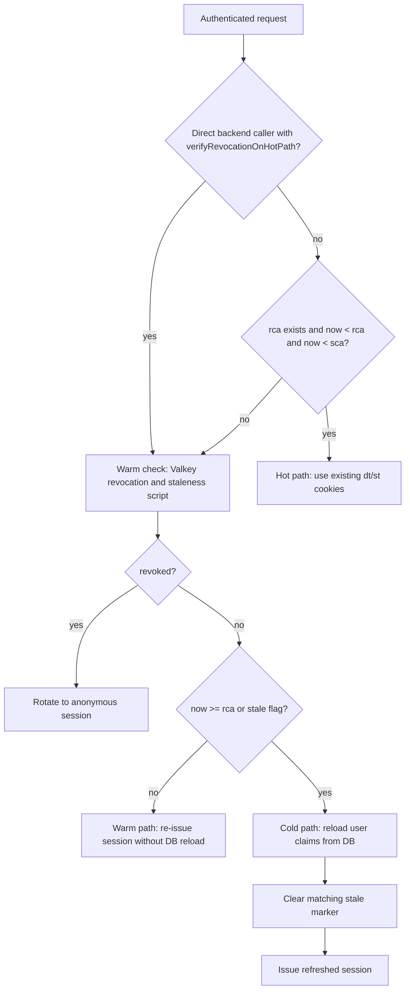

# Authentication Overview reference

[Back to Authentication Overview](auth-overview.md)

## Stateless Session Architecture

Sessions are mostly stateless by design. The JWT is self-contained and cryptographically signed.
Every authenticated API request verifies the `dt`/`st` pairing and checks the session ID revocation
flag before treating the session as authenticated.

### Hot / Warm / Cold Paths (PATCH /api/v1/session)

The `PATCH /api/v1/session` endpoint implements three paths based on freshness timestamps embedded
in the session JWT. The Next.js proxy (`web/proxy.ts`) decodes `sca` and only calls this endpoint when an
authenticated session is due for a warm/cold check; hot sessions keep using the edge-verified
cookies.
Direct backend callers of `PATCH /api/v1/session` still force a revocation check before returning
authenticated session state, so a revoked token is rotated to anonymous even if its embedded `sca`
window is still fresh.

| Path     | Trigger                                                     | Valkey calls              | Action                                                |
| -------- | ----------------------------------------------------------- | ------------------------- | ----------------------------------------------------- |
| **Hot**  | defined `rca`, `now < rca`, and `now < sca`                 | 0 refresh calls           | Return existing session as-is                         |
| **Warm** | `now < rca` and `now >= sca` (sca = 5 min interval)         | 1 script                  | Check revocation + staleness; preserve `rca`          |
| **Cold** | missing/elapsed `rca` (rca = 30 min interval) OR stale flag | 1 script + 1 DB + 1 write | Reload user from DB, then re-issue with a fresh `rca` |

### Staleness Invalidation

When user roles or membership change, `markJwtStale(userId)` sets a Valkey flag
(`voucha:jwt-stale:{userId}`). On the next PATCH /api/v1/session warm/cold check, the flag
forces a cold-path DB reload and the flag is cleared after re-issuance.

### Revocation

Logout calls `revokeSession(sid)` for verified uid-bearing sessions, which sets
`voucha:jwt-revoked:{sid}` in Valkey with a TTL of `REVOCATION_EXPIRATION_SECONDS`
([`session-revocation-keys.mts`](../../../backend/services/jwt-session/session-revocation-keys.mts)),
the longest supported session lifetime. The same TTL applies to every revoked session regardless of
device class, so the marker outlives even an attested device's longer-lived session. Anonymous
logout and reset only clear or rotate cookies because anonymous revocation markers are not checked
by request context.
Request context checks this flag for uid-bearing sessions before resolving the current user, so
logout takes effect immediately for API requests. `PATCH /api/v1/session` also checks revocation on
the warm/cold refresh paths and rotates revoked sessions back to anonymous.
If a regular API request sees a revoked uid-bearing session first, request context also returns an
anonymous user and sets a fresh anonymous `st` cookie for subsequent requests.

### Active Session Registry

The backend also persists an active-session registry in `user_sessions`, keyed by JWT `sid` and
partitioned `RANGE(id)` with a default partition only. `created_at` is derived from
`uuid_extract_timestamp(id)`, so the public API still returns creation time without a separate
mutable timestamp column. Login flows (`email OTP`, `OAuth`, `discoverable passkey`, and MFA
completion) insert or refresh the current session row with the current device/IP/user-agent
metadata. `GET /api/v1/auth/sessions` repairs a missing current row for already-issued JWTs,
`DELETE /api/v1/auth/sessions/:id` revokes a single owned session, `POST /api/v1/auth/sessions/revocations`
revokes all of the current user's active sessions, and logout marks the current row revoked
alongside the Valkey revocation flag. `last_seen_at` advances on login, list, logout, revoke, and
warm/cold refreshes, but not on the hot JWT verification path.
