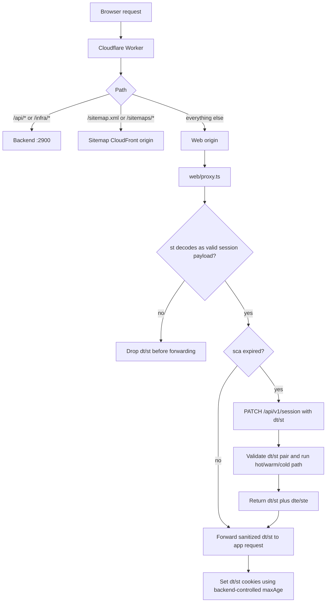

# Authentication Overview reference

[Back to Authentication Overview](auth-overview.md)

## Valkey State

| Key                                       | Purpose                               | TTL                                                                                                                                                                            |
| ----------------------------------------- | ------------------------------------- | ------------------------------------------------------------------------------------------------------------------------------------------------------------------------------ |
| `voucha:jwt-revoked:{sid}`                | Revoked session flag                  | Longest supported session lifetime — see `REVOCATION_EXPIRATION_SECONDS` in [`session-revocation-keys.mts`](../../../backend/services/jwt-session/session-revocation-keys.mts) |
| `voucha:jwt-user-revoked-before:{userId}` | User-wide revocation cutoff timestamp | `REVOCATION_EXPIRATION_SECONDS` in [`session-revocation-keys.mts`](../../../backend/services/jwt-session/session-revocation-keys.mts)                                          |
| `voucha:jwt-stale:{userId}`               | Stale claims flag                     | 2 days                                                                                                                                                                         |

Session and device creation and refresh events are emitted to the `auth_sessions` analytics table (see [analytics-pipeline.md](analytics-pipeline.md)) for daily active user, device, and session counts in S3 Tables. Event types distinguish newly created sessions from authenticated and anonymous refreshes.

### JWT Key Configuration

The app session/device JWTs use standardized rotated JWK env vars:

- `VOUCHA_SESSION_JWT_PRIVATE_KEYS_B64`: base64-encoded JSON array of private JWKs, newest
  first. The backend signs with the first key.
- `VOUCHA_SESSION_JWT_PUBLIC_KEYS_B64`: base64-encoded JSON array of public JWKs, newest first.
  The Cloudflare Worker verifies with this list; the backend can derive public keys from the
  private-key list when needed.

Keys must be RSA signature JWKs with `alg: "RS512"` and unique `kid` values. Startup/signing fails
fast if a configured key uses a different type, algorithm, use, or duplicate key id.

Rotation workflow:

1. Prepend the new key pair to both arrays
2. Deploy backend and Cloudflare Worker with both keys present
3. Wait for old JWTs to expire
4. Drop the trailing old key

## Request Flow

The Cloudflare Worker is the public entry point. It routes API and sitemap traffic directly, and only requests sent to the web origin then run the Next.js proxy (`web/proxy.ts`):

The backend reads browser session authentication from the `dt` / `st` cookies. The logged-in path
requires a verified pair, and client-supplied auth-looking `x-*` headers are stripped before origin
forwarding.
