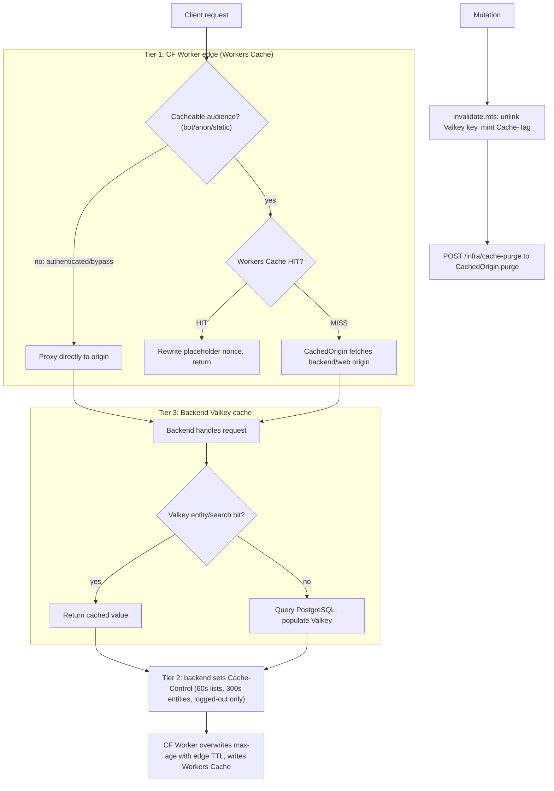

# Caching Strategy reference

[Back to Caching Strategy](caching-strategy.md)

## Cache Tiers

The read path below traces a request across all three tiers, plus where the invalidation/purge
path re-enters at Tier 1.

### Contents

- [Tier 1: CF Worker Edge Cache (Workers Cache)](reference-tier-1-cf-worker-edge-cache-workers-cache.md)
- [Bot Tiers](reference-bot-tiers.md)
- [Origin and Browser `Vary` Boundaries](reference-origin-and-browser-vary-boundaries.md)
- [Navigation Performance](reference-navigation-performance.md)
- [Tier 2: Backend HTTP Cache-Control](reference-tier-2-backend-http-cache-control.md)
- [Tier 3: Backend Valkey Cache](reference-tier-3-backend-valkey-cache.md)
