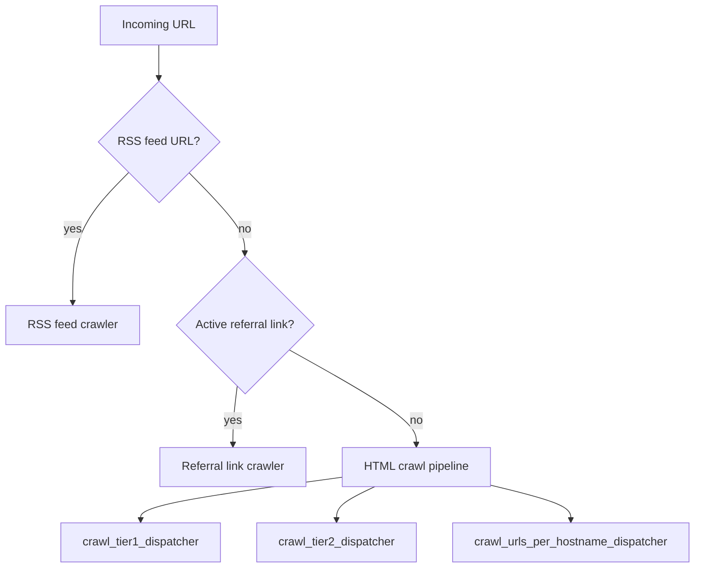

# Crawling Architecture reference

[Back to Crawling Architecture](crawling.md)

## Components

| Component             | Location                                   | Purpose                                                   |
| --------------------- | ------------------------------------------ | --------------------------------------------------------- |
| Crawl service         | `backend/services/crawls/`                 | Core crawl logic, rate limiting, dispatch                 |
| Crawler rules         | `backend/services/crawlers/`               | Per-hostname CSS selector/link removal rules              |
| robots.txt            | `backend/services/urls-domains-robots/`    | robots.txt fetching, compliance, rate limit computation   |
| Domain blacklist      | `backend/services/urls-domains-blacklist/` | External blacklist sync, bloom filter cache               |
| HTML crawler          | `backend/services/crawler-html/`           | Secure fetch, HTML extraction, crawl-local embed planning |
| Crawl embeds          | `backend/services/crawl-embeds/`           | Filaments provider/SSRF policy and exact-crawl enrichment |
| Crawl chunks          | `backend/services/crawl-chunks/`           | Content chunking for embeddings                           |
| RSS feeds             | `backend/services/rss-feeds/`              | RSS feed fetching and item extraction                     |
| Referral link crawler | `backend/services/crawler-referral-links/` | Referral link health crawling (no embeddings)             |
| Crawler system        | `backend/queues/crawler/`                  | glide-mq queue for individual URL crawls                  |
| Crawl embeds queue    | `backend/queues/crawl-embeds/`             | Destination-host-limited remote oEmbed enrichment         |
| Crawl referral links  | `backend/queues/crawl-referral-links/`     | glide-mq queue for referral link crawl jobs               |
| Crawl hostnames       | `backend/queues/crawl-hostnames/`          | glide-mq dispatch jobs and scheduling                     |
| Blacklist system      | `backend/queues/urls-domains-blacklist/`   | Weekly blacklist sync from external sources               |

## Crawl Pipeline

For each URL crawl:

1. **Guard checks** — skip if `hostname.blocked = true` or `hostname.crawlable = false`
2. **Domain rate limit check** — skip (throw `CrawlerRateLimitError`) if domain has an active 429 lock in Valkey
3. **robots.txt check** — skip if `isUrlCrawlable()` returns false; network errors and HTTP 4xx/5xx from robots.txt are treated as ALLOW (RFC 9309); only unexpected runtime exceptions (e.g. parsing bugs) are treated as disallowed
4. **Crawler rule lookup** — fetch per-hostname rules (`css_selectors_to_remove`, `link_*_to_remove`)
5. **Google Web Risk** — optional lookup runs only after local blocklist, rate-limit, robots, and crawler-rule checks pass. Provider failures/rate limits fail open; risky verdicts block the registrable domain locally.
6. **Conditional HTTP fetch** — send `If-None-Match`/`If-Modified-Since` from last successful crawl
7. **Redirect handling** — follow up to 10 hops; 301/308 redirects set `canonical_url_id`; loops detected via visited URL set; redirect targets that normalize to the source URL are treated as self-redirects
8. **noindex detection** — check `<meta name="robots">` and `X-Robots-Tag`; noindex pages stored with empty markdown, no embeddings
9. **Embed extraction** — pass the already-extracted document to `@vouchington/embeds` (no second
   document fetch or remote oEmbed request), store the normalized local `embed_metadata` and the
   crawl-local `embed_oembed_url` candidate.
10. **Content storage and handoff** — store `markdown`, `title`, `links`, `meta_tags`, `lang`, the
    crawl's nullable normalized `embed_metadata`, and its optional endpoint. Only after that write,
    enqueue the durable crawl ID on `crawl_embeds`; its I/O worker applies destination-host ordering,
    retries remote oEmbed, conditionally updates that exact crawl, and records
    `embed_oembed_resolved_at`. `html_snapshot_uploaded_at` records when the crawl actually writes a
    snapshot.
11. **S3 upload** — raw HTML bodies are uploaded to 7-day S3 snapshots when the origin returns a body, including noindex pages; snapshot keys are hash-based (`hostname/urlId/htmlSha256`), so unchanged pages skip the PUT only while the previous snapshot is still inside the lifecycle window. Conditional request headers are also withheld after that window so stale snapshots force a full-body refresh.
12. **Boilerplate extraction** — recent raw-body crawl HTML from S3 is the only input to nightly boilerplate removal; parsed crawl rows/history keep their existing DB retention and are not the source corpus for that pass, and the 7-day snapshot lifecycle remains safe because reads require a fresh `html_snapshot_uploaded_at`
13. **Canonical URL** — extract from `<link rel="canonical">`, create/link URL entry, and skip links that normalize to the current URL row
14. **Embeddings** — chunk markdown via `@services/ai-chunking`, reuse existing embeddings by SHA256, enqueue OpenAI jobs for new chunks

Crawler-related outbound HTTP uses centralized undici dispatchers to reuse sockets and avoid port exhaustion under worker/test concurrency. SSRF-validated HTML fetches use cached pinned dispatchers keyed by resolved addresses so DNS pinning still removes the TOCTOU window between validation and connect. `@jongleberry/vurst-html` decodes bounded HTML bytes before parsing, with BOM, `Content-Type`, and early HTML meta declarations taking precedence before UTF-8 and Windows-1252 fallbacks so legacy pages can still be parsed.

The `crawl_urls/crawl_url` queue processor stores crawl output through the crawl service and returns only a small crawl reference to GlideMQ. It must not return full crawl rows because `markdown`, `links`, and `meta_tags` can exceed GlideMQ's serialized return-value limit.

## Rate Limiting

Rate limiting operates at two levels:

### Per-Hostname Rate Limit

Computed by `computeHostnameRateLimitMs()` as `max(rps_delay, crawl_delay)`, capped at 60s:

- `rps_delay` = `ceil(1000 / url_hostnames.requests_per_second_limit)` (default 1 RPS → 1000ms)
- `crawl_delay` = `Crawl-delay` value from robots.txt for `voucha-bot` user-agent (in ms)

Applied at job-queue level via `glide-mq` `ordering.rateLimit` — jobs for the same hostname are enqueued with a delay between them.

### Domain Rate Limit (429 Lock)

When a server returns 429, the domain is locked in Valkey with a TTL:

- Lock duration = `Retry-After` header value (if present) or 60s default
  - `retryAfterMs = 0` re-enqueues the original job with no per-job delay, but still sets a 1s lock so subsequent same-hostname jobs may defer briefly in preflight
- Overlapping 429 locks preserve the longest remaining TTL, so a later short Retry-After cannot shorten an existing longer lock
- Subsequent crawl jobs for that domain read the lock and throw `CrawlerRateLimitError`

## Triggered Crawls

Crawls are enqueued immediately (fire-and-forget, debounced by `urlId`) in these cases:

- **URL row first created** — `addUrls` in `backend/services/urls/upsert.mts` calls `enqueueBulkOnUrlCreated` when running outside a transaction (the non-transactional path), which creates or retrieves the crawler record for the URL's hostname and triggers boilerplate removal. When running inside a transaction it calls `processUrlCreatedInline` instead, which only creates the hostname crawler record. Neither path immediately enqueues a crawl for the URL itself; scheduled dispatchers handle that.
- **URL entity-relation upserted** — `upsertEntityRelation` in `backend/services/entity-relations/upsert.mts` calls `enqueueBulkCrawlUrls` for every object with `object_type === 'url'`. This ensures a fresh crawl is enqueued even when an existing URL row is attached to a post or other entity as a related link.
- **Manual admin trigger** — `POST /api/v1/urls/:id/crawl` in `backend/api/v1/urls/url.mts`.

## URL Crawl Routing And Exclusivity

Each URL is crawled by exactly one pipeline. The HTML dispatchers explicitly exclude URLs owned by RSS feeds and referral links, so routing stays mutually exclusive.
