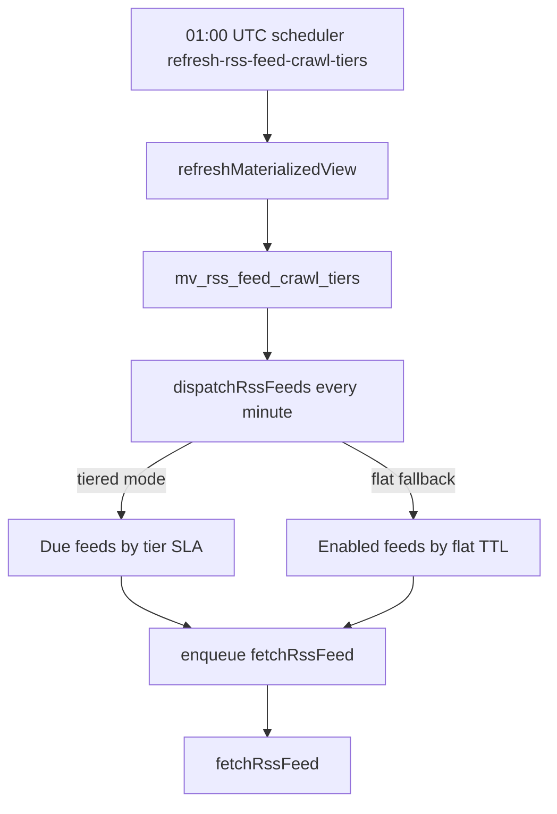

# Crawling Architecture reference

[Back to Crawling Architecture](crawling.md)

## Error Handling

All errors are recorded in the `crawls` row:

| Error                              | `response_status_code` | `network_error` |
| ---------------------------------- | ---------------------- | --------------- |
| `CrawlerTimeoutError`              | 504                    | `'timeout'`     |
| `CrawlerNetworkError` (DNS cause)  | 502                    | `'dns'`         |
| `CrawlerNetworkError` (other)      | 502                    | `null`          |
| `CrawlerRateLimitError`            | 429                    | `null`          |
| `CrawlerServerError`               | 5xx                    | `null`          |
| `CrawlerResponseSizeExceededError` | 413                    | `null`          |
| `CrawlerHttpClientError`           | 4xx                    | `null`          |
| `HttpNoBodyError`                  | 502                    | `null`          |

The crawler system retries 3 times with 5s exponential backoff. 429 errors re-enqueue with the `Retry-After` delay. Fetch/host crawl failures may enqueue alternate same-hostname retry candidates; local persistence and S3 upload failures use only the original job's bounded retry budget. DNS lookup failures and RSS TLS certificate hostname mismatches count toward the shared hostname auto-disable counter; stale failures older than 7 days do not compound, and 3 counted failures mark the hostname non-crawlable until an admin re-enables it.

Expected crawler operational failures are not reported to Sentry or stderr. They are recorded through the crawler persistence path (`crawls`, referral link health state, hostname DNS/configuration counters) and `crawler_requests` analytics, which can land in S3 Tables when the analytics Firehose backend is enabled.

## Domain Blacklist

External spam/malware domain lists are synced weekly:

1. `domain_blacklist_sources` — sources fetched from external URLs (Spamhaus, etc.)
2. `domain_blacklists` — normalized domains from all sources
3. Bloom filters in Valkey — O(1) negative checks; populated after each sync

`checkDomainBlacklisted()` logic:

- **Bloom filter `false`** (definitely not blacklisted): only checks `url_hostnames` flags
- **Bloom filter `true`/unavailable**: runs full query including `domain_blacklists`

## RSS Feed Crawling

RSS feeds are fetched independently from HTML crawls. The dispatcher honors shared domain 429 locks before Web Risk, robots.txt, or feed fetch work, and RSS 429 responses extend the same lock used by HTML crawls. Vouchington injects its SSRF-pinned transport, limits, typed errors, and analytics into `@vouchington/rss-crawler`; `@vouchington/rss-parser` owns BOM, `Content-Type`, XML declaration, UTF-8/windows-1252 fallback, and feed parsing. JSON Feed responses remain UTF-8 regardless of stale charset parameters, and content hashes continue to use the raw response bytes for dedupe. Feed items are deduplicated by `(url_hostname_id, guid)`, linked through `rss_feed_item_sources`, and embedded for search.

`rss_feed_crawls` keeps crawl bodies for 30 days via monthly RANGE partition drop owned by `cleanupPartitions`. A month is dropped once its upper bound is older than that cutoff, so visible history is about 30-60 days, matching `crawls`. Conditional GET etag and `last_modified_at` stay on `rss_feeds`; 304 body replay still needs a crawl row inside the retained window. After the body ages out, fetch withholds `If-None-Match`/`If-Modified-Since` so the next crawl stores a fresh 200 body instead of replaying a missing 304.
