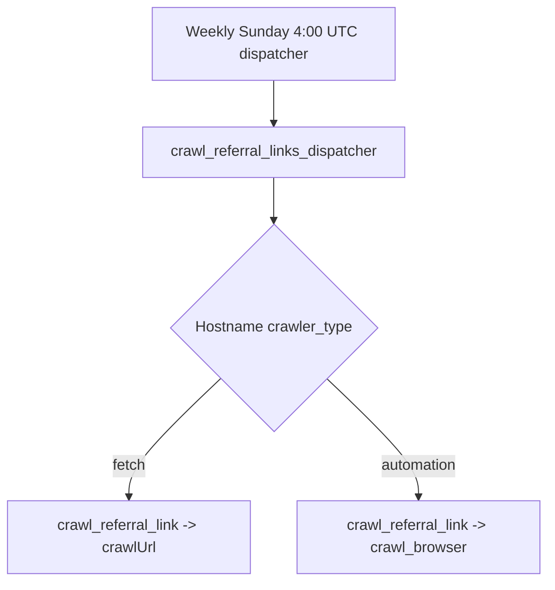

# Crawling Architecture reference

[Back to Crawling Architecture](crawling.md)

## Referral Link Crawling

Referral links use a full HTML crawl with markdown and no embeddings. The `automation` path is for client-side rendered pages; the `fetch` path uses the standard crawler.

### Auto-Deactivation Rules

| Error type          | Behavior                                                                |
| ------------------- | ----------------------------------------------------------------------- |
| Success (200)       | Reset `consecutive_crawl_failures` to 0, update `last_crawl_success_at` |
| 404/410 (removed)   | Deactivate immediately                                                  |
| 5xx / timeout / DNS | Increment `consecutive_crawl_failures`, deactivate at >= 3              |
| 429 (rate limited)  | Do NOT count as failure (server is alive), rethrow for queue retry      |

Auto-deactivation sets `activated_at = NULL`, `deactivated_at = CURRENT_TIMESTAMP`.

## robots.txt Compliance

- User-Agent: `voucha-bot https://voucha.ai/article/voucha-bot`
- Robots.txt cached in Valkey for 24 hours
- RFC 9309 §2.4: 4xx → ALLOW (bot cannot access rules file)
- 5xx after 3 retries → ALLOW (temporary server error)
- Network error after 3 retries → ALLOW
- Blacklisted domain → DISALLOW (before fetch)

## Related

- Workspace instructions: [backend/CLAUDE.md](../../../backend/CLAUDE.md)
- Worker entry point: [backend/workers/crawler/workers.mts](../../../backend/workers/crawler/workers.mts)
- [backend/services/crawls/README.md](../../../backend/services/crawls/README.md) — error recording, embeddings workflow
- [backend/CLAUDE.md](../../../backend/CLAUDE.md) — backend workspace conventions
- [backend/services/crawler-html/index.mts](../../../backend/services/crawler-html/index.mts) — secure HTML fetch policy, upstream extraction, crawler error classification, and metrics
- [backend/services/crawler-html/README.md](../../../backend/services/crawler-html/README.md) — crawler HTML service ownership and contracts
- [backend/services/urls-domains-robots/README.md](../../../backend/services/urls-domains-robots/README.md) — bloom filter fast path, RFC 9309
- [backend/queues/crawler/README.md](../../../backend/queues/crawler/README.md) — job queue configuration, S3 storage
- [articles/voucha-bot.md](../../../articles/voucha-bot.md) — public-facing crawler documentation
- [Runtime timeout classification](../../development/reference-runtime-timeouts-classification.md#hard-constraints-externalprotocol-driven) — per-fetch hard constraints for crawler HTML, robots.txt, and RSS chapters
