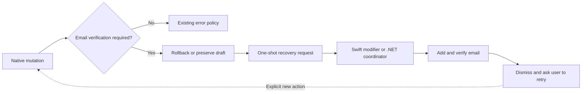

# Error Handling reference

[Back to Error Handling](error-handling.md)

## Precondition Errors and Action-Oriented Modals

Some `4xx` errors signal a missing precondition the user can fix _right now_ (e.g. creating a username before posting). These must not be surfaced as a plain Sonner toast. They should open an action-oriented modal that lets the user resolve the precondition inline. Whether the original action is retried depends on the precondition contract.

**Rule: banners vs. modals**

| Precondition                                                   | Surface                         | Why                                         |
| -------------------------------------------------------------- | ------------------------------- | ------------------------------------------- |
| Can be resolved right now (missing username, unverified email) | Action-oriented modal           | User fixes it inline                        |
| Cannot be resolved right now (`account_too_new`)               | `<Alert>` banner above the form | Informational only; no inline fix available |

**Canonical modal contract** — name the resolution callback after what it resolves (e.g. `onUsernameSet`, `onVerified`):

```tsx
type Props = {
  open: boolean
  on<Resolved>: () => void // precondition satisfied — parent retries the original action
  onClose: () => void      // user dismissed — parent resets submitting state
}
```

**Catch-side handling pattern** (see `web/components/posts/post-form.tsx`):

```typescript
} catch (err) {
  if (err instanceof ApiError && err.code === 'IDENTITY_REQUIRED') {
    setUsernameDialogOpen(true)
    shouldResetSubmitting = false  // keep submit button disabled while dialog is open
  } else if (err instanceof ApiError) {
    toast.error(err.message || 'An error occurred. Please try again.')
  }
}
```

**Retry policy** — username recovery may retry a preserved submission automatically. Verified-email
recovery must not replay the interrupted mutation. Roll back optimistic state where necessary,
preserve safe drafts, and after verification show `Email verified. Try your action again.` The user
then explicitly repeats the action.

Native clients encode that policy in one-shot gated-mutation helpers. The helper executes the
operation once, applies the caller's action-specific rollback or draft preservation before requesting
recovery, and retains only presentation state. It never retains the mutation closure or payload.



For an auto-retried username precondition, extract the API call into a `submitPost()` function separate from the form-validation logic. `onUsernameSet` calls `submitPost()` directly (bypassing validation since the form state is unchanged):

```tsx
<UsernameRequiredDialog
  open={usernameDialogOpen}
  onUsernameSet={() => {
    setUsernameDialogOpen(false)
    void submitPost()
  }}
  onClose={() => {
    setUsernameDialogOpen(false)
    setIsSubmitting(false)
  }}
/>
```

**Reference implementations**

- `web/components/shared/username-required-dialog.tsx` — shared dialog for `IDENTITY_REQUIRED`; accepts optional `title`, `description`, and `submitLabel` props to customize copy per context
- `web/components/my/email-verification-recovery-dialog.tsx` — shared recovery for `EMAIL_VERIFICATION_REQUIRED`; completes verification but deliberately does not replay the action
- `web/components/my/mfa-reauth-dialog.tsx` — resolves `MFA_REAUTH_REQUIRED` (original precedent)
- [Swift recovery implementation](https://github.com/vouchington/vouchington-clients/tree/main/swift-clients/ui/Sources/VouchaFeatures/Settings) — executes one Swift mutation, rolls back on failure, and drives the shared recovery modifier without retaining retry work
- [.NET recovery implementation](https://github.com/vouchington/vouchington-clients/tree/main/dotnet-clients/src/Voucha.Client.Core/Support) — returns action-specific gate fallbacks and exposes a one-shot request consumed by the MAUI recovery coordinator

**Consumers of `UsernameRequiredDialog`**

- `web/components/posts/post-form.tsx` — post creation (reviews, discussions, stories, etc.)
- `web/components/communities/create-community-form.tsx` — community creation
- `web/components/topic-recommendations/topic-recommendation-form.tsx` — topic recommendation submission
- `web/components/my/landing-pages-manager-sections.tsx` — landing pages empty state CTA
- `web/components/news/news-global-discussions-menu.tsx` (via `use-start-discussion-action.ts`) — global "Discuss" on news/RSS items
- `web/components/news/news-community-discussion-action.tsx` — "Discuss with Community" on community news pages

## Related

- [docs/overview/architecture/ai-agents.md](./ai-agents.md)
- [docs/overview/architecture/auth-overview.md](./auth-overview.md)
- [Bluesky OAuth callback](../../../backend/api/v1/auth/README.md#get-apiv1authblueskycallback)
- [web/CLAUDE.md](../../../web/CLAUDE.md)
- [Native client rules](https://github.com/vouchington/vouchington-clients)
