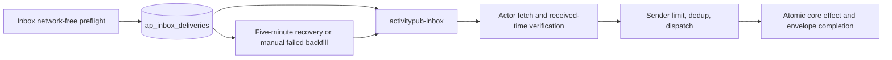

# Fediverse Federation reference

[Back to Fediverse Federation](fediverse-federation.md)

## Phase C — Outbound ActivityPub (resurrect the removed federation server) — Shipped

ActivityPub federation existed once and was deliberately removed. Phase C is largely a
**resurrection** of that removed implementation — a reference corpus to recover from source-control
history, not a drop-in: it predates the systems→queues/workers split, the `@modules/token-secrets`
secret-storage rule, and the repo's unflagged-API convention, so it needs modernizing, not copying.

Federatable actors are **Voucha users first** (people as AP actors); source/topic actors are
secondary. Federation is **per-user opt-in, default off**. The outbox publishes **social actions
only** (follow, like) — it never publishes posts, reviews, or data points as ActivityPub objects, and
that boundary does not move in this phase or any later one (see
[FEDIVERSE.md](../../requirements/content/FEDIVERSE.md), Current boundaries).

**Correctness prerequisites**, required before any inbound or outbound work — these are not optional
design choices:

- A new state row represents remote actors (via the config-driven relations pattern) — never overload
  the `users` table. **Shipped**: `remote_actors` table + `remote_actor` entity-relations config; the
  generic entity-relations API rejects `subject_type: 'remote_actor'` writes with `403` — only the
  signature-verified inbox receiver (C2) may write these rows.
- Loop prevention: writes that originate from a remote activity must not re-emit outbound. **Shipped**
  (C2+C3): `upsertEntityRelation`/`softDeleteEntityRelation` accept an `origin: 'remote'` tag that
  `dispatchInboundActivity`'s inbound Follow/Undo handling always sets, suppressing the outbound
  distribution enqueue. Verified both at the entity-relations origin-gate in isolation
  (`upsert-origin-gating.test.mts`/`delete-origin-gating.test.mts`) and at the real inbound-receiver
  entry point (`backend/workers/activitypub-delivery/e2e-round-trip.test.mts`).
- Actor URIs are UUID-based, not username-based — usernames are mutable. **Shipped**:
  `@modules/activitypub-uris` makes `/ap/users/:id` the only actor-identity primitive; `username` usage
  is isolated to `webfinger.mts` as the `acct:` alias.
- Cloudflare Worker routing must forward `/.well-known/`, `/ap/`, and `/nodeinfo/` — this is
  prod-blocking and is not exercised by route-level unit tests, so it needs its own routing test.
  **Shipped** (C5): `cloudflare-worker/src/routing.mts` forwards these prefixes to the backend, with a
  dedicated routing integration test.
- Remote HTTP-signature keys use a fixed two-window cache policy. **Shipped** (C2): the
  [remote-actor cache service](../../../backend/services/remote-actors/README.md) treats a key younger
  than one hour as fresh; from one hour through less than seven days, transport and non-2xx refresh
  failures may use the cached key without changing `fetched_at`; at seven days a successful refresh
  is mandatory. Only typed transport/non-2xx availability errors, bounded DNS-resolution
  availability failures, and explicitly classified response-body socket interruptions are
  fallback-eligible; unsafe SSRF decisions, body content/protocol failures, document validation,
  identity, and unexpected errors fail closed. A valid refresh recovers the existing row in place
  regardless of age. The seven-day ceiling is deliberately not configurable so deployment settings
  cannot extend trust in an unreachable actor key.

**Built, in dependency order, all Shipped:** an HTTP-signature verification module and an actor-keys
table (private key encrypted via `@modules/token-secrets`) — `@modules/http-signatures`,
`ap_actor_keys`, and the per-user `fediverse_federation_enabled` opt-in toggle, default off (C0+C1) →
an inbound receiver (WebFinger, NodeInfo, actor document, inbox with signature verification and replay
dedup) that maps incoming `Follow`/`Undo` onto the existing bookmarks write-path (tagged as
remote-origin) and incoming `Like`/`Undo` onto the new isolated `ap_posts`/`ap_post_likes` ledger
(never `post_votes` — see the [reuse-mapping table](reference-fediverse-federation-protocol-reality.md#how-the-existing-model-maps-reuse-targets); inbound `Like`/`Undo(Like)` resolution is also
gated on `canViewPost(null, post)`, so a remote actor cannot record a like tally against a post it
could not otherwise view) (C2) → loop prevention itself, by giving the relation-upsert write-paths an
origin flag (local vs. remote, default local) and gating outbound emission on the local case (C3) → a
queued outbound delivery worker (never `Promise.all` fan-out) that signs and delivers activities to
follower inboxes, hooked into the existing follow/like write-paths (C4). Its PostgreSQL checkpoint
records one activity's committed remote-actor cursor: it reads strict 500-candidate pages, lets
Valkey accept each page's distinct inbox jobs before compare-and-swap commit, and hands off an
ordered continuation. This bounds per-job work and makes retry proportional to remaining followers.
It is deliberately at least once, not a receipt ledger: a Valkey-accepted page whose DB commit is
lost can replay, remote HTTP can be ambiguous, and a Valkey wipe has no durable per-inbox recovery
path. Each page evaluates current follower eligibility, excluding only explicitly blocked
instances; unreviewed instances remain eligible (C4) → Cloudflare Worker routing
forwarding `/.well-known/`, `/ap/`, and `/nodeinfo/` to the backend (C5) → end-to-end round-trip tests
exercising the real discovery-to-write chain in both directions (C6):
`backend/api/activitypub/e2e-round-trip.test.mts` drives a synthetic remote actor through NodeInfo →
WebFinger → actor document → a signature-verified inbox POST that writes a real follow/like;
`backend/workers/activitypub-delivery/e2e-round-trip.test.mts` drives a real local follow/vote through
the real queue → delivery worker → a cryptographically verifiable signed outbound request, plus a
receiver-level loop-prevention check that an inbound remote Follow never itself enqueues outbound
distribution. The default-false `activitypub-inbox.async_delivery_enabled` flag preserves that inline
receiver and its exact statuses as a rollback path. When enabled, the API performs network-free
header/body, source-IP, allowlist, and sender preflight, plus a local-cache signature check when
the `keyId` already exists in `remote_actors`; it persists the exact signed envelope before
an awaited enqueue and returns `202` once PostgreSQL is durable. Invalid cached signatures never
become durable rows. The I/O worker fetches unknown actors,
verifies signature freshness relative to `received_at`, checks the activity actor, and atomically
checkpoints the verification timestamp with the active remote actor. Recovered retries recheck the
instance approval and parse the body but use that database checkpoint instead of refetching or
reverifying; an inactive checkpointed actor is a terminal rejection without network access. It
applies the sender limit once through a per-delivery Valkey decision preserved for the active
window. A closed typed lifecycle facade owns every timestamp transition and fencing-token rotation;
the canonical state model is documented in
[`backend/services/ap-inbox-activities/README.md`](../../../backend/services/ap-inbox-activities/README.md#durable-delivery-lifecycle).
The activity-id reservation, core database effect, and fenced envelope completion commit in one
transaction. Duplicate Follow recovery performs its guarded relation replay in that transaction,
while only the Accept enqueue is post-commit. A five-minute reconciler recovers lost or stale jobs;
an admin backfill re-arms exhausted operational failures. Success, duplicates, and terminal protocol
rejections delete the pending row and raw bytes.

Phase C's completion updated [FEDIVERSE.md](../../requirements/content/FEDIVERSE.md)'s boundary list
and replaced `backend/api/v1/fediverse/__tests__/federation-removal.test.mts`: the paths matching real
Phase C routes (WebFinger, NodeInfo) now assert they serve, while the paths that were never part of
Phase C — the old `/api/v1/activitypub/*` namespace, a Mastodon-compatible REST API, and a per-actor
inbox/outbox shape — still assert `404`.
