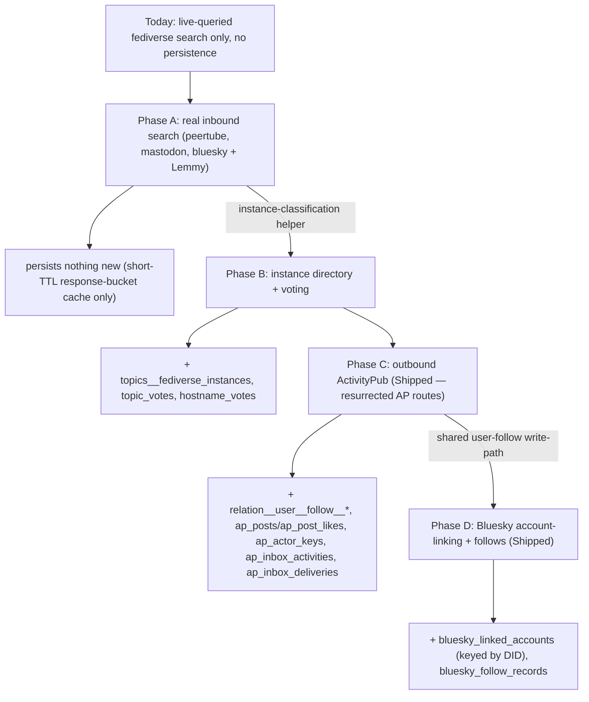

# Fediverse Federation reference

[Back to Fediverse Federation](fediverse-federation.md)

## Protocol reality

"The fediverse" is not one protocol. Mastodon, Lemmy, and PeerTube speak **ActivityPub**:
server-to-server delivery via actor documents, inboxes/outboxes, and HTTP signatures. Bluesky speaks
**AT Protocol**, a different mechanism entirely — a single ActivityPub actor cannot follow or like on
Bluesky. Outbound work therefore splits into two mechanisms:

- **ActivityPub** (Mastodon/Lemmy/PeerTube) — server-to-server delivery via a resurrected Voucha AP
  actor (Phase C). Federates Voucha **users** as AP actors first; source/topic actors are secondary.
- **AT Protocol** (Bluesky) — per-user OAuth account-linking; Voucha acts as a client and reconciles
  user follows via `app.bsky.graph.follow` (Phase D). A Bluesky like requires the target record's AT
  URI and CID. Voucha never publishes its posts to Bluesky, so it has no valid strong reference for
  generic like propagation.

## How the existing model maps (reuse targets)

Everything below already exists and is reused rather than reinvented.

| Fediverse concept                                               | Existing primitive                                                                                                                                                                                                                                                                                               | Key files                                                                                                                                                         |
| --------------------------------------------------------------- | ---------------------------------------------------------------------------------------------------------------------------------------------------------------------------------------------------------------------------------------------------------------------------------------------------------------- | ----------------------------------------------------------------------------------------------------------------------------------------------------------------- |
| Instance = a votable "source-like" entity                       | new `topic_type='fediverse_instance'` + 1:1 extension table, mirroring how a **source** = `topic_type='rss_feed'` + `rss_feeds`                                                                                                                                                                                  | `backend/data-stores/psql/migrations/0060-…-topics-taxonomy.sql`, `0080-…-rss-feeds-items.sql`; `backend/services/topics/*`                                       |
| Instance trust vote (community)                                 | **hostname election** (`hostname_votes` on `url_hostnames`) + derived 4-tier trust badge                                                                                                                                                                                                                         | `backend/services/elections-votes/hostname/*`, `docs/requirements/anatomy/domain.md`; `PUT /api/v1/hostnames/:id/vote`                                            |
| Topic-level vote (the "topic" of the instance)                  | **topic election** (`topic_votes`)                                                                                                                                                                                                                                                                               | `PUT /api/v1/topics/:id/vote`                                                                                                                                     |
| Owner "decide whether to integrate"                             | admin **allowlist** as append-only history + trigger-synced denormalized status, mirroring `rss_feed_enablement_changes`→`is_enabled` and `url_hostname_blocks`→`blocked`                                                                                                                                        | migration `0080`, `0470-…-url-hostname-blocks.sql`; `backend/services/hostname-blocking`                                                                          |
| Vote schema (any)                                               | config-driven generators — **never** hand-write vote tables                                                                                                                                                                                                                                                      | `backend/data-stores/psql/config-driven/utils/election-schema-config.mts` (`VOTE_SCHEMA_CONFIGS`), `election-vote-handler.mts` (`createVoteHandler`)              |
| Follow (inbound AP `Follow` / outbound)                         | **bookmarks** system: `relation__user__follow__{user,topic,post,rss_feed}`                                                                                                                                                                                                                                       | `backend/api/v1/bookmarks/bookmarks.mts`, `backend/services/bookmarks/upsert.mts`, `backend/services/entity-relations/{upsert,delete,notification-reconcile}.mts` |
| Like (outbound)                                                 | A positive post sentiment choice (`like` or `vouch`) triggers the outbound emission; Neutral, negative choices, and Clear do not.                                                                                                                                                                                | `backend/api/election-vote-handler.mts`, `backend/services/elections-votes/shared/vote-upsert.mts`                                                                |
| Like (inbound AP `Like` / `Undo`)                               | **not** `post_votes` — an isolated `ap_posts`/`ap_post_likes` ledger keyed by `remote_actor_id`. `post_votes.user_id` has no voter-side flexibility for a non-`users` actor (no polymorphic relationships — see `data-stores/psql/CLAUDE.md`), and remote actors must never move local `votes_score_net` ranking | `backend/data-stores/psql/migrations/0563-…-ap-post-likes.sql`, `backend/services/ap-inbox-activities/dispatch-activity.mts`                                      |
| Follower fan-out / side-effect hook to emit outbound activities | relation upsert side-effect stage + follower distributions                                                                                                                                                                                                                                                       | `backend/services/entity-relations/notification-reconcile.mts`, `backend/services/follower-distributions/*`, `backend/queues/elections`                           |
| Instance software/protocol classification                       | **inbound-read** of remote NodeInfo (allowed — distinct from _serving_ it)                                                                                                                                                                                                                                       | new helper (Phase B), built alongside the directory that consumes it                                                                                              |

## Persistence boundary

Federation never persists fediverse **content** — remote posts, videos, profiles, and statuses stay
live-queried on every search or read and are never mirrored into local entity tables. Only the state
federation itself needs is ever stored, and only starting in the phase that introduces it:

- **Phase A** persists nothing. Search stays live-queried; only a short-TTL cache of response buckets
  is kept, and that cache holds the same data the request would otherwise re-fetch.
- **Phase B** persists instance-directory rows (`topics__fediverse_instances`) and votes (`topic_votes`,
  `hostname_votes`) — an instance's classification metadata, not its content.
- **Phase C** persists follows (`relation__user__follow__*`), inbound likes (`ap_posts`/
  `ap_post_likes` — an isolated ledger, deliberately never `post_votes`, so a remote actor can never
  move local ranking), AP actor keys (`ap_actor_keys`, encrypted via `@modules/token-secrets`), and
  inbox-dedup references (`ap_inbox_activities`), and pending unverified inbox envelopes
  (`ap_inbox_deliveries`, deleted after a final protocol outcome). New and resurrected local
  user-follow rows store their outbound Follow generation ID, and append-only post vote events
  carry the active outbound Like generation so retries and Undo activities reference stable wire
  identities. Follow/Like generations created before durable identity tracking retain an unknown
  original ID, so ActivityPub skips their Undo rather than fabricating an unmatchable reference.
  Legacy Follow deletion still reconciles Bluesky from current relation state. Pre-upgrade queued
  Undo jobs missing the original ID are terminally discarded before any federation effect; see the
  [delivery queue contract](../../../backend/queues/activitypub-delivery/README.md).
- **Phase D** persists Bluesky linked-account tokens (`bluesky_linked_accounts`, encrypted via
  `@modules/token-secrets`), keyed by DID rather than handle, since handles are mutable.

Content ingestion — turning remote posts or videos into local Voucha entities — stays out of scope
across all four phases ("search now, ingest trusted later").
