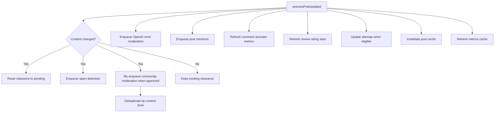

# Post / Comment Creation Pipeline reference

[Back to Post / Comment Creation Pipeline](post-lifecycle.md)

## Comment-Specific Behavior

Comments use the same `createPost()` path with `post_type='comment'`. Key differences:

| Field                 | Comment behavior                                        |
| --------------------- | ------------------------------------------------------- |
| `broadcast`           | Always `'everyone'`                                     |
| `privacy`             | Always `'public'`                                       |
| `parent_id`           | Required                                                |
| `root_id`             | Derived from parent chain                               |
| Community scope       | Inherited from the parent post/comment                  |
| Review topic ratings  | Not applicable                                          |
| `handleCommentAction` | Refreshes metrics for ALL ancestor posts (up the chain) |

Comments also use the same global moderator dispatcher after clearance approval, so moderators such
as `politics-averse` run on comments without a separate comment-only pipeline.

---

## Post Update Pipeline

> **Note:** Post revisions are tracked synchronously inside the `updatePost()` transaction via `createPostRevision()`, not via the entity-listeners queue.

### Community moderation on edit

When post content changes, `processPostUpdated` queries `community_post_reviews` for the post's
approved, non-unpublished community review and re-enqueues community moderation. The community
moderation dispatcher deduplicates via content SHA-256 (`getAlreadyModeratedPromptIds`): if content
hasn't changed since last moderation, all prompts are skipped with zero API calls. Only when content
actually changes do prompts re-run.

---
