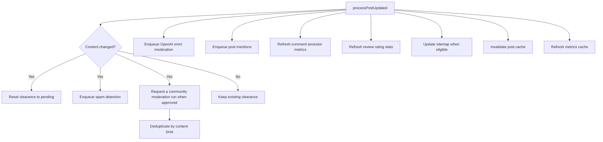

# Post / Comment Creation Pipeline reference

[Back to Post / Comment Creation Pipeline](post-lifecycle.md)

## Comment-Specific Behavior

Comments use the same `createPost()` path with `post_type='comment'`. Key differences:

| Field                 | Comment behavior                                        |
| --------------------- | ------------------------------------------------------- |
| `broadcast`           | Always `'everyone'`                                     |
| `privacy`             | Always `'public'`                                       |
| `parent_id`           | Required                                                |
| `root_id`             | Derived from parent chain                               |
| Community scope       | Inherited from the parent post/comment                  |
| Review topic ratings  | Not applicable                                          |
| `handleCommentAction` | Refreshes metrics for ALL ancestor posts (up the chain) |

Comments also use the same post-classifier dispatch after clearance approval, so label classifiers
such as `politics-averse` run on comments without a separate comment-only pipeline.

---

## Post Update Pipeline

```mermaid
flowchart TD
  update[processPostUpdated] --> changed{Content changed?}
  changed -- Yes --> reset[Reset clearance to pending]
  changed -- Yes --> spam[Enqueue spam detection]
  changed -- Yes --> community[Request a community moderation run when approved]
  community --> dedupe[Deduplicate by content SHA]
  changed -- No --> skip[Keep existing clearance]
  update --> omni[Enqueue OpenAI omni moderation]
  update --> mentions[Enqueue post mentions]
  update --> comment[Refresh comment ancestor metrics]
  update --> review[Refresh review rating stats]
  update --> sitemap[Update sitemap when eligible]
  update --> cache[Invalidate post cache]
  update --> metrics[Refresh metrics cache]
```

> **Note:** Post revisions are tracked synchronously inside the `updatePost()` transaction via `createPostRevision()`, not via the entity-listeners queue.

### Community moderation on edit

When post content changes, `processPostUpdated` queries `community_post_reviews` for the post's
approved, non-unpublished community review and requests a community moderation run in a transaction
of its own, then enqueues the shared dispatcher after commit. The request is keyed by the content
SHA-256, so a replay never queues a second run and a run for content that has not changed makes no
further API call. Only when content actually changes does a new run ask the community's prompts
again.

---
