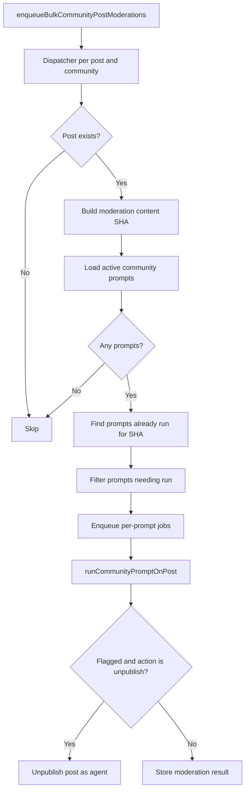

# Post / Comment Creation Pipeline reference

[Back to Post / Comment Creation Pipeline](post-lifecycle.md)

## Community Moderation Pipeline

Community moderation runs independently from the global clearance gate.

### When community moderation runs

| Trigger                                | Condition                                     |
| -------------------------------------- | --------------------------------------------- |
| Community post created (auto-approved) | Always                                        |
| Community review approved by moderator | Always                                        |
| Post content updated                   | Only for approved, non-unpublished review row |

---

## Notification Reconciliation

Post notifications are reconciled in two passes:

1. **After OpenAI moderation** (`enqueueReconcilePostNotifications`): first pass, before topic
   categories are known.
2. **After autotagger** (`enqueueNotificationReconcileForRelations`): second pass, after topics are
   tagged. Idempotent and debounced (60s TTL).
3. **On post delete** (`processPostDeleted`): final cleanup.

---
