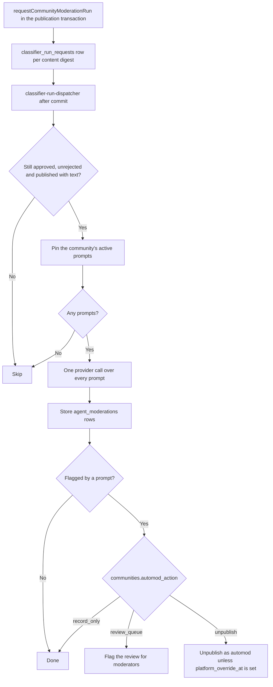

# Post / Comment Creation Pipeline reference

[Back to Post / Comment Creation Pipeline](post-lifecycle.md)

## Community Moderation Pipeline

Community moderation runs independently from the global clearance gate.

```mermaid
flowchart TD
  request[requestCommunityModerationRun in the publication transaction] --> row[classifier_run_requests row per content digest]
  row --> dispatcher[classifier-run-dispatcher after commit]
  dispatcher --> eligible{Still approved, unrejected and published with text?}
  eligible -- No --> stop[Skip]
  eligible -- Yes --> prompts[Pin the community's active prompts]
  prompts --> any{Any prompts?}
  any -- No --> stop
  any -- Yes --> run[One provider call over every prompt]
  run --> record[Store agent_moderations rows]
  record --> flagged{Flagged by a prompt?}
  flagged -- No --> done[Done]
  flagged -- Yes --> action{communities.automod_action}
  action -- record_only --> done
  action -- review_queue --> review[Flag the review for moderators]
  action -- unpublish --> unpublish[Unpublish as automod unless platform_override_at is set]
```

### When community moderation runs

| Trigger                                               | Condition                                       |
| ----------------------------------------------------- | ----------------------------------------------- |
| Post created in, or added to, a community (`add.mts`) | Approved on add, unless an administrator posted |
| Community review approved by moderator                | Always                                          |
| Platform override approves a publication              | Always                                          |
| Post content updated (entity listener)                | Only for an approved, published review row      |
| Post-created recovery                                 | A post whose creation work did not finish       |

The publication triggers write the request in the same transaction as the publication change. The
listener and recovery write it in a transaction of their own, which is safe to repeat because the
request is idempotent per content digest. Every trigger enqueues the shared dispatcher only after
commit, so a lost enqueue is recovered by the reconciliation sweep. A completed run is replayed
rather than re-applied, so a content digest never repeats its action.

---

## Notification Reconciliation

Post notifications are reconciled in two passes:

1. **After OpenAI moderation** (`enqueueReconcilePostNotifications`): first pass, before topic
   categories are known.
2. **After autotagger** (`enqueueNotificationReconcileForRelations`): second pass, after topics are
   tagged. Idempotent and debounced (60s TTL).
3. **On post delete** (`processPostDeleted`): final cleanup.

---
