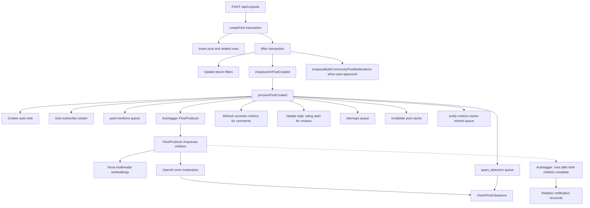
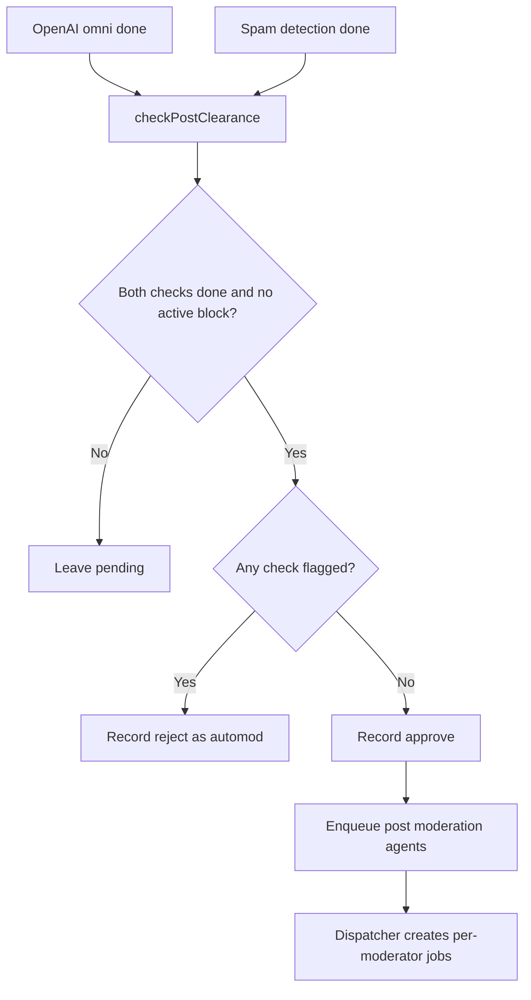

# Post / Comment Creation Pipeline reference

[Back to Post / Comment Creation Pipeline](post-lifecycle.md)

## Post Creation Pipeline

> **Note:** Post revisions are tracked synchronously inside the `createPost()` transaction via `createPostRevision()`, not via the entity-listeners queue.

### Admin-created posts

- `createPost()` records an `approve` clearance change for admin-created posts
- Recovery reads the immutable clearance marker written at creation. During the rolling deployment,
  pre-marker rows require the original create revision, initial author approval, and an administrator
  role assignment that predates the post; it never treats a later role grant as creation-time bypass.
- Still enqueues mentions, embeddings, autotagger, notification reconciliation, sitemap updates,
  and metrics/cache refresh
- Create-time OpenAI moderation, moderator agents, spam detection, and community moderation are
  skipped
- Later content edits still reset clearance to `pending` and use the normal update pipeline

### Link source provenance

- Link creation records the submitted raw URL in `posts.creation_source_url_id` within the post
  transaction, separately from the editable post-to-URL relation.
- Recovery uses that immutable column to crawl both the raw source and its canonical URL. Vote or
  relation removal cannot erase a submitted URL's required create-time crawl. Rows written before
  the column rollout use the prior positive relation as a bounded compatibility fallback. Recovery
  also safely re-enqueues every link post's canonical URL; the crawl queue deduplicates that work,
  avoiding an unrecoverable gap when an old writer's source relation no longer exists.

### Clearance Gate

Both the OpenAI omni moderation worker and the spam detection worker call `checkPostClearance()` after completing. The clearance gate atomically transitions the post from `pending` to `approved` or `rejected` only when **both** checks are done. Whichever finishes second triggers the transition.

See [`backend/services/post-clearance/README.md`](../../../backend/services/post-clearance/README.md) for details.

---
