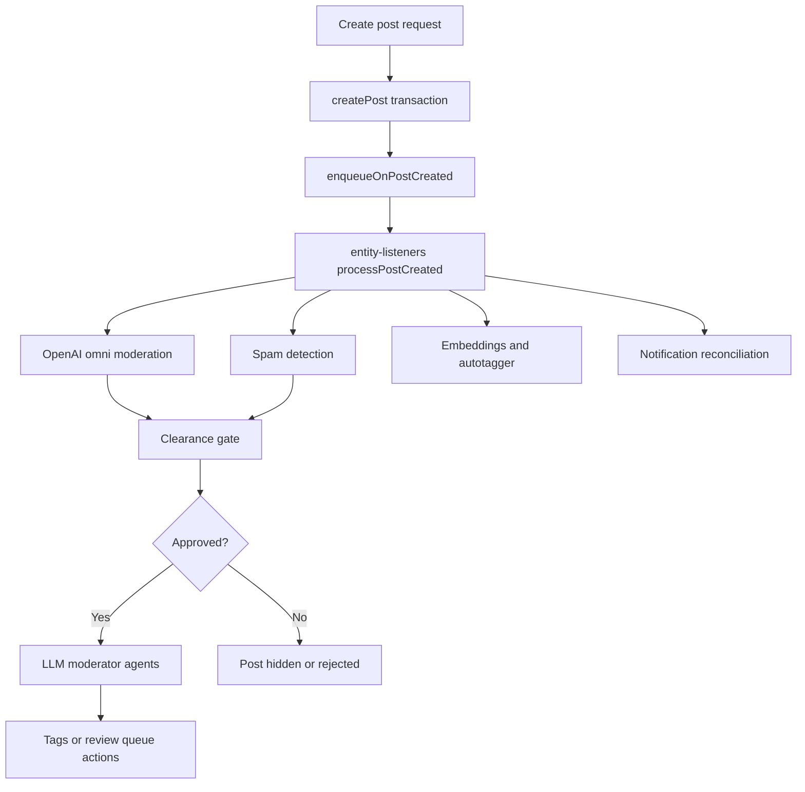

# Post / Comment Creation Pipeline reference

[Back to Post / Comment Creation Pipeline](post-lifecycle.md)

## Table of Contents

- [Overview](#overview)
- [Post Creation Pipeline](reference-post-lifecycle-post-creation-pipeline.md#post-creation-pipeline)
- [Comment-Specific Behavior](reference-post-lifecycle-comment-specific-behavior.md#comment-specific-behavior)
- [Post Update Pipeline](reference-post-lifecycle-comment-specific-behavior.md#post-update-pipeline)
- [Community Moderation Pipeline](reference-post-lifecycle-community-moderation-pipeline.md#community-moderation-pipeline)
- [Clearance Gate](reference-post-lifecycle-post-creation-pipeline.md#clearance-gate)
- [Review Succession](../../requirements/content/reference-post-lifecycle-review-succession.md)
- [Notification Reconciliation](reference-post-lifecycle-community-moderation-pipeline.md#notification-reconciliation)

---

## Overview

Post creation is split into two phases:

1. **Synchronous (HTTP request)**: `createPost()` runs a database transaction that inserts the post
   and associated data, then returns immediately.
2. **Asynchronous (job queues)**: `enqueueOnPostCreated()` fans out to multiple independent
   pipelines — moderation, spam detection, embeddings, notifications, sitemap, etc.

The pipelines are independent and resilient: each retries on failure without affecting the others.
Admin-created posts use a reduced create-time branch: they record an `approve` clearance change, skip
moderation/spam/community-moderation on create, and still run embeddings plus autotagger.

---
