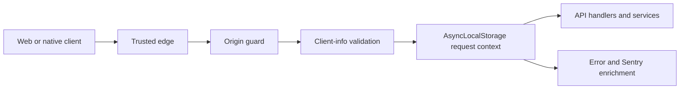

# Request Client Information

Interactive first-party requests under `/api/**` carry a client family, platform, app version, and
optional SDK version. The backend combines those self-asserted telemetry fields with a device ID
from the verified `dt` token and an IP address from the first `x-forwarded-for` value. The backend
origin guard verifies Worker provenance before this listener runs, so it trusts the Worker-stamped
forwarding header ahead of `cf-connecting-ip`. The listener still falls back to
`cf-connecting-ip` for direct Cloudflare-to-backend paths, then to the peer socket for local
callers. The Worker removes the original header before origin fetches, but same-zone Cloudflare
subrequests may regenerate it.



Required headers are `x-voucha-client` (`web`, `swift`, or `dotnet`),
`x-voucha-platform` (`web`, `ios`, `ipados`, `macos`, `android`, or `windows`), and
`x-voucha-app-version`. `x-voucha-sdk-version` is optional. Version values are 1–64 printable ASCII
characters. Family/platform pairs must match the supported client runtime.
The shared parser mechanics come from `@vouchington/utils/request-client-info`; Voucha owns this
header vocabulary and compatibility catalog through its stable local adapter.

The `request-client-info` Dynamic Config namespace starts with `enforcement_enabled: false`.
Observe mode logs sanitized validation failures and continues without request client context.
Enforce mode returns HTTP 400 with `code: INVALID_CLIENT_INFO` and includes `request_id` when the
request supplied one. Enable enforcement only after all producers have deployed and production
observe logs are clean.

`PATCH /api/v1/session` and first-use `POST /api/v1/auth/**` or
`POST /api/v1/app-attestation/**` requests may bootstrap a UUIDv7 when no valid device token exists.
The session bootstrap UUID is shared with authentication context so the subsequently minted token
and request metadata agree. Native bootstrap IDs provide request context until the authentication
or attestation route mints its device token. Verified device payloads are also reused by
authentication context to avoid verifying the same JWT twice. Edge-anonymous device tokens are
verified together with their session token so the edge issuer's configured public keys are used. A
stale session token falls back to independent device verification, allowing the normal anonymous
or session-refresh path while the longer-lived device token remains valid.

The server's global feature-flag read has one separate bootstrap path. An exact, cookie-free
`GET /api/v1/feature-flags` may mint request-scoped device context only when it carries valid web
client metadata and the `global-feature-flags` request kind, and the origin guard has verified the
configured Worker secret for that same request. The Worker strips incoming request-kind headers
before forwarding public API requests, so a caller cannot claim this internal kind through the
public edge. Direct requests without the secret, other paths or methods, and requests with cookies
still require a verified device token. When origin-secret validation is disabled, the marker is not
set and this bootstrap fails closed. This read does not issue or persist a session.

Exemptions are `OPTIONS`, non-API paths, webhook and MCP/admin-MCP paths, signed
`/api/v1/email-unsubscribe` callbacks, and edge-authenticated requests marked
`x-voucha-request-kind: bot` or `cache-fill`. The origin guard runs first, so callers cannot use that
internal marker to bypass backend validation directly.

The edge treats any request carrying `Sec-Fetch-Site`, `Sec-Fetch-Mode`, or `Sec-Fetch-Dest` as
browser-shaped, removes every client-supplied `x-voucha-*` client header, and stamps `web`/`web` only
when one of two kinds of browser evidence holds:

- **Same-origin app request:** `Sec-Fetch-Site` is `same-origin`, and any `Origin` or `Referer`
  that is present resolves to the incoming request's origin. `Origin: null`, which browsers send
  under a `no-referrer` policy, counts as absent; a foreign or unparseable value disqualifies.
- **Top-level navigation:** a `GET` or `HEAD` with `Sec-Fetch-Mode: navigate` and
  `Sec-Fetch-Dest: document`, from any site. OAuth broker callbacks (`/auth/callback/<provider>/broker`)
  and the Bluesky callback (`/api/v1/auth/bluesky/callback`) arrive this way from the provider.

`same-site` requests from sibling hosts and other cross-site subresource use of `/api` are not
supported web traffic and stay unstamped. Browser-shaped requests that fail both checks reach the
backend with no client metadata. Requests without Fetch Metadata keep explicit native metadata, but
a bare `x-voucha-client: web` claim is removed because the web app never sends it through the edge:
server rendering, the web proxy, and the localization smoke probe call the backend directly with
`CF_WORKER_SECRET`. Server rendering must therefore set the internal `API_BASE_URL`; a public
`NEXT_PUBLIC_API_BASE_URL` fallback that routes through the edge loses its `web` classification.
Headerless callers are left unstamped so backend enforcement rejects them instead of silently
classifying an unknown client as web. The evidence check lives in
`cloudflare-worker/src/web-browser-evidence.mts`.

Any non-browser caller can forge these headers, so `web`, `swift`, and `dotnet` stay
telemetry-grade. Nothing public is derived from them; public provenance labels come only from the
authenticated credential. Before enabling enforcement, confirm in observe logs that valid web
traffic still arrives stamped.

Swift and .NET transports perform one `PATCH /api/v1/session` bootstrap before their first
same-origin API request. They persist the `dt` and `st` values from the response JSON into their
shared cookie stores because production session responses do not use `Set-Cookie`. Device-cookie
presence is the bootstrap invariant, so clearing authentication cookies causes the next request to
bootstrap again. Fresh installs can therefore browse anonymous public APIs with a stable trusted
device ID. An explicit session request satisfies the bootstrap without issuing a duplicate request;
external upload origins never trigger bootstrap or receive client metadata.

## Local validation

Initialize DB/Valkey-backed tests with `./dev/initialize web` and `source .env`, then run the
focused contract suites with:

```sh
pnpm exec vitest run --project backend-modules backend/modules/request-client-info/index.test.mts backend/modules/request-client-info/listener.test.mts
pnpm exec vitest run --project ts-shared ts-shared/request-client-info/index.test.mts
pnpm exec vitest run --project cloudflare-worker cloudflare-worker/src/web-browser-evidence.test.mts cloudflare-worker/src/client-info.test.mts cloudflare-worker/src/origin-request.client-info.test.mts
pnpm exec vitest run --project web web/lib/api/server/client-info.test.ts web/lib/api/server/request.mock.test.ts web/lib/api/server/images-proxy.test.ts
```

Run focused native checks from the [client repository](https://github.com/vouchington/vouchington-clients).
Before pushing, run the repository-wide static/type gates selected by
[`docs/development/tests.md`](../../development/tests.md). CI enforces 100% patch coverage and no
overall coverage regression.

Code entry points:

- [`ts-shared/request-client-info`](../../../ts-shared/request-client-info/) defines the public
  header contract.
- [`backend/modules/request-client-info`](../../../backend/modules/request-client-info/) owns
  parsing integration and request-scoped storage.
- [`backend/services/request-client-info`](../../../backend/services/request-client-info/) owns
  runtime enforcement configuration.
