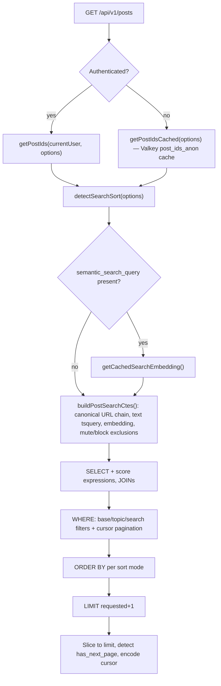

# Search Architecture

## Global Search Dialog

The global search dialog (`Cmd+K` / `Ctrl+K`) supports keyboard navigation:

| Key                          | Action                                                                                                        |
| ---------------------------- | ------------------------------------------------------------------------------------------------------------- |
| `Cmd+K` / `Ctrl+K`           | Open dialog, or refocus input if already open                                                                 |
| `ArrowUp` / `ArrowDown`      | Navigate through results                                                                                      |
| `ArrowLeft` / `ArrowRight`   | Cycle entity type tabs (All → Topics → Communities → Posts → News → Domains → Fediverse when enabled → Pages) |
| `Shift+Arrow`                | Text selection in input                                                                                       |
| `Option+Arrow` (macOS)       | Word navigation in input                                                                                      |
| `Ctrl+Arrow` (Windows/Linux) | Word navigation in input                                                                                      |
| `Enter`                      | Select highlighted result                                                                                     |
| `Escape`                     | Close dialog                                                                                                  |

ArrowLeft/ArrowRight cycle tabs when the cursor is at the boundary of the input text (start for ArrowLeft, end for ArrowRight), or when the input is not focused. Character-by-character navigation still works in the middle of a word. Modifier+Arrow shortcuts (Shift, Option/Ctrl, Cmd/Meta) always work normally and do not cycle tabs.

Post search is powered by a hybrid approach combining full-text search and semantic (vector) search.

## Fediverse Search

Fediverse search is a separate provider-bucket endpoint at `GET /api/v1/fediverse/search`. It
accepts `q`, `providers`, `type`, `limit`, and `after`, then returns buckets for PeerTube,
Mastodon-compatible servers, and Bluesky. The endpoint is always mounted; the `fediverse` feature
flag gates navigation, command-search tabs, pages, and PeerTube discovery affordances.

The v1 service is a contract shell with empty default adapters. Real provider adapters must keep
provider failures isolated to a single bucket and must not reintroduce ActivityPub inbox/outbox,
delivery queues, WebFinger, NodeInfo, or Mastodon-compatible local API routes.

## Query Entry Point

The route layer (`backend/api/v1/posts/posts-routes/posts-get.mts`) forks on auth state before
reaching the search service: authenticated requests call `getPostIds(currentUser, options)`
directly, while anonymous requests call `getPostIdsCached(options)` — a Valkey-backed wrapper
(`post_ids_anon` cache) around the same `getPostIds(undefined, options)`.

All search then goes through `@services/posts/search`:

1. **Query builder** — assembles a reusable SQL query from filter options
2. **`getPostIds()`** — executes the query, returns paginated IDs with cursor
3. **`getPostFacets()`** — returns aggregate counts (total_count) for the same query

The diagram below traces a request through the query-builder stage groups (not every filter):

## Filter Options

| Filter                  | Description                                                                                                 |
| ----------------------- | ----------------------------------------------------------------------------------------------------------- |
| `user_id`               | Posts by a specific user                                                                                    |
| `related_topic_ids`     | Posts tagged with all specified topics (AND logic). API param: `categories=`                                |
| `universal_topic_ids`   | Posts related to topic by any relationship: tagged OR review-rated OR data-point-for. API param: `topics=`  |
| `review_topic_ids`      | Reviews for specified topics (implies `post_type = 'review'`). API param: `review_topic=`                   |
| `data_point_topic_ids`  | Data points for specified topics (implies `post_type = 'data_point'`). API param: `data_point_topic=`       |
| `url_id`                | Posts related to a specific URL entity                                                                      |
| `similar_post_id`       | Posts semantically similar to a given post (vector distance)                                                |
| `similar_topic_id`      | Posts semantically similar to a given topic (vector distance)                                               |
| `text_search_query`     | Full-text search (PostgreSQL `tsvector`). Shorthand: `q=` (mapped automatically by the parser)              |
| `semantic_search_query` | Semantic search (pgvector cosine similarity)                                                                |
| `post_types`            | Filter by post type array: `discussion`, `review`, `data_point`, `comment`, `article`, `blog_post`, `story` |

When both `text_search_query` and `semantic_search_query` are provided, their score vectors are multiplied for cross-ranking.

## Sort Modes

| Sort            | Cursor encodes            | Default when                         |
| --------------- | ------------------------- | ------------------------------------ |
| `new`           | `{ id: string }`          | No search query                      |
| `best`          | `{ score: number, id }`   | Explicit `sort=best`                 |
| `hot`           | `{ score: number, id }`   | Explicit `sort=hot`                  |
| `relevance`     | `{ ranking: number, id }` | Text or semantic search applied      |
| `following_new` | `{ ranking: number, id }` | Authenticated feed (following first) |

The `hot` sort uses the same three-day decay expression as post feeds and trending posts. Its clock-skew and future-UUID behavior is canonical in the [shared hot-score builder](../../../backend/modules/feed-query-builders/README.md#hot-score).

## Visibility & Moderation Filtering

- **Privacy/broadcast**: `buildPrivacyFilter()` applies audience rules (anonymous, logged-in, followers, mutual followers)
- **Moderation**: Posts flagged by OpenAI omni-moderation are hidden from all non-owners and non-admins
- **Deleted**: `deleted_at IS NOT NULL` rows always excluded
- **Post types**: `topic_recommendation` is excluded from generic search by default

## Embeddings

Embeddings are generated by `@queues/bedrock-embeddings` after post creation and stored as pgvector on the `posts` table. Similarity queries use cosine distance with a pgvector index.

## Pagination

Uses the unified cursor-based pagination module. Cursors are opaque base64 strings; structure varies by sort mode. See [backend/modules/pagination/README.md](../../../backend/modules/pagination/README.md).

## URL Search Min-Length

The URL search endpoint (`GET /api/v1/urls?query=`) requires a minimum query length of 3 characters after trimming (`backend/services/urls/search.mts`). Shorter queries return a 400 error.

Frontend guards prevent the API call before the minimum is met:

- Shared constant: `web/lib/api/url-query-min-length.ts` exports `URL_QUERY_MIN_LENGTH = 3`, plus trim/short-circuit helpers used by both API clients.
- Browser client: `web/lib/api/client/urls.ts` imports the shared helpers, trims the outbound query, omits empty queries from the request URL, and short-circuits `fetchUrls` for queries whose trimmed length is 1–2 characters, returning an empty result immediately.
- Server helper: `web/lib/api/server/urls.ts` applies the same trim and min-length short-circuit in `getUrls`, so the `/urls` SSR page does not call the backend with a 1–2 character query and 400.
- Autocomplete components: `web/components/shared/entity-autocomplete.tsx` owns the min-length guard; the community-list and tag wrappers pass `URL_QUERY_MIN_LENGTH` for URL searches so they skip scheduling the debounced fetch and show "Type at least 3 characters to search." in the dropdown instead.

## Hashtag Filter Dimensions

List-filter search supports either linked-topic or standalone `#hashtag` tokens via
`backend/services/search-params/hashtag-topic-search.mts`. Canonical hashtag keys use ASCII
alphanumeric segments separated by `-`; `.` and `_` are normalized to `-` for mobile-friendly input.
Each parser maps linked topics and exact unlinked aliases to the appropriate SQL filter for its
surface:

- **Posts** (`parse-posts.mts`) → positive topic and topic-alias category relations.
- **News** (`parse-rss-feed-items.mts`) → `hashtag_topic_ids` — one `(feed-owner-topic OR category-topic)` clause per resolved topic ID, ANDed together for multi-hashtag searches, so that `/news?q=#slug` returns items matching either ownership or categorization for that topic, overlapping with `/topic/[slug]/news`.
- **Topics list** (`parse-topics.mts`) → direct linked topic match; standalone aliases produce an empty result because they do not identify a topic.
- **RSS feeds list** (`parse-rss-feeds.mts`) → `topic_ids` — feeds where `rss_feeds.topic_id` matches the resolved ID.

Linked hashtags expand to the direct topic relation and every alias linked to that topic. Standalone
hashtags match only their exact alias relation. The `topic_ids` and `category_topic_ids` filter
dimensions for `rss-feed-items` are AND-ed when both are present. One filter is generated per
hashtag, so items must match every hashtag. Unknown valid hashtags return an empty result.

See [Feed And List Filters](../../requirements/navigation/FEED-LIST-FILTERS.md#hashtag-filter-dimensions-per-surface) for the full surface matrix.

## Related

- [Backend rules](../../../backend/CLAUDE.md) — service and data conventions
- [Web rules](../../../web/CLAUDE.md) — UI and routing conventions

- [docs/requirements/navigation/TOPBAR-SEARCH.md](../../requirements/navigation/TOPBAR-SEARCH.md)
- [docs/overview/architecture/ai-agents.md](./ai-agents.md)
