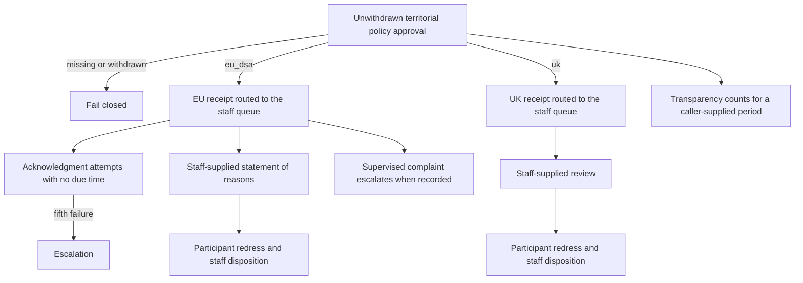
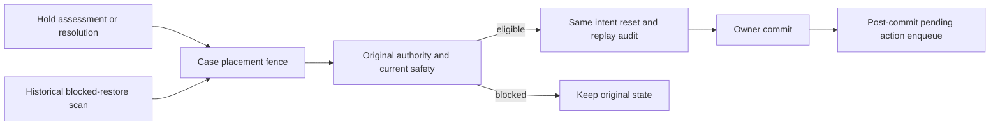

# @services/copyright-notices

Source entrypoint: [backend/services/copyright-notices/README.md](../../../../../backend/services/copyright-notices/README.md)

Copyright notices are a distinct legal workflow. This package owns pure lifecycle rules and the
allowlisted member projection; PostgreSQL owns the durable legal aggregate introduced by migration
`0634-00-00-copyright-notices.sql`.

The package provides transactional aggregate creation, immutable submission and assessment records,
deadline derivation, restriction/review transitions, hold resolution, correspondence approval, and
revision-fenced restore intents. The intake layer adds structured form and preserved-email records,
but remains disabled by default with `COPYRIGHT_INTAKE_ENABLED`. `assertCopyrightIntakeEnabled()`
is the one guard every new-intake route (US form, EU and UK notices) and staff approval of an
emailed notice call first; in-case responses and every other staff route never call it. Email
ingest, MIME parsing, and thread linking do not call it either; the email-intake recommendation job,
the form-screening job, and the dispatch reconciler check `isCopyrightIntakeEnabled()` instead. The
reconciler holds back only the `email` and `form-screening` dispatches while the switch is off; an
`appeal` and a saved `form-effect` stay in scope because they belong to an open case. Later enforcement and delivery
layers must use these boundaries instead of treating a generic content report or ordinary appeal as
a statutory notice.

Delivery obligations are durable `copyright_notice_delivery_intents` rows. Claimant addresses are
re-encrypted into an intent-scoped private recipient record, while poster addresses resolve from
the affected member's current verified address only at send time. Every legal email references an
immutable deterministic correspondence body; SES acceptance records its MessageId and sets the
correspondence `sent_at` in the same database transaction as the intent receipt. The five-minute
notification-queue reconciliation re-enqueues pending, failed, and expired claims. Bounce and
complaint feedback transitions only the correlated SES intent to `bounced`.

A statutory counter-notice forwarding intent is created only inside the qualifying deadline
transaction, after an identified reviewer has found the immutable counter-notice compliant. The
forwarded body and restoration date derive from that assessed submission and exact target scope.

The form-intake layer adds a deliberately small authoritative resolver for the currently supported
post-image placement: it accepts a hosted post URL plus image ID, verifies the association in the
primary database, and derives the placement key server-side. It does not accept caller-supplied
placement keys or revisions. The full authoritative revision and delivery transition remain in the
media-placement layer.

While `copyright.automaticProvisionalWithholding` is on (off at launch), signed-in forms may create
a provisional restriction only after the exact current structured intake is deterministically
complete (contact, work, declarations, signature, and hosted target) and receives a
`not_obviously_invalid` anti-spam screen; PostgreSQL binds the assessment and restriction to that
screening record. The screening is not a legal assessment and cannot fill missing statutory fields.
The reconciliation sweep reapplies the latest saved clear screen, without rerunning the model, to
repair its matching automated assessment and only still-unrestricted targets. A moderator review or
a target lifted under automated authority prevents automated reimposition. Guest forms and every
email intake remain moderator-gated. Email admission uses
the trusted SES `intakeKind`/S3-prefix contract, preserves the exact raw object version before
parsing, retains encrypted threading headers, and retains malformed messages for manual review.
The extraction records all statutory fields plus bounded source excerpts without inventing missing
declarations. Ordinary approval identifies the recommendation reviewed; an agent failure requires
an explicit manual-fallback reason.

After an email intake is admitted, its Message-ID and reply references are correlated with keyed
digests only. A matched inbound reply receives an immutable pending-review record and remains attached
to the original MIME evidence and still receives the advisory extraction/recommendation. Staff must
classify and admit it through the correspondence endpoint; the admission creates the case submission and inbound correspondence without allowing the agent to trigger a
restriction, deadline, or outbound delivery. An accepted statutory counter-notice produces a
case-scoped private forwarding correspondence containing the canonical declarations, consents,
contact details, signature, and exact target IDs and URLs; those private details never enter the
member projection.

The current screening execution, rather than the newest result UUID or any historical clear result,
owns automatic authority. See [current screening authority](../../../../requirements/moderation/COPYRIGHT-NOTICES.md#current-screening-authority)
for the admission boundary and [execution services](../../../../../backend/services/copyright-notices/form-screening-executions.mts) for token fencing.
Final restriction admission takes placement, form, notice, and assessment locks in that order.
Human approval commits a genuine human assessment with its intake review; that assessment is the
durable record that its targets still need restricting.
Human provenance is the absence of a screening FK, including after the reviewer account is erased.

## Invariants

- An ordinary appeal is not a US statutory counter-notice.
- The restoration clock starts at the immutable receipt time of the submission that a compliance
  assessment finds substantially compliant. Parsing and staff-approval time never move that clock.
- Restoration intent creation cannot occur before business day ten, before that exact restriction's
  human review, while another restriction is active, while the case has an unassessed court or CCB
  filing, or after a target-specific qualifying court/CCB filing is received from the original
  claimant. Missing day fourteen escalates but does not prohibit an overdue restoration. The media
  service still performs the authoritative delivery check.
- Member responses are built from an explicit allowlist and only for accepted complaints. Claimant
  attribution is the current `view_users_public` profile, limited to its ID and display label; guest
  and erased claimants are null. Callers must separately determine whether the viewer may see the
  target reference.
- Legal receipts, evidence, assessments, targets, and lifecycle events are immutable. Restriction
  lifts are one-way transitions. A legal-blocker transition may reopen the same eligible blocked
  restore intent; its identity and original authority are immutable, and the reset is audited.
- A compliant, current notice assessment owes a restriction to every target that has no restriction
  row yet, and there is no separate enforcement queue: the assessment commits atomically with that
  obligation, and the reconciliation sweep recomputes it from the durable restrictions. Each
  restriction rechecks the assessment under the placement, form, notice and assessment locks, so a
  superseded or non-compliant assessment imposes nothing, and a failed imposition stays owed. A
  target that has had a restriction, even one since lifted, is settled for every assessment, so
  enforcement never restricts it again.
- `precheckCopyrightRestoration` is a non-authoritative pure helper.
  `createEligibleCopyrightRestoreIntent` locks the legal ledger and creates a preliminary fenced
  intent; it cannot authorize a media delivery change by itself.

Repeat-infringer reviews close with warning, no action, restrict, or terminate. Restrict and
terminate are administrator-only and suspend the account through `@services/users`. Termination
blocks unsuspend until a later reinstatement row. Account deletion refuses while an operative
incident or an unresolved qualifying legal hold remains.

[`repeat-infringer-incidents.mts`](../../../../../backend/services/copyright-notices/repeat-infringer-incidents.mts) derives incidents from the initial
restriction review and immutable appeal reviews. A reversal dominates confirmation for that exact
restriction. Appeal review synchronizes incidents before committing. The sorted union of target
authors and existing incident owners uses the canonical author publication lifecycle lock before
recomputation, excludes deleted authors from desired incidents, and creates one open threshold
review through the existing partial unique index. Reversals preserve an open review for staff
disposition; restrict and terminate recheck the operative threshold at decision time.

EU and UK contracts live in migration `0737-00-00-copyright-eu-uk-contracts.sql`. They record
receipt, routing, reasons or review, redress, escalation, and EU reporting facts, and they fail
closed until a separate territorial policy approval exists. They do not use the US restoration
clock or decide legal merits. [`eu-notice-receipt.mts`](../../../../../backend/services/copyright-notices/eu-notice-receipt.mts) and
[`uk-notice-receipt.mts`](../../../../../backend/services/copyright-notices/uk-notice-receipt.mts) are wrappers around the shared receipt flow in
[`territorial-notice-receipt.mts`](../../../../../backend/services/copyright-notices/territorial-notice-receipt.mts) and
[`territorial-notice-receipt-sql.mts`](../../../../../backend/services/copyright-notices/territorial-notice-receipt-sql.mts). Each wrapper keeps its
jurisdiction, storage tables, encryption purpose, and failure label.
[`eu-redress.mts`](../../../../../backend/services/copyright-notices/eu-redress.mts) and
[`uk-redress.mts`](../../../../../backend/services/copyright-notices/uk-redress.mts) are wrappers around the shared redress flow in
[`territorial-redress.mts`](../../../../../backend/services/copyright-notices/territorial-redress.mts) and
[`territorial-redress-sql.mts`](../../../../../backend/services/copyright-notices/territorial-redress-sql.mts). Each wrapper keeps its
policy key, encryption purpose, and error text. Table and column identifiers stay in static SQL.

Hold assessment and resolution fence every placement on the case before taking its notice lock.
They recheck and reopen original eligible blocked restore intents inside the legal
transaction, then enqueue only after commit. Ordinary active restrictions need no late-hold
binding. The existing action reconciler also recovers historical blocked restores using the same
eligibility/reset/audit helper. Neither legal transitions nor reconciliation automatically reset
provider-failed work; that requires explicit operator replay. Original
counter-notice scope, current assessment, human review, time and cancellation, placement identity,
revision and safety must still permit restoration. Other active restrictions retain denial.

The durable workflow is documented in
[`COPYRIGHT-NOTICES.md`](../../../../requirements/moderation/COPYRIGHT-NOTICES.md).
