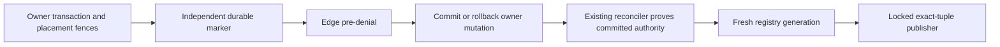

# Media Delivery Safety

Source entrypoint: [backend/services/media-delivery-safety/README.md](../../../../../backend/services/media-delivery-safety/README.md)

This service provides fail-closed publication helpers for media routes whose ownership rows are
about to change or disappear. Callers publish the current immutable placement tuple as withheld
before mutating its owning user, topic, community, or profile-link row.

It owns the concrete image-placement registry, placement lock, staging, publication, replay, and
recovery implementation. Image and post services both depend on this lower-level boundary, so a
deployed workspace package never reaches across into a sibling service or creates an
images-to-posts package cycle.

The helper stages a generation-checked delivery-registry record in the caller's PostgreSQL
transaction, publishes the denial to the edge registry, invalidates the exact CloudFront route,
and marks only that generation complete. Provider failures reject the caller transaction. A later
database failure can leave an extra denial at the edge, but can never expose content that the
database intended to withhold.

An allowed tuple may also name the countries where delivery is denied. That set is the union of
active country-scoped copyright grounds and is empty when the allow is not country-restricted.
Changing only the country set advances the generation and republishes the same region-neutral URL.
A withheld tuple stores no countries. Global copyright grounds, court or CCB holds, safety, and
deletion still publish withheld for every viewer.

Registry generations are database-assigned decimal values, not caller counters. The PostgreSQL
trigger advances them for a new authority state or explicit republish and uses a nontransactional
sequence. This prevents a deny published before a rolled-back
transaction from being overwritten by a reused generation; retries of the same persisted state keep
the same generation, while the edge rejects a conflicting state at that generation.

The publisher reads the committed exact tuple, retains its placement fence, locks relevant legal
cases before the registry row, and proves current byte safety, typed owner binding, revision,
restriction, and court/CCB eligibility before any allow. The outbox worker, marker repair, and
periodic staging use the same proof. Periodic staging selects a bounded batch of changed or missing
records and stages each in its own authority transaction, avoiding registry lock cycles with owner
triggers. Registry and edge activation must both be enabled before a legal action mutates authority.

Recovery uses the shared [claim policy](../../../../../backend/services/media-delivery-safety/delivery-registry-policy.mts). An abandoned final claim
becomes a terminal, replayable failure without changing its generation or attempt history. Cleanup
is bounded per page; exhausted claims are excluded from dispatch immediately, including records
left for a later cleanup pass. Only the existing operator replay reopens terminal failures.
Ordinary same-state staging leaves the entire persisted record unchanged, including retry timing
and failure evidence; authority changes and explicit forced generations restart publication.

The root reconciler repairs markers and stages authority once, then captures an exact cutoff from
the primary database. Recovery pages use opaque scoped cursors in immutable delivery-key order,
with creation and retry eligibility bounded by that cutoff. This replaces oldest-first preference
with complete traversal. Each queue continuation follows successful child enqueues and retains the
same cutoff; later admissions or eligibility changes wait for the next root sweep. The primary
pool preserves visibility of staging and cleanup writes. Internal exact-key scopes support owned
recovery and replay; an empty supplied scope does no work, while omitted scope covers the registry.

New binding admissions and unsafe image mutations first acquire the same immutable batch of
canonical UUID asset-admission roots, before image rows, owners, or placement discovery. PostgreSQL
transaction-local state permits subset reentry but rejects additional roots after that initial
batch; it follows borrowed clients and resets with transaction/savepoint rollback. Exact delivery
publication remains placement-only and does not expand into asset admission.

Surface mutations then use explicit user-profile, profile-link, topic, and community owner domains
(topic/community domains cover both slots) and retain the complete historical placement
footprint in canonical order. They then re-read current tuples, pre-deny those revisions, and mutate
the owner. Image moderation retains the same placement domain from pre-denial through unsafe
flag/quarantine admission. An autocommit query cannot satisfy the retained-transaction contract.
Same-value surface updates compare UUID identity under the retained owner fence and do not deny an
unchanged route. Disabled registry publication leaves existing repair markers untouched and makes
no provider calls.

Registry rows require typed image and placement foreign keys and an exact immutable revision.
Hard owner deletion retains only the retired placement/image binding, not a deleted-owner UUID.
Live owner links clear after owner-removal retirement, including profile-link deletion cascades;
ownerless bindings cannot be created or reactivated. Recovery proves current live ownership.
There is no generic public-image route, media discriminator, or image-wide allow fallback.
The fresh-bootstrap schema is defined by the placement, delivery registry, surface binding, and
repair-marker creators in migrations 0647, 0648, 0649, and 0731. Runtime owner writes create their
bindings; there is no historical population or upgrade path.

The image byte root is registered with the live image. A new owner creates the immutable
`(placement_id, image_id, post|surface)` binding in its own transaction, pins the image root and
exact binding in that order, then inserts the live placement. Surface triggers reject an
unprepared image instead of allocating a placement inside the owner transaction. Retained
identities are not delivery authority; recovery still proves live ownership.

An independently committed repair marker references an already committed registry delivery key
with an `ON DELETE RESTRICT` foreign key and contains only that key, rotating token, and timestamps.
It precedes an owner pre-commit denial when that committed registry parent exists, and also
precedes a publisher's local correction from stale allow to withheld, because that correction can
roll back after the edge accepts its fresh token. Ordinary committed withheld publication does
not create a marker. The existing reconciler consumes only the observed marker token, stages a
fresh generation derived from the registry's typed tuple and committed binding authority, and
leaves publication/retries to the existing outbox. The staged publisher always owns its transaction;
it cannot see or publish an allow from an uncommitted first registry insert. That insert's rollback
leaves no marker and no prior permission to restore. Historical revisions cannot borrow a current
revision or sibling binding and remain withheld.
Immediate rollback repair reads independently committed markers from the primary database, then
uses the same persisted wakeups and exact reconciler; it never manufactures
an allow from a separate image-wide eligibility query.

The exact observed marker token is acknowledged before a separate scheduled, cursor-bounded
orphan sweep may remove an unreferenced binding and then its image root. A committed registry
reference keeps those identities pinned; cleanup never authorizes a route.

OG cards register an explicit dependency manifest of placement tuples. Authorization allows
delivery only when that manifest exists and every recorded tuple passes the same
`imageDeliveryAuthorityProof()` used for placement publication. A missing manifest is denied.
An empty registered manifest allows the card with no source bytes. A later placement revision
or withhold does not satisfy the recorded dependency.

