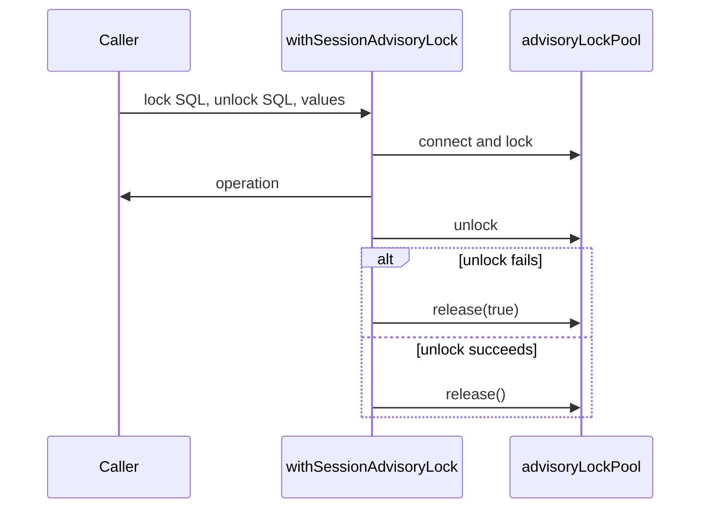

# Session advisory lock

Source entrypoint: [backend/services/session-advisory-lock/README.md](../../../../../backend/services/session-advisory-lock/README.md)

`withSessionAdvisoryLock` is the shared session protocol for a lock held across work on other
pooled connections. It connects from `advisoryLockPool`, runs the caller-supplied lock SQL, runs
the operation, runs the caller-supplied unlock SQL, and returns the client to the pool. If unlock
fails, or PostgreSQL reports the lock was not held, it destroys that client with `release(true)`.

The helper does not choose a key space. Each caller keeps its lock SQL, unlock SQL, bound values,
and the text thrown when the lock was not held:

- [Bluesky disconnect](../../../../../backend/services/bluesky-follows/disconnect-lock.mts) uses a
  two-integer key. That space stays disjoint from Bluesky's one-bigint user/DID transaction locks
  ([why](../bluesky-follows/README.md)).
- [Election vote requests](../../../../../backend/services/elections-votes/shared/request-lock.mts)
  use one `hashtextextended` bigint and the key
  `vote-request:${entityType}:${userId}:${entityId}`.

When the operation and unlock both fail, Bluesky disconnect reports the unlock error through
`onError` and throws the operation error unchanged. Election vote requests attach the unlock error
as `cause` when the operation error does not already have one.

