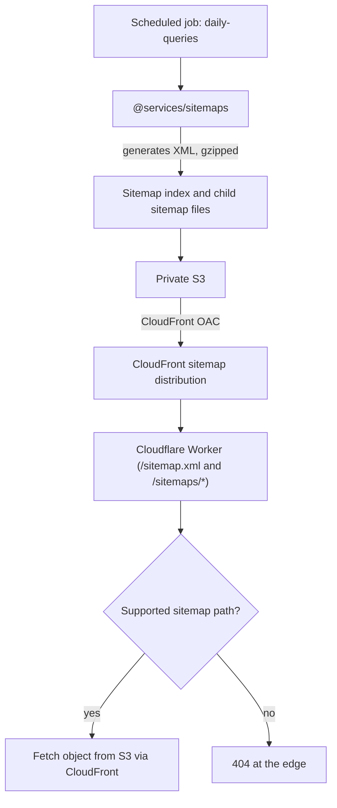

# Sitemaps

Voucha generates XML sitemaps for public content and uploads them to private S3. The Cloudflare Worker fetches them through a CloudFront distribution that uses Origin Access Control.

## Architecture

Generation and upload flow from the scheduled job through to edge delivery:

The Worker only maps supported sitemap XML paths to S3 object keys. Unsupported paths, including
paths with impossible `YYYY-MM-DD` dates or URL-encoded dot, slash, or backslash octets, return 404
at the edge and are not fetched from S3.

## What Gets Indexed

Only fully public, sitemap-eligible posts are included:

- `privacy = 'public'` AND `broadcast = 'everyone'`
- `votes_score_net > 0`
- Not deleted, not flagged

Post sitemap families cover `discussion`, `review`, `article`, `blog_post`, `data_point`, `link`, and `story`. Public URLs use canonical route segments, so underscored types become hyphenated routes such as `/blog-post/:slug` and `/data-point/:slug`.

Dynamic non-post sitemap families are generated separately:

- Users: `/user/:username`, excluding deleted users, users without usernames, and users with active suspensions.
- Topics: indexable subpages only (`posts`, `data-points`, `latest`, `news`, plus `reviews` when reviews are allowed and `referral-links` for referral topics). Topic root pages and `discussions` subpages are not listed.
- Communities: public, non-deleted community pages. Archived public communities remain indexable.
- Domains: `/domain/:hostname` for unblocked hostnames with at least one positive semantic trust choice.
- Landing pages: default pages at `/@username` and non-default pages at `/@username/:slug` when the owner is eligible and the page has at least one public item.

## Implementation

- **`eligibility.mts`** — shared eligibility logic (post + user rules)
- **`generation.mts`** — XML sitemap document builder
- **`xml-builder.mts`** — low-level XML serialization
- **`gzip.mts`** — gzip compression for upload
- **`storage.mts`** — S3 upload via AWS SDK
- **`url-builder.mts`** — canonical URL construction
- **`generated-paths.mts`** — path enumeration for static pages
- **`daily-queries.mts`** — queries to fetch eligible entities for daily generation
- **`family-queries.mts`** / **`family-generation.mts`** — non-post dynamic sitemap families
- **`tracked-range-cache.mts`** / **`tracked-range-discovery.mts`** — tracks which UUIDv7 ranges have
  been included, enabling incremental updates without full regeneration. Post-day generation uses
  one atomic Lua upsert on the warm-cache path; the script returns both the previous and next range
  so the caller can decide whether the durable S3 range changed without a separate Valkey read.

## Sitemap Index

A sitemap index at `/sitemap.xml` links to per-category sitemaps under `/sitemaps/`:

- `/sitemaps/static.xml` — static public navigation pages
- `/sitemaps/posts.xml` — index of post type sitemap indexes
- `/sitemaps/{post_type}.xml` — index of daily post sitemap pages for one post type
- `/sitemaps/{post_type}/YYYY-MM-DD/{page}.xml` — daily post sitemap pages
- `/sitemaps/{family}.xml` — index for a dynamic non-post family
- `/sitemaps/{family}/{page}.xml` — dynamic family sitemap pages

Static pages included in `/sitemaps/static.xml.gz`:
`/`, `/news`, `/stories`, `/plans`, `/articles`, `/blog`, `/channels`, `/communities`, `/topics`, `/cards`, `/domains`, `/domains/compare`, `/sources`, `/news-sources`, `/podcasts`, `/podcast-episodes`, `/videos`, `/web-search`, `/reviews`, `/discussions`, `/posts`, `/data-points`, `/referral-programs`, `/rewards-programs`, `/spending-categories`, `/rewards-program-statuses`

The source of truth is `STATIC_PAGE_PATHS` in `backend/services/sitemaps/static-pages.mts`. The list above may lag behind — check the source file for the current set.

To add a new public page to the static sitemap, append its path to `STATIC_PAGE_PATHS` in `backend/services/sitemaps/static-pages.mts`.

## Related

- Cloudflare Worker routing: [cloudflare-worker/README.md](../../../cloudflare-worker/README.md)
- SEO requirements: [../../requirements/seo/SEO.md](../../requirements/seo/SEO.md)
- Post visibility rules: [../../requirements/content/POSTS.md](../../requirements/content/POSTS.md)
- [Sitemap service](../../../backend/services/sitemaps/README.md) — Sitemap generation logic
- [PostgreSQL system](../../../backend/queues/psql/README.md) — Nightly job that triggers sitemap generation
- [SEO requirements](../../requirements/seo/SEO.md) — Sitemap eligibility tied to indexability rules
- [Backend rules](../../../backend/CLAUDE.md) — service and caching conventions
- [Web rules](../../../web/CLAUDE.md) — SEO metadata and sitemap-linked indexability rules

## Google News Sitemaps

Voucha's `/news` section is a curated feed of **external** articles; the canonical URL of each item lives on a third-party domain. Google News sitemaps require that articles be hosted on the submitting site, so a News sitemap with `<news:news>` namespace is **not applicable** here. If Voucha ever hosts original news content at `/news/[slug]`, revisit this decision.
