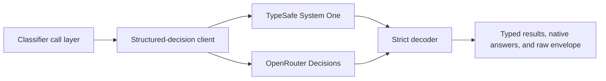

# Structured decisions

`@modules/structured-decisions` is the provider-neutral boundary for Jev's native Noul, Choice,
and Score decisions. Later classifier work owns candidate selection, persistence, thresholding, and
side effects; this module owns only a strict remote call and normalized result.

Callers explicitly select one transport. Retries repeat the same Jev model on that transport only;
the client never changes provider or model after an ambiguous attempt. Every returned answer must
match one requested ID and primitive, use valid probabilities, and completely cover the request.
Partial, malformed, duplicate, unknown, and non-normalized results reject as a whole.
Each normalized answer also retains its validated native provider fragment so the classifier layer
can persist one auditable response per candidate without copying the entire response envelope.

The deterministic test suite owns request validation, provider decoding, and retry behavior. One
credentialed OpenRouter test verifies the native contract using all three primitives. The opt-in
benchmark uses a bounded candidate-count sweep and repeated fixed anchor to record success or
failure, probability drift, latency, usage, and deterministic cost comparisons in a private local
artifact. A completed operator cap is not a claimed provider ceiling. This public repository keeps
only the method and contract, not operational latency, usage, cost, or capacity values.

## Classifier persistence

Classifier configuration is deliberately independent of `agents`: a classifier fixes its primitive
and candidate kind, while immutable prompt versions record the provider/model and instruction
revision used for a decision. A stored candidate has one concrete `topic_id` or `story_id`; generic
call code chooses the entity type rather than storing a polymorphic identifier.

Thresholds are two explicit probability bounds versioned with the prompt. Prompt-revision defaults
apply where a candidate omits either override independently, and PostgreSQL rejects every effective
lower/upper pair outside `0..1` or not strictly ordered. Candidate-specific bounds are immutable
revisions: replacing one deactivates the current row and inserts a new row. Each stored-candidate
result references the exact threshold revision, whose nullable sides inherit prompt defaults, and
snapshots the effective pair, so later threshold
management cannot rewrite or obscure historical decisions. Community enablement is an immutable
lifecycle revision with at most one active row per `(community, candidate)`, so repeated
enable/disable cycles retain their history while communities reuse a global classifier definition
rather than creating one.

A decision batch records one classified post or RSS item, prompt version, and global/community
scope. Every stored candidate included in a batch has an explicit threshold revision for the batch's
prompt version; null override fields inherit that prompt's defaults. In the same transaction, stored
candidates capture the exact threshold revision and effective bounds selected for that batch; results
must reference that immutable snapshot, so a concurrent threshold replacement cannot rewrite or
invalidate in-flight lineage. Its ordered call
rows represent one unsharded call or multiple context-window shards. Results remain one row per
candidate and preserve both the scalar probability used by C4 and the raw native answer. Fixed
moderation candidates reference their stored candidate row; dynamically prefiltered tagging and
story candidates leave that reference null and use the concrete result owner directly. Topic and
story results are sibling UUIDv7 RANGE parents, partitioned directly by `topic_id` and `story_id`;
that keeps pruning and foreign keys concrete without a polymorphic result owner. Result scope must
match the batch. C4 re-reads a committed topic-only decision with the caller's original expected
bindings. It maps each persisted effective threshold snapshot, never current configuration: values
strictly outside the pair are downvote or upvote, while the inclusive interval is durable semantic
neutral `0`. A supplied shared system actor keeps automation distinct from human votes, and a
transactional actor/topic/subject receipt makes exact retries no-ops while fencing an older UUIDv7
batch behind a newer application. Story decisions have no vote domain at this boundary and reject.

## Multi-candidate call layer

`@agents/classifiers` binds each concrete topic or story candidate to a Noul question or Choice
criterion while keeping the classified post or RSS item as the separate state. Choice may include
one unbound option such as `none`; it never creates a synthetic candidate result. Noul persists its
probability, while Choice persists the probability of each bound criterion. Score is rejected until
a classifier defines a real scalar projection rather than inventing one in the generic layer.
State and question text are branded safe values: callers sanitize and wrap every external fragment,
then interpolate those fragments through a static template tag. Choice criteria are opaque keys,
not user-authored labels.

The caller supplies an exact, synchronous context measurer for the active provider and model. There
is deliberately no character, byte, or candidate-count approximation. Direct TypeSafe requests are
bounded by the documented 64,000-token request limit and the 32,000-token state-plus-longest-question
limit. OpenRouter requests use its advertised 32,000-token model context. Questions are indivisible
and packed by deterministic first fit in input order; a single question that cannot fit fails before
any provider request.

Shards execute sequentially through one supplied C1 client, which retains ownership of same-route
retry behavior. Every answer must map back to exactly one requested question and every bound
candidate must appear exactly once across the batch. Provider calls finish before persistence begins.
The caller supplies the prompt version it rendered; execution rejects if that version is no longer
the classifier's active prompt before any provider call. Topic classifiers accept either a post or
an RSS feed item subject; story classifiers accept RSS-item subjects only. `@services/classifiers`
rechecks both invariants, then writes the caller-owned UUIDv7 batch, stored-candidate threshold
snapshots, ordered call rows, and topic or story results in one PostgreSQL transaction. Runtime
prefiltered candidates use prompt defaults. A repeated identical batch ID returns the existing
decision; conflicting reuse fails closed. No generic classifier code casts votes, applies labels,
tags topics, or changes story membership.

### Measurer-less single-call executor

`executeSingleCallClassifierDecision` (`@agents/classifiers/execute-single-call.mts`) is a
sharding-free twin of `executeClassifierDecision` for classifier families that have no exact,
synchronous context measurer for their active provider/model — the C6 tagging autotagger's Noul
classifier dispatch (`backend/agents/autotagger/dispatch-classifier-execute.mts`) is the current
caller. It shares validation, mapping, and persistence with the sharded executor through a common
base input type, but sends every binding as a single request instead of packing shards against a
token budget: it makes no character, byte, or candidate-count estimate at all, rather than
approximating one. The tradeoff this accepts: an oversized-context provider rejection is not
caught or packed around ahead of time — it surfaces as an ordinary `StructuredDecisionError`, and
the caller's own retry/queue semantics (for C6, the receipt lease expiring and a fresh dispatch
attempt) are what recover from it, rather than the call layer itself ever splitting an
over-budget request into shards.

## Related

- [AI agents](ai-agents.md)
- [Environment variables](../infrastructure/reference-environment-variables-ai-ml.md)
- [Structured-decision module](../../../backend/modules/structured-decisions/README.md)
- [Classifier call layer](../../../backend/agents/classifiers/README.md)
- [Classifier persistence service](../../../backend/services/classifiers/README.md)
