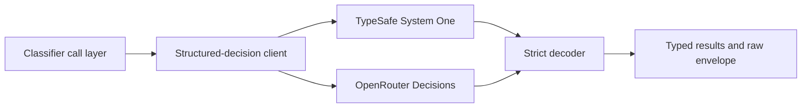

# Structured decisions

`@modules/structured-decisions` is the provider-neutral boundary for Jev's native Noul, Choice,
and Score decisions. Later classifier work owns candidate selection, persistence, thresholding, and
side effects; this module owns only a strict remote call and normalized result.

Callers explicitly select one transport. Retries repeat the same Jev model on that transport only;
the client never changes provider or model after an ambiguous attempt. Every returned answer must
match one requested ID and primitive, use valid probabilities, and completely cover the request.
Partial, malformed, duplicate, unknown, and non-normalized results reject as a whole.

The deterministic test suite owns request validation, provider decoding, and retry behavior. One
credentialed OpenRouter test verifies the native contract using all three primitives. The opt-in
benchmark uses a bounded candidate-count sweep and repeated fixed anchor to record success or
failure, probability drift, latency, usage, and deterministic cost comparisons in a private local
artifact. A completed operator cap is not a claimed provider ceiling. This public repository keeps
only the method and contract, not operational latency, usage, cost, or capacity values.

## Related

- [AI agents](ai-agents.md)
- [Environment variables](../infrastructure/reference-environment-variables-ai-ml.md)
- [Structured-decision module](../../../backend/modules/structured-decisions/README.md)
