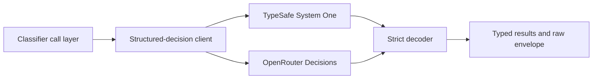

# Structured decisions

`@modules/structured-decisions` is the provider-neutral boundary for Jev's native Noul, Choice,
and Score decisions. Later classifier work owns candidate selection, persistence, thresholding, and
side effects; this module owns only a strict remote call and normalized result.

Callers explicitly select one transport. Retries repeat the same Jev model on that transport only;
the client never changes provider or model after an ambiguous attempt. Every returned answer must
match one requested ID and primitive, use valid probabilities, and completely cover the request.
Partial, malformed, duplicate, unknown, and non-normalized results reject as a whole.

The deterministic test suite owns request validation, provider decoding, and retry behavior. One
credentialed OpenRouter test verifies the native contract using all three primitives. The opt-in
benchmark uses a bounded candidate-count sweep and repeated fixed anchor to record success or
failure, probability drift, latency, usage, and deterministic cost comparisons in a private local
artifact. A completed operator cap is not a claimed provider ceiling. This public repository keeps
only the method and contract, not operational latency, usage, cost, or capacity values.

## Classifier persistence

Classifier configuration is deliberately independent of `agents`: a classifier fixes its primitive
and candidate kind, while immutable prompt versions record the provider/model and instruction
revision used for a decision. A stored candidate has one concrete `topic_id` or `story_id`; generic
call code chooses the entity type rather than storing a polymorphic identifier.

Thresholds are two explicit probability bounds versioned with the prompt. Prompt-revision defaults
apply where a candidate omits either override independently, and PostgreSQL rejects every effective
lower/upper pair outside `0..1` or not strictly ordered. Candidate-specific bounds are immutable
revisions: replacing one deactivates the current row and inserts a new row. Each result references
the exact override revision when present and snapshots the effective pair, so later threshold
management cannot rewrite or obscure historical decisions. Community enablement is an explicit
`(community, candidate)`
lifecycle record, so communities reuse a global classifier definition rather than creating one.

A decision batch records one classified post or RSS item, prompt version, and global/community
scope. Its ordered call rows represent one unsharded call or multiple context-window shards.
Results remain one row per candidate and preserve both the scalar probability used by C4 and the
raw native answer. Fixed moderation candidates reference their stored candidate row; dynamically
prefiltered tagging and story candidates leave that reference null and use the concrete result
owner directly. Topic and story results are sibling UUIDv7 RANGE parents, partitioned directly
by `topic_id` and `story_id`; that keeps pruning and foreign keys concrete without a polymorphic
result owner. Result scope must match the batch. C3 owns validating the complete remote answer set
and inserting every result in one transaction before any threshold-driven action can run.

## Related

- [AI agents](ai-agents.md)
- [Environment variables](../infrastructure/reference-environment-variables-ai-ml.md)
- [Structured-decision module](../../../backend/modules/structured-decisions/README.md)
